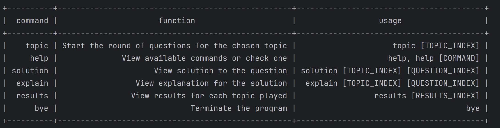

# Player2113

A CLI tool to help COMP2113 student revise conceptual questions in a gamification environment.

## Getting Started

Prerequisites: JDK 11, Player2113 release `JDK` file

Start the programme with the following command:

```
java --jar Player2113.jar
```

You will see the welcome screen upon successful start-up:

```
Hello from
______ _                       _____  __   __   _____
| ___ \ |                     / __  \/  | /  | |____ |
| |_/ / | __ _ _   _  ___ _ __`' / /'`| | `| |     / /
|  __/| |/ _` | | | |/ _ \ '__| / /   | |  | |     \ \
| |   | | (_| | |_| |  __/ |  ./ /____| |__| |_.___/ /
\_|   |_|\__,_|\__, |\___|_|  \_____/\___/\___/\____/
                __/ |
               |___/
What is your name?
```

## Features

### Attempt Question Sets

You can select a topic from the menu and attempt the questions related to the topic you wish to revise. There are multiple question banks pre-configured in Player2113.

### Result Statistics

You may check your answer accuracy after attempting a question set. The result is separated from practicing session for concentration consideration.

### Solution

You may check the correct solution to a specific question in a certain question set.

### Explaination

Detailed explaination is hidden unless invoked by the user for progressive learning and maximizing self-relection.

### Help

A in-app user guide is available for your reference in usage.

## Usage

> [!IMPORTANT]
> The current release of Player2113 is a MVP preview version with various proposed functions unimplemented. Please strictly follow this user's guide.

### `topic` - Choose a topic to revise

Example of usage: `topic [TOPIC_INDEX]`

```
topic 1
```

The practice session for `topic 1` will be started:

```
topic 1
Selected topic: topic1
Here are the questions:
question1
Enter your answer:
```

### `results` - View the accuracy for an attempt

Example of usage: `results [TOPIC_INDEX]`.

```
results 1
```

Sample output:

```
Your results for Topic 1:
0/2 (0%)
```

### `list` - List all available topics and their summaries

Example of usage: `list`.

Sample output:

```
+-------+--------+-------------------------------------------------+-----------+
| index |  topic |                     summary                     | attempted |
+-------+--------+-------------------------------------------------+-----------+
|     1 | topic1 | Covers topic 1 notions mentioned in lecture 1-2 |     false |
|     2 | topic2 | Covers topic 2 notions mentioned in lecture 3-4 |     false |
+-------+--------+-------------------------------------------------+-----------+
```

### `solutions` - View solution to a question

Example of usage: `solutions [TOPIC_INDEX] [QUESTION_INDEX]`.

```
solutions 1 1
```

Sample output:

```
The solution for question 1:
solution1
```

### `explain` - View reasonings for a solution to a question

Example of usage: `explain [TOPIC_INDEX] [QUESTION_INDEX]`.

```
explain 1 1
```

Sample output:

```
The solution for question 1:
explanation1
```

### `help` - View built-in user's guide

Example of usage: `help`

Sample output:



### `bye` - Exit programme

Example of usage: `bye`.

A goodbye message will be displayed:

```
bye bye, get more sleep zzz
************************************************
```

## Troubleshooting
