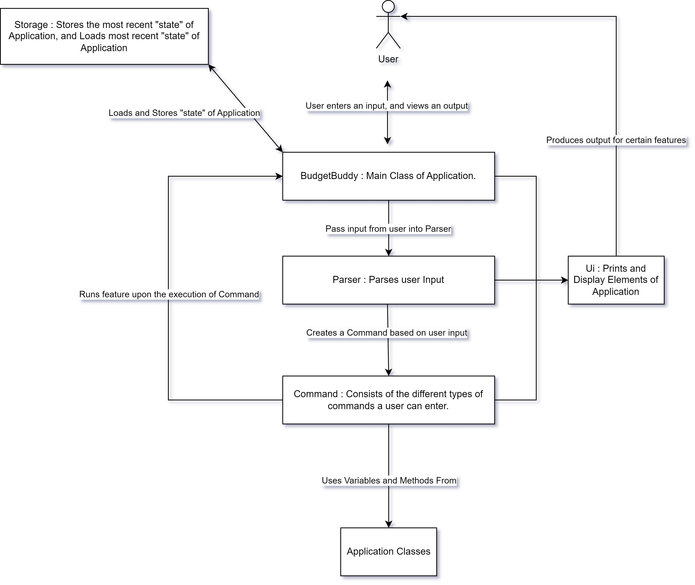
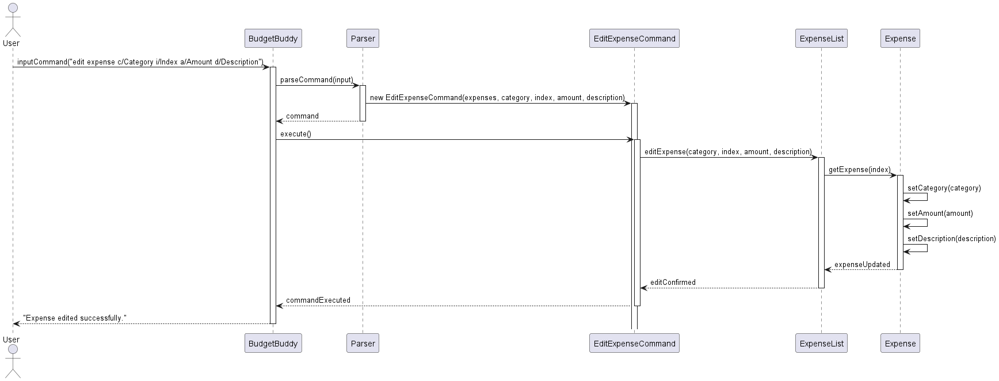
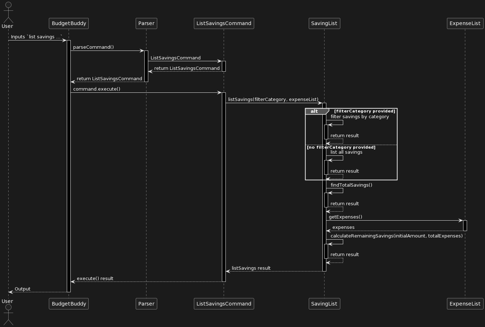
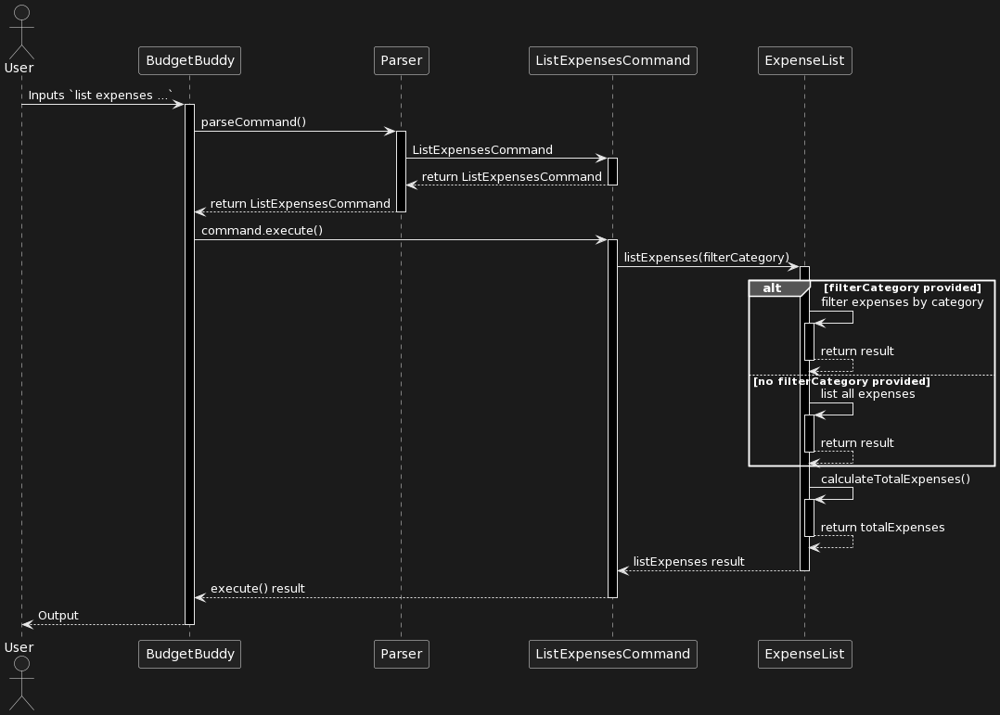
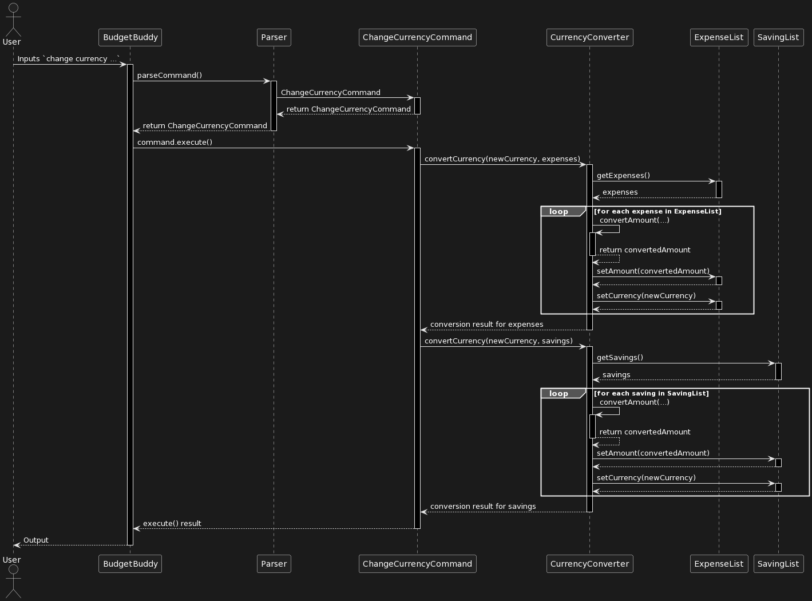
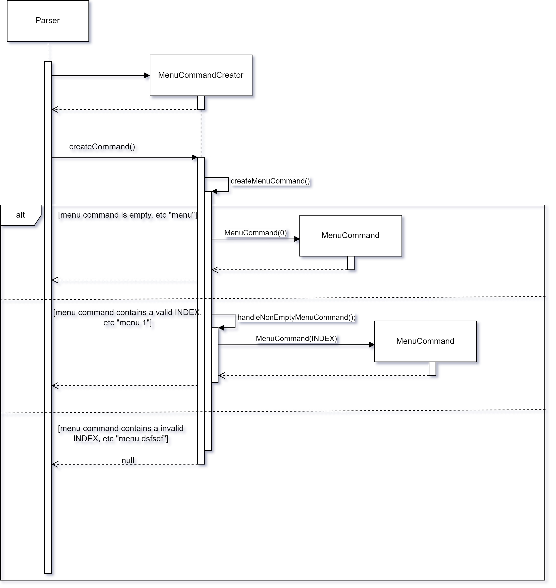
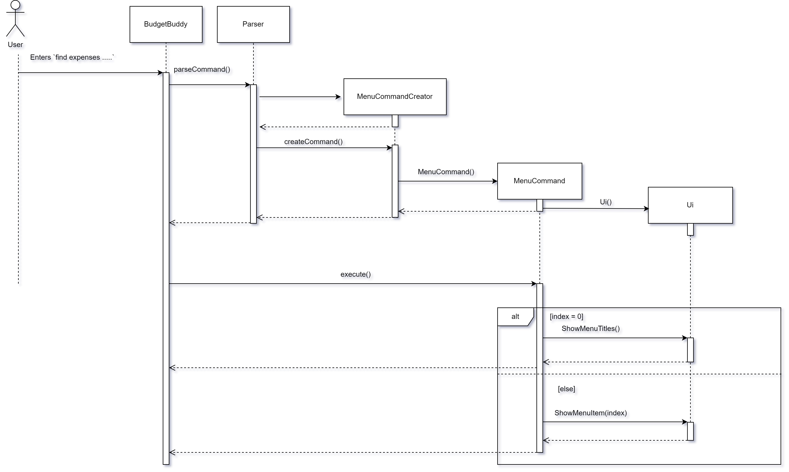
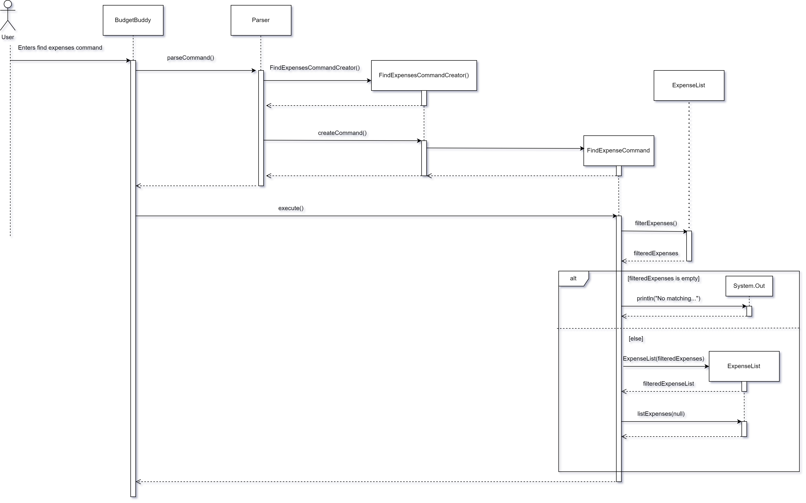

# Developer Guide

## Acknowledgements

{list here sources of all reused/adapted ideas, code, documentation, and third-party libraries -- include links to the original source as well}

## 1. Introduction
Welcome to the Developer Guide for BudgetBuddy! This guide has been created to help you current and future 
developers of Budget understand how BudgetBuddy works and aid developers in easily adding new features, 
fix bugs. In this guide, it will go over the main parts of the app, how they work together, 
and why we made them that way.

## 2. Setup Guide
This section describes how to set up the coding environment, along with the tools needed to work on BudgetBuddy

### 2.1. Prerequisites
1. JDK 11
2. IntelliJ IDEA

## 3.Design

### 3.1 Architecture
The following diagram provides a rough overview of how BudgetBuddy is built

`BudgetBuddy` is the main class of the application and directly interacts with the user, passing along the input
into the Parser. The `Parser` creates a `CommandCreator` object depending on the user's input. The `CommandCreator`
object then creates the `Command` object. This `Command` will be executed in `BudgetBuddy`. The `Command` object 
utilizes methods and the class present in the `Application Classes`, which will be explained in more 
detail in the following sections.

#### 3.2 Parser Class
The main functionality of the Parser Class is to determine the type of `CommandCreator` object to initialize, and
return the created `Command` object created by the `CommandCreator` back to `BudgetBuddy`

#### 3.3 Ui Class
The Ui Class is used to print certain elements to the CLI. In particular, it consists of the Welcome Message,
Goodbye Message, Divider Lines and all the corresponding commands' command format.

#### 3.5 CommandCreator Class
The CommandCreator class contains multiple subclasses, which corresponding to a specific function of the application.
Within the CommandCreator classes, it handles making sense of the user input, obtaining the relevant parameters to be
used in the created `Command` class.

#### 3.4 Command Class
The Command class, similar to the CommandCreator class, contains multiple subclasses, all corresponding to a specific
function of the application. In this case, each CommandCreator class would be associated to their relevant Commands.
Here is a table of all CommandCreator class and the Commands that they can create.

"Insert Table Here"

#### 3.5 Storage Class
The Storage Class handles the loading and saving of the Expenses and Savings in BudgetBuddy.

### 3.6 Application Classes
The classes present in this group of `Application Classes` refers to certain elements which serves a purpose more
towards the `user` instead of application itself. They represent data of the user's financial transactions,
including expenses and savings, along with mechanisms for organizing and managing this data in meaningful ways.

##### 3.6.1 Transaction
This is an abstract class, which is the superclass for both the Expense and Saving Classes. It contains common variables
such as Currency, Category and Amount.

##### 3.6.2 Expense
This class holds details regarding an expense a user has. Within this class, it has 4 class-level variables :
`String category`, `LocalDate dateAdded` , `String description` and `Double amount`. The variables and their relevance
are as follows : 

##### 3.6.3 ExpenseList
This class represents a list of expenses. Within this class, it has 2 class-level variables :
`ArrayList<Expense> expenses` and `ArrayList<String> categories`, The variables and there relevance are as follows :

This class also contains the methods to handle any user interactions with the list of expenses. The methods and a
brief explanation on their functionality is as follows :

##### 3.6.4 Saving
This class holds details regarding a saving a user has. Within this class, it has 3 class-level variables :
`String category`, `LocalDate dateAdded`, `Double amount`. The variables and their relevance
are as follows :

##### 3.6.5 SavingList
This class represents a list of savings. Within this class, it has 2 class-level variables :
`ArrayList<Saving> expenses` and `ArrayList<String> categories`, The variables and there relevance are as follows :

This class also contains the methods to handle any user interactions with the list of savings. The methods and a
brief explanation on their functionality is as follows :

##### 3.6.6 RecurringExpenseList
Explain what it does

##### 3.6.7 RecurringExpensesList
Explain what it does

## 4. Implementation

### Edit Expense Feature
The Edit Expense feature allows users to edit their previously added expenses, specifically the `category`, `amount`, 
and `description`. This feature is managed by the `EditExpenseCommand` class, which is initialized by the 
`Parser` class. Within the `EditExpenseCommand` object, 5 variables would have been initialized in the `Parser` class:
an `ExpenseList` object, `category`, `index`, `amount` and `description`. The relevance of these Class Attributes in 
`EditExpenseCommand` is as follows:

| Class Attribute | Variable Type | Relevance                                                             |
|-----------------|---------------|-----------------------------------------------------------------------|
| expenses        | ExpenseList   | ExpenseList Object containing the list of expenses that can be edited |
| category        | String        | The edited category for the expense in the specified index            |
| index           | Integer       | The index of the expense to be edited from `ExpenseList`              |
| amount          | Double        | The edited amount the expense in the specified index should be        |
| description     | String        | The edited description for the expense in the specified index         |

When the `execute()` method in `BudgetBuddy` is called via `command.execute()`, the `EditExpenseCommand` Object, 
utilizes the following method from the `ExpenseList` class to edit the expense.

| Method        | Return Type | Relevance                                                                                 |
|---------------|-------------|-------------------------------------------------------------------------------------------|
| editExpense() | void        | Edits the `category`, `amount` and `description` for the expense in the specified `index` |

The following UML Sequence diagram below shows how the Edit Expense Feature Command is executed when a user
inputs a valid edit expense command:

The following is a step by step explanation of the processes that occur for an example input:
`edit expense c/Transport i/2 a/40 d/GRAB`

1. The BudgetBuddy application receives the input string `edit expense c/Transport i/2 a/40 d/GRAB` and uses 
the `Parser` to interpret it.
2. The `Parser` splits the input into parts and constructs a `EditExpenseCommand` Object with the category 
(`c/Transport`), index (`i/2`), 
amount (`a/40`), and description (`d/GRAB`).
3. `Parser` returns this called `EditExpenseCommand` Object to `BudgetBuddy`.
4. The `BudgetBuddy` application calls `execute()` on the `EditExpenseCommand` object.
5. The `EditExpenseCommand` object calls `editExpense` on the `ExpenseList` with the provided parameters. 
6. The `ExpenseList` looks up the second expense in its list 
(as lists are zero-indexed, it uses index - 1 to access the correct item), and updates this expense’s 
category to "Transport," amount to 40.0, and description to "GRAB."
7. A message "Expense edited successfully." is printed to the console.

### Listing feature (List Savings)
The Listing Savings Feature enables users to view their savings, potentially filtered by a specific category. This functionality is orchestrated by the `ListSavingsCommand` class, which is initialized by the `Parser` class. Within the `ListSavingsCommand` object, the `Parser` provides it with an `SavingList` object, along with an optional `filterCategory`. The relevance of these class attributes in `ListSavingsCommand` is detailed in the following table:

| Class Attribute | Variable Type | Relevance                                                                           |
|-----------------|---------------|-------------------------------------------------------------------------------------|
| savings         | SavingList    | The `SavingLi st` object containing the list of savings to be displayed or filtered |
| filterCategory  | String        | The category to filter the savings by, if provided                                  |

When `BudgetBuddy` invokes the `execute()` method via `command.execute()`, the `ListSavingsCommand` object uses several methods from the `SavingList` class to perform its tasks:

| Method                      | Return Type        | Relevance                                                      |
|-----------------------------|--------------------|----------------------------------------------------------------|
| getSavings()                | ArrayList<Sav ing> | Retrieves the list of all savings from the `SavingList`        |
| findTotalSavings()          | void               | Calculates the  total amount of savings stored in `SavingList` |
| listSavings()               | void               | Prints the savings, filtered by `filterCategory`, to the CLI   |
| calculateRemainingSavings() | double             | Calculates the remaining amount after deducting total expenses |

The Listing Savings feature follows these steps when a user inputs a command to list savings:
1. The user inputs `list savings [optional: filterCategory]`. This input is processed by the `Parser` class in `BudgetBuddy`, which creates a `ListSavingsCommand` object with `savings` set to the current `SavingList` and `filterCategory` to the user-specified category, if any.
2. The `Parser` returns this `ListSavingsCommand` object to `BudgetBuddy`, which calls `ListSavingsCommand.execute()`.
3. `execute()` calls `SavingList.listSavings(filterCategory)`, where the `filterCategory` is applied if provided.
4. Within `listSavings()`, the `findTotalSavings()` method is called first to calculate the initial total savings amount.
5. The `listSavings()` method continues by iterating through each `Saving` and printing those that match the `filterCategory` criteria.
6. After listing, the method calculates and displays the remaining savings by calling `calculateRemainingSavings(initialAmount, totalExpenses)`, accounting for any expenses deducted.
7. If the `filterCategory` is not provided, all savings are printed, and the total initial amount and remaining savings after expenses are displayed.

#### Sequence Diagram
The UML Sequence diagram for the Listing Savings feature would illustrate the interactions between the `User`, `BudgetBuddy`, `Parser`, `ListSavingsCommand`, and `SavingList` classes, showing the method calls and returns between these objects to complete the operation.

### Listing feature (List Expenses)
The Listing Expenses Feature enables users to view their recorded expenses, optionally filtered by a category. This functionality is coordinated by the `ListExpensesCommand` class, which is instantiated by the `Parser` class with an `ExpenseList` object and an optional `filterCategory`. The roles of these attributes in `ListExpensesCommand` are:

| Class Attribute | Variable Type | Relevance                                                                         |
|-----------------|---------------|-----------------------------------------------------------------------------------|
| expenses        | ExpenseList   | Holds the list of expenses to be filtered and listed                              |
| filterCategory  | String        | The category to filter the expenses by (null if no filtering is needed)           |

Upon invocation of the `execute()` method by `BudgetBuddy` via `command.execute()`, the `ListExpensesCommand` object leverages methods from the `ExpenseList` class to display the filtered list of expenses:

| Method         | Return Type | Relevance                                                               |
|----------------|-------------|-------------------------------------------------------------------------|
| listExpenses() | void        | Prints the expenses, filtered by `filterCategory`, to the command line  |

Here's an overview of the process flow when a user employs the Listing Expenses feature:
1. The user inputs `list expenses [category]`. This input is processed by the `Parser` class in `BudgetBuddy`, creating a `ListExpensesCommand` object with the `expenses` set to the current overall `ExpenseList`, and the `filterCategory` set to the user-specified category (or null if not specified).
2. `Parser` returns this `ListExpensesCommand` object to `BudgetBuddy`, which then invokes `ListExpensesCommand.execute()`.
3. The `execute()` method calls `ExpenseList.listExpenses(filterCategory)`.
4. The `listExpenses()` method in `ExpenseList` then iterates over the expenses, applying the category filter if one is provided, and prints each qualifying expense.
5. It concludes by printing the total amount of listed expenses.

#### Sequence Diagram
The sequence diagram for the Listing Expenses feature would illustrate the above steps, showing the interactions between the `User`, `BudgetBuddy`, `Parser`, `ListExpensesCommand`, and `ExpenseList` classes.

### Currency Converter feature
The Currency Converter Feature allows users to convert the currency of expenses and savings. This feature is facilitated by the `ChangeCurrencyCommand` class, initialized by the `Parser` class with `CurrencyConverter`, `ExpenseList`, and `SavingList` objects, alongside the `newCurrency` to convert to. The importance of these class attributes is as follows:

| Class Attribute   | Variable Type     | Relevance                                                   |
|-------------------|-------------------|-------------------------------------------------------------|
| currencyConverter | CurrencyConverter | The object responsible for currency conversion calculations |
| expenseList       | ExpenseList       | Contains the expenses whose currency will be converted      |
| savingList        | SavingList        | Contains the savings whose currency will be converted       |
| newCurrency       | Currency          | The new currency to which the amounts will be converted     |

When `BudgetBuddy` calls `command.execute()`, `ChangeCurrencyCommand` employs the following methods from `CurrencyConverter` to convert the currency of all financial records:

| Method             | Return Type | Relevance                                                                         |
|--------------------|-------------|-----------------------------------------------------------------------------------|
| convertCurrency()  | void        | Converts the currency of each `Expense` and `Saving` object to `newCurrency`      |

Here's the step-by-step process when the user uses the Currency Converter feature:
1. The user inputs `change currency [newCurrencyCode]`. `Parser` processes this input and constructs a `ChangeCurrencyCommand` object with the necessary attributes.
2. The `ChangeCurrencyCommand` object is returned to `BudgetBuddy`, which calls `ChangeCurrencyCommand.execute()`.
3. `execute()` invokes `CurrencyConverter.convertCurrency(newCurrency, expenseList)` and `CurrencyConverter.convertCurrency(newCurrency, savingList)`.
4. Within each `convertCurrency` call, the amounts of `Expense` or `Saving` objects are converted to the `newCurrency` using the `convertAmount` method.
5. The `setAmount` and `setCurrency` methods of `ExpenseList` and `SavingList` are used to update the amounts and currency codes.
6. The updated financial records are now in the new currency.

#### Sequence Diagram

### Menu Feature
  
The menu feature is designed to allow users to view the relevant command formats by inputting the relevant menu
indexes. This feature is orchestrated by the `MenuCommand` class, which is initialized by the `MenuCommandCreator` 
class. Which is in turn, created by the `Parser` class. Within the `MenuCommand` object, the 
`MenuCommandCreator` would initialize one class-level variable `index` of type `String`. The relevance of
this class-level variable in `MenuCommand` is as follows

| Variable Name | Variable Type | Relevance                                              |
|---------------|---------------|--------------------------------------------------------|
| index         | int           | Refers to the corresponding item in the displayed menu |

For Clarity, the menu items and their corresponding indexes are as follows :

| index | Menu Item               |
|-------|-------------------------|
| Empty | Displays all Menu Items |
| 1     | Manage Expenses         |
| 2     | Manage Savings          |
| 3     | View Expenses           |
| 4     | View Savings            |
| 5     | Find Expenses           |

Upon the call of the `execute()` method in BudgetBuddy using `command.execute()`, the `MenuCommand` object
utilizes methods from the `UI` class to display the relevant menu items. The utilized methods are as follows :

| methodName          | Return Type | Relevance                           |
|---------------------|-------------|-------------------------------------|
| showMenuTitles()    | void        | Prints all Menu Items               |
| showMenuItem(INDEX) | void        | Prints commands associated at INDEX |

The following UML Sequence Diagram shows how the MenuCommandCreator for Menu Commands work, NOTING that the Parser
has already detected that the user input is a menu command and has initialized a MenuCommandCreator object:

The following UML Sequence Diagram shows how the overall Menu feature works :

Given below is an example usage scenario and how the full Menu feature works :
1. The user types `menu 1`. This input passed from `BudgetBuddy` into `Parser#parseCommands()`.
2. Within the `Parser` , it determines that the input is a menu command from `isMenuCommand()`, and creates a new
`MenuCommandCreator` object.
3. The `Parser` then calls `MenuCommandCreator#createCommand()`
4. The checks for whether the input is valid, in particular whether it is a valid integer, 
along with obtaining the value of `index` is done in `MenuCommandCreator#handleMenuCommand`
5. `MenuCommandCreator` creates a constructor for `MenuCommand` with the parameter `1`, which in turn 
also constructs a new `Ui` object
6. `MenuCommandCreator` returns this created `MenuCommand` to `Parser`, which is then returned to `BudgetBuddy`
7. `BudgetBuddy` then calls `MenuCommand#execute()`
8. `execute()` then calls `Ui#showMenuItem(1)`
9. `showMenuItem()` in `Ui` then prints all commands for `case 1` which is for `Manage Expenses`

  
### Find Feature

The Find Feature allows users to search for expenses based on a specific criteria such as description, minimum amount
and maximum amount. This feature is orchestrated by the `FindExpensesCommand` class, which is created by the `FindExpensesCommandCreator`
, which is in turn created by the `Parser`. Within the `FindExpensesCommand` object, the `FindExpensesCommandCreator` 
would have initialized it with 4 variables, an `ExpenseList` object,  along with a `description`, `minAmount` , 
`maxAmount`. The relevance of these Class Attributes in `FindExpensesCommand` is as follows : 

| Class Attribute | Variable Type | Relevance                                                                 |
|-----------------|---------------|---------------------------------------------------------------------------|
| expenses        | ExpenseList   | ExpenseList Object containing the list of expenses which will be filtered |
| description     | String        | The description to match against expenses in `expenses`                   |
| minAmount       | Double        | The minimum amount matched expenses should be                             |
| maxAmount       | Double        | The **maximum** amount matched expenses should be                         |

Upon the call of the `execute()` method in `BudgetBuddy` using `command.execute()`,
the `FindExpensesCommand` Object, utilizes the following methods from the `ExpenseList` class in order to both 
obtain a new `ExpenseList` object containing the filtered expenses, along with printing them.

| Method           | Return Type        | Relevance                                                       |
|------------------|--------------------|-----------------------------------------------------------------|
| filterExpenses() | ArrayList<Expense> | Returns an ArrayList<Expense> containing all filtered expenses  |
| listExpenses()   | void               | Prints the filtered expenses obtained from `filterExpenses()`   |

The following UML Sequence diagram below shows how FindExpensesCommandCreator works to 
obtain the relevant inputs for the Find Feature, NOTING that the Parser has already determined the input to be a find :
expenses command, and has also created the FindExpensesCommandCreator.

The following is a step-by-step explanation for the processes that occur before the FindExpensesCommand is created :
1. `BudgetBuddy` calls `Parser#parseCommand(input)` with `input` being the entire user input.
E.g `find expenses d/bruno`
2. Within the `Parser`, it will have determined that the `input` is a Find Command from the `isFindCommand(input)`.
3. The `Parser` then creates a `FindExpensesCommandCreator` object, initializing it with the overall Expense List and
the provided user input
4. The `Parser` then calls `FindExpensesCommandCreator#createCommand()`.
5. `FindExpensesCommandCreator#createCommand()` then calls `FindExpensesCommandCreator#handleFindExpensesCommand()`
6. Within `handleFindExpensesCommand(input)`, the first check would be the check for the existence of any combination of 
`d/ , morethan/ and lessthan/`. If none of these combinations were found, it immediately returns `null`
7. This is then followed by a second check `checkForDuplicateParameters()`, which checks for duplicates of parameters
in the user input. It duplicates are found, similarly, it immediately returns `null`.
8. If the checks in `4.` and `5` is passed, Three variables would be initialized.

    * | Variable Name | Variable Type |                                                              
      |---------------|---------------|
      | description   | String        | 
      | minAmount     | Double        |
      | maxAmount     | Double        |
9. Depending on which parameters were present, the corresponding input would be extracted and placed into each variable
using the `FindExpensesCommandCreator#parse*()`, where `*` represents the variable name we wish to obtain.
10. Should the values of `minAmount` and `maxAmount` not be empty,  a check is done to ensure `minAmount` is less than
or equals to `maxAmount`. If this check does not pass, the function immediately returns `null`
11. Finally, `FindExpensesCommandCreator#handleFindExpensesCommand()` creates and returns a 
`FindExpensesCommand` containing the extracted description, minAmount and maxAmount
12. `FindExpensesCommandCreator#createCommand()`, which is returned to, `Parser#parseCommand()`
, which is then returned to `BudgetBuddy`

The following UML Sequence diagram below shows how the Find Feature command works when a user provides a **valid**
find expenses command:

The following is an example of the processes that occur when the user uses the find expenses feature:

**Important Note** : Although d/ , morethan/ and lessthan/ are optional parameters, the optional component would mean
user has left that option empty if not in use, e.t.c `find expenses d/ morethan/ lessthan/200`. Hence, 
unused parameters are treated a null variables instead.

1. The user types `find expenses d/bruno morethan/30 lessthan/200`. This input is passed through the `Parser`
class from `BudgetBuddy`, which constructs a `FindExpenseCommand` Object with `expenses : current overall ExpenseList`, 
`description : bruno`, `minAmount : 30`, `maxAmount : 200`.
2. `Parser` returns this created `FindExpenseCommand` Object to `BudgetBuddy` and `BudgetBuddy` calls 
`FindExpenseCommand#execute()`
3. `execute()` is called, which initializes a variable `filteredExpenses` of type `ArrayList<Expense>`.
4. `execute()`then calls `ExpenseList#filterexpenses`, which returns the filtered expenses based on the `description`,
`minAmount` and `maxAmount` into the `filteredExpenses` variable.
5.  If `filteredExpenses` is empty, "No Matching Expenses Found" is printed and `execute` ends here.
6. If `filteredExpenses` is not empty, `execute()` then initializes a new variable `filteredExpenseList` 
of type `ExpenseList` with `filteredExpenses` initialized as the `expenses` Class attribute.
7. Finally `execute()` calls `filteredExpenseList#listexpenses()` to print filtered expenses into the CLI.

## 5. Product scope

### Target user profile
This product is for users who can type fast, and wishes to handle and track their current and future
expenses on a singular platform.

### Value proposition
BudgetBuddy is faster and more efficient way to track and calculate current and future expenses if a user is able to
type fast. It also provides the ability to deal with finances on a singular platform.

## 6. User Stories

## User Stories

| Version | As a ...          | I want to ...                                             | So that I can ...                                                |
|---------|-------------------|-----------------------------------------------------------|------------------------------------------------------------------|
| v1.0    | user              | be able to view my expenses                               | track my prior expenditures and plan future expenses accordingly |
| v1.0    | user              | be able to view my savings                                | plan my budget accordingly                                       |
| v1.0    | user              | be able to view my expenses by  their relevant categories | control my spending                                              |
| v1.0    | user              | be able to identify my largest savings category           | allocate necessary saved funds                                   |
| v1.0    | user              | add expenses                                              | track my spending                                                |
| v1.0    | user              | Categorise my expenses                                    | manage my finances more efficiently                              |
| v1.0    | user              | Edit or delete expenses                                   | remove any incorrectly added items                               |
| v1.0    | user              | allocate saved funds                                      | know how much I will have left after expenses                    |
| v1.0    | User              | See what commands i can use                               | I know how to use the application                                |
| v2.0    | user              | Plan my budget                                            | Avoid overspending                                               |
| v2.0    | frequent traveler | log my expenses in multiple currencies                    | accurately track my expenses across different countries          |

## Non-Functional Requirements

{Give non-functional requirements}

## Glossary

* *glossary item* - Definition

## Instructions for manual testing

{Give instructions on how to do a manual product testing e.g., how to load sample data to be used for testing}

