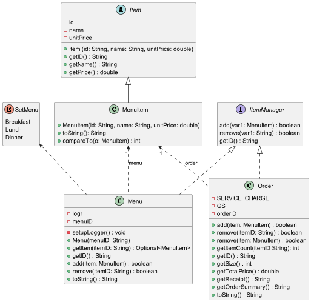

# Developer Guide

## Acknowledgements

{list here sources of all reused/adapted ideas, code, documentation, and third-party libraries -- include links to the original source as well}

## Design

### Architecture

The **Architecture diagram** given above shows the high-level design of the application.

Given below is a quick overview of main components and how they interact with each other.

**`Main`** is in charge of the app launch, shut down, and taking user input.

* At the app launch, it loads the data from the file system, and initializes other components.
* At the app shut down, it saves the data to the file system, and shuts down other components.

The app's work is done by the following components:

* [**`MainLogic`**](#sublogic-component): The main logic command executor.
* [**`SubLogic`**](#sublogic-component): The sub logics(i.e. **`MenuLogic`**, **`OrderLogic`**) command executor.
* [**`Parser`**](#parser-component): The parser that parses user input to command.
* [**`Model`**](#model-component): The data model that stores the data.
* [**`Command`**](#command-component): Represents a command that the user can execute.
* [**`Storage`**](#storage-component): Reads data from, and writes data.

**How the architecture components interact with each other**

The *Sequence Diagram* below shows how the components interact with each other for the scenario where the user issues 
the command `Create order -menu 01`, `add -item 001` and `complete`.

### Logic Component
The logic component consists of classes that handle the logic of the application. The logic component is divided into
`MainLogic` and `SubLogic` which consists of `OrderLogic` and `MenuLogic`.

* [**`MainLogic`**](#model-component): A class to handle the first level commands, and pass the user input to corresponding
classes for analysis and execution.
* [**`OrderLogic`**](#model-component) and [**`MenuLogic`**](#model-component): A class to handle the second level commands,
and pass the user input to corresponding classes for analysis and execution.

### Command Component
The command component consists of two different command interfaces: `MainCommand` and `OrderCommand`. The `MainCommand`
interface is for the various command classes that are used in the `MainLogic`, while the `OrderCommand` interface is for
command classes used in `OrderLogic`.  

A `Command` object will be created in either the `MainLogic` or `OrderLogic`
based on what command the user has inputted(e.g., `MainHelpCommand` object is created when the user inputs the `help`
command). The `execute()` method of the `Command` object is then called to execute the command, which may require
certain arguments based on the type of command.

### Model Component
The model consists of classes describing the objects used in this application.
The general structure is that menu and order are separate, but they both work with `menuItem(s)`, which 
represent food items on the menu.

* [**`ItemManager`**](#model-component): An interface containing methods representing operations common to **`Menu`** 
  and **`Order`**.   
* [**`Item`**](#model-component): An abstract class representing a food item. It should be implemented by **`MenuItem`**.
    
* [**`Menu`**](#model-component): A class representing the menu(s) of the restaurant, where each contains menuItem(s)
 that can be ordered. Multiple menus can exist and each has a unique ID.   
* [**`MenuItem`**](#model-component): A class inheriting item, and represents a food item on the menu.   
* [**`Order`**](#model-component): A class representing an order to be entered into the system to be kept track of. Each 
  order has a unique ID generated from the time of order.  
* [**`SetMenu`**](#model-component): An enumeration representing the different types of set menus available, examples of
  which includes *breakfast*, *lunch*, *dinner*.

The *Class Diagram* below shows how the model components interact with each other, including interactions such as 
dependencies, associations and inheritance.

## Implementation

### `MainLogic`
Generally, the main logic works as follows:
1. User enters an input which is received in the *ui* and parsed by the `Parser`.
2. The `Parser` classifies the command based on `CommandType`.
3. If it is a first level command, `execute` is called on the corresponding class.
4. If it is not a first level command, the command will be pass to `SubLogic` to handle.

**Create Order**  
`Mainlogic` takes user input and crate an `Order` class and pass it to `OrderLogic` to execute the command.

### `OrderLogic`
Generally, the order logic works as follows: 
1. User enters an input which is received in the *ui* and parsed by the `Parser`. 
2. The `Parser` classifies the command based on `CommandType`
3. Within `OrderLogic`, `execute` is called on the corresponding class
4. Control is passed to other sections of the code

**View Menu**  
Within the construct of the order logic, the menu can be accessed for viewing in order to select items from 
available menus. This is carried out with the `view menu` command.

**View Item**  
Within `OrderLogic`, a list containing all the items that have been added to the current active order can be viewed by executing
the `view item` command.

**Add**  
Inside `OrderLogic`, items from the menu can be added into the current active order.
This is carried out using the `add -item <item_id> -quantity <quantity_of_item>` command,
where `<item_id>` is an integer corresponding to the item's id in the menu,
and `<quantity_of_item>` is an integer of the amount of that item to be added.

**Delete**  
In `OrderLogic`, items from the current order can be removed via the
`delete -item <item_id> -quantity <quantity_of_item>` command. `<item_id>`
and `<quantity_of_item>` are the same type of parameters as the ones specified
in the `Add` command class.

**Complete**  
Inside `OrderLogic`, once the order is finished, it can be completed and closed
by executing the `complete` command. This marks the current order as completed
and the program returns back to `MainLogic` for subsequent command executions.

## Product scope
### Target user profile

{Describe the target user profile}

### Value proposition

{Describe the value proposition: what problem does it solve?}

## User Stories

|Version| As a ... | I want to ... | So that I can ...|
|--------|----------|---------------|------------------|
|v1.0|new user|see usage instructions|refer to them when I forget how to use the application|
|v2.0|user|find a to-do item by name|locate a to-do without having to go through the entire list|

## Non-Functional Requirements

{Give non-functional requirements}

## Glossary

* *glossary item* - Definition

## Instructions for manual testing

{Give instructions on how to do a manual product testing e.g., how to load sample data to be used for testing}
