---
layout: page
title: Developer Guide
---
* Table of Contents
  {:toc}

--------------------------------------------------------------------------------------------------------------------

## **Acknowledgements**

* The formatting for the developer guide is inspired by [AB-3](https://se-education.org/addressbook-level3/DeveloperGuide.html).

Third-party libraries:
* [OpenCSV](https://opencsv.sourceforge.net/) - This package is licensed under [Apache2](https://opencsv.sourceforge.net/licenses.html), which is a business-friendly open-source software license.

--------------------------------------------------------------------------------------------------------------------

## **Design**

:bulb: **Tip:** The `.puml` files used to create diagrams in this document `docs/diagrams` folder. Refer to the [_PlantUML Tutorial_ at se-edu/guides](https://se-education.org/guides/tutorials/plantUml.html) to learn how to create and edit diagrams.

### Architecture
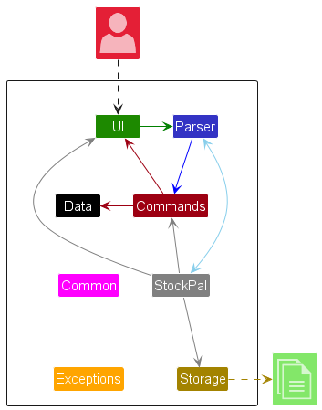

The ***Architecture Diagram*** given above explains the high-level design of the App.

Given below is a quick overview of main components and how they interact with each other.

**Main components of the architecture**

[**`StockPal`**](https://github.com/AY2324S2-CS2113T-T09-3/tp/blob/master/src/main/java/seedu/stockpal/StockPal.java) is in charge of the app launch and shut down.

The bulk of the app's work is done by the following five components:

* [**`UI`**](#ui-component): The UI of the App.
* [**`Parser`**](#parser-component): Parses user input into respective commands.
* [**`Commands`**](#commands-component): The command executor.
* [**`Data`**](#data-component): Holds the data of the App in memory.
* [**`Storage`**](#storage-component): Reads data from, and writes data to, the hard disk.

[**`Commons`**](#common-classes) represents a collection of classes used by multiple components above.
[**`Exceptions`**](#exceptions-classes) represents a collection of exceptions used by multiple components above.

**How the architecture components interact with each other**

The *Sequence Diagram* below shows how the components interact with each other for the scenario where the user issues the command `delete 1`.

The sections below give more details of each component.

### UI component
The **API** of this component is specified in [`Ui.java`](https://github.com/AY2324S2-CS2113T-T09-3/tp/tree/master/src/main/java/seedu/stockpal/ui/Ui.java)

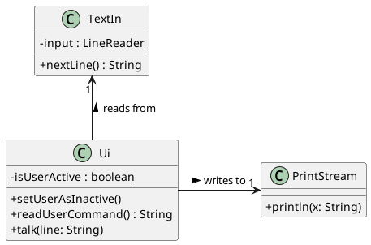

### Parser component

**API** : [`Parser.java`](https://github.com/AY2324S2-CS2113T-T09-3/tp/blob/master/src/main/java/seedu/stockpal/parser/Parser.java)

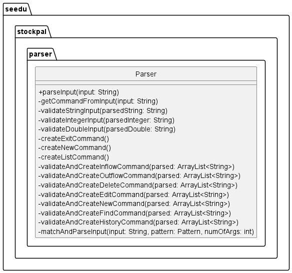

How the parsing works:
1. When user inputs, the input is passed to the `Parser`.
2. `Parser` first extracts the command.
3. Using the extracted command, `Parser` will perform different validation checks on the arguments supplied in the
input.
4. Arguments (mainly the `pid`, `name`, `quantity`, `price`, `description`, `amount` fields) are validated. 
Exceptions are thrown when the fields do not pass their respective type checks.
5. Once validation passes, `Parser` uses the validated arguments to creates an instance of that particular command. 
For example, a `delete` command will cause `Parser` to create a new instance of `DeleteCommand(pid)`.
6. The created command object is returned back to `main` function for further processing.

### Commands component

**API** : [`Command.java`](https://github.com/AY2324S2-CS2113T-T09-3/tp/blob/master/src/main/java/seedu/stockpal/commands/Command.java)

### Data component

**API** : [`Data`](https://github.com/AY2324S2-CS2113T-T09-3/tp/blob/master/src/main/java/seedu/stockpal/data)

The following is a class diagram of the `data` component.
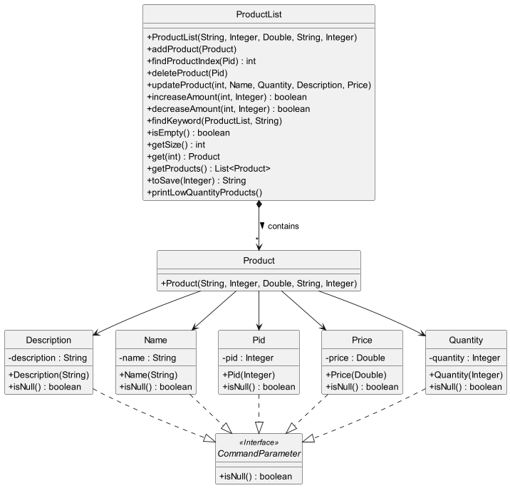

### Storage component

**API** : [`Storage.java`](https://github.com/AY2324S2-CS2113T-T09-3/tp/blob/master/src/main/java/seedu/stockpal/storage/Storage.java)

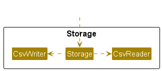

The `Storage` component,
* can save product list data in CSV format, and load them back into corresponding Products.
* depends on the `StockPal` component (because the `Storage` component's job is to save/load objects that belong to `StockPal`)
* consists of the classes `Storage`, `CsvWriter` and `CsvReader`.
  * `Storage` defines methods that loads and saves data.
  * `CsvWriter` is responsible for handling the writing of data to the CSV data file.
  * `CsvReader` is responsible for handling the reading of data from the CSV data file.

### Common classes

Classes used by multiple components are in the `seedu.stockpal.common` package.

### Exception classes

Exceptions classes used by multiple components are in the `seedu.stockpal.exceptions` package.

--------------------------------------------------------------------------------------------------------------------

## **Implementation**

This section describes some noteworthy details on how certain features are implemented.

### Add new product feature
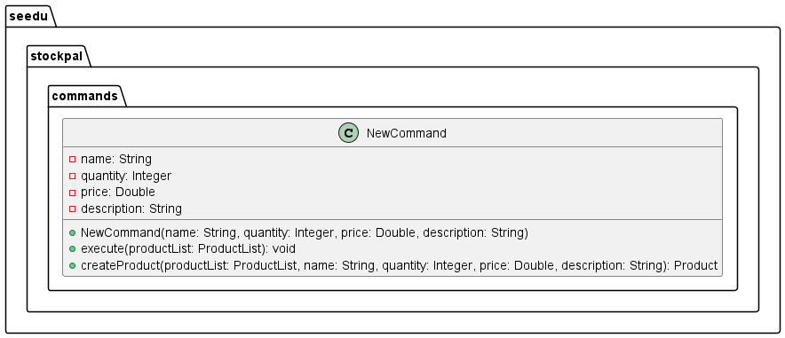

The NewCommand class is responsible for adding a new product to the inventory in the StockPal application.

**Attributes**
* name: The name of the product.
* quantity: The initial quantity of the product.
* price: The price of the product.
* description: The description of the product.

**Methods**
* `NewCommand`: Constructor for creating a new instance of the NewCommand class.
* `execute`: Method to add the new product to the product list.
* `createProduct`: Method to create a new product with a unique product ID.

The following sequence diagram shows how an add operation works:
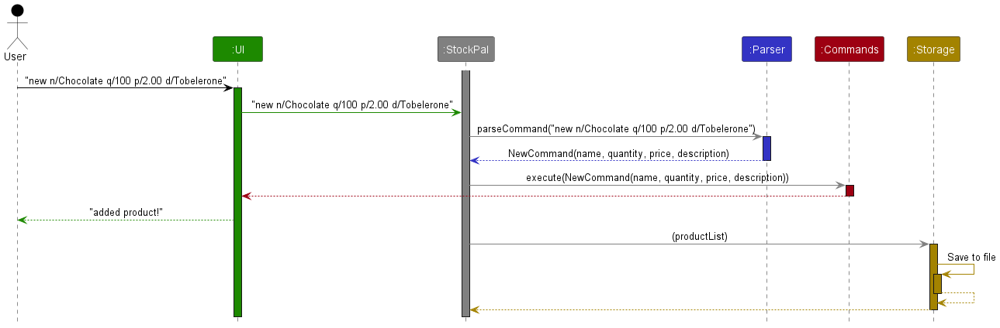

### Edit product feature
#### Implementation
The edit product feature is facilitated by `EditCommand` which extends `Command`.

Given below is an example usage scenario and how the edit product mechanism behaves.

Step 1. The user launches the application for the first time. There are no products in the product list.

Step 2. The user executes `add n/Highlihgter q/100 p/2.00 d/Neon highlighter` to add a product to product list.

Step 3. The user realises that he made mistakes in the product name and price. The user executes
`find Highlihgter` to obtain the `PID` of the product. The `PID` is `1`.

Step 4. The user executes `edit 1 n/Highlighter p/1.00` to edit the product name and price. The product name is 
successfully updated from `Highlihgter` to `Highlighter`. The price is successfully updated from `2.00` to `1.00`.

The following sequence diagram summarizes what happens when a user inputs a valid `edit` command.
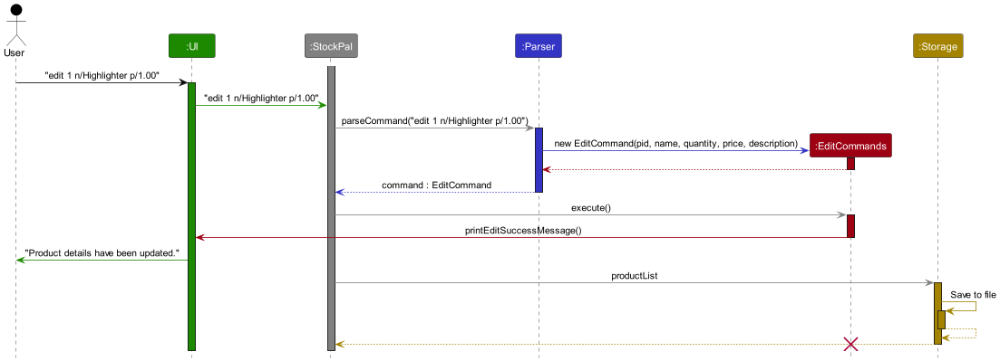

> INFO:
> The lifeline for EditCommand should end at the destroy marker (X) but due to a limitation of PlantUML, 
> the lifeline reaches the end of diagram.

**Aspect: Validating parameters and handling errors**

- Alternative 1 (current choice): Check parameters and handle errors within EditCommand.
  - Pros: Easy to implement
  - Cons: -
  
- Alternative 2: Handle validation of errors within to productList#updateProduct().
    - Pros: Implementing EditCommand#execute() will be very simple. Usage of throw/catch to handle errors.
    - Cons: productList#updateProduct() will be more lengthy. May require further abstraction.

### List feature
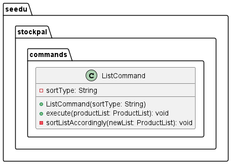

The ListCommand class is responsible for sorting and printing out the products in the list. 

**Attributes**
* sortType: Additional optional flags the user can set to sort the products in the list.

**Methods**
* `ListCommand`: Constructor for creating a new instance of the ListCommand class.
* `execute`: Method to list out the products in the product list.
* `sortListAccordingly`: Method to sort the list according to the products' PID, products' name or products' quantity.

The following sequence diagram shows how a list operation works, by calling `list`.
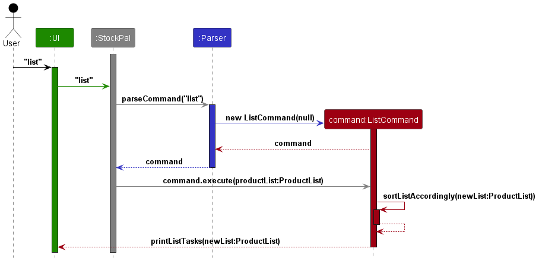

### InflowCommand Feature

**API** : [`InflowCommand.java`](https://github.com/AY2324S2-CS2113T-T09-3/tp/blob/master/src/main/java/seedu/stockpal/commands/InflowCommand.java)

The `InflowCommand` class is used to increase the quantity of a specific product in the inventory.
This could represent scenarios like receiving new stock and updating inventory with new quantities.

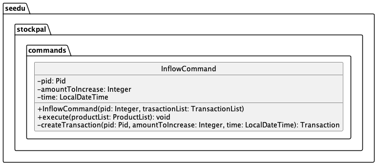

**Implementation of InflowCommand**

The InflowCommand class is called in this format: `InflowCommand(pid, amountToIncrease)`
When the InflowCommand is called, a new instance of the InflowCommand initialised with pid and
amountToIncrease would be created.

The execute method will call `increaseAmount` which is a method of the ProductList class.
In the ProductList class, the `increaseAmount` method will call a `updatedIncreaseQuantity`
method in the quantity class.

It is implemented this way to adhere to Single Responsibility Principle (SRP), such that the
ProductList class will only handle the product involved in quantity increase, whereas the
Quantity class will be responsible for updating the quantities.

**Attributes**
* pid: The unique Product ID for each product
* quantity: The amount of quantity to increase product by

**Methods**
* `InflowCommand`: Constructor for creating a new instance of the InflowCommand class.
* `execute`: Method to increase quantity of the specified product.
  * `execute` calls `increaseAmount` in the ProductList class.
  * `increaseAmount` will call `updateIncreaseQuantity` in the Quantity class.

The following sequence diagram shows how the InflowCommand works.
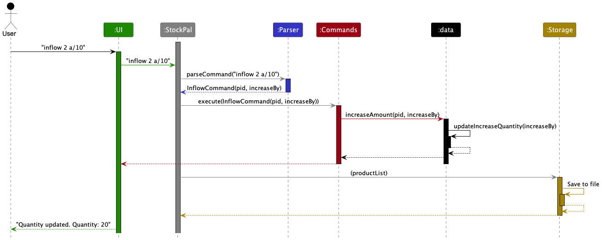

### OutflowCommand Feature

**API** : [`OutflowCommand.java`](https://github.com/AY2324S2-CS2113T-T09-3/tp/blob/master/src/main/java/seedu/stockpal/commands/OutflowCommand.java)

The `OutflowCommand` class is used to decrease the quantity of a specific product in the inventory.
This could represent scenarios like selling products and updating inventory with new updated quantities.

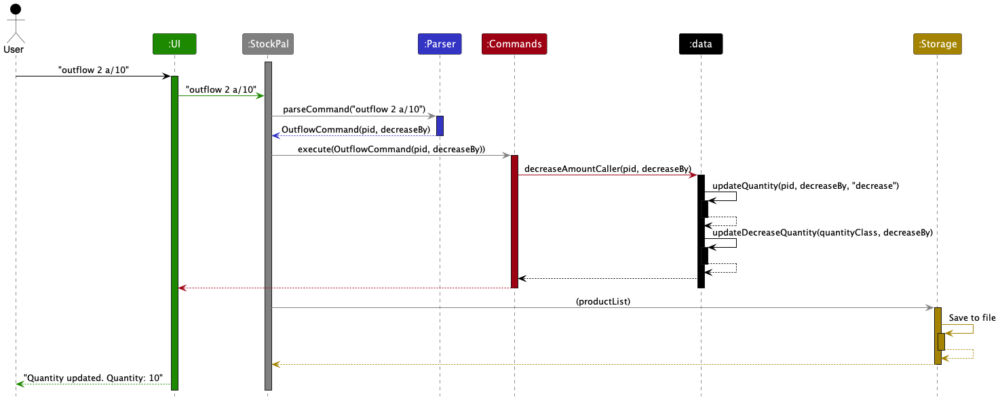

**Implementation of OutflowCommand**

The OutflowCommand class is called in this format: `OutflowCommand(pid, amountToDecrease)`
When the OutflowCommand is called, similar to the InflowCommand class, a new instance of the
OutflowCommand initialised with pid and amountToDecrease would be created.

The execute method will call `decreaseAmount` which is a method of the ProductList class.
In the ProductList class, the `decreaseAmount` method will call a `updatedDecreaseQuantity`
method in the quantity class.

It is implemented this way to adhere to Single Responsibility Principle (SRP), such that the
ProductList class will only handle the product involved in quantity increase, whereas the
Quantity class will be responsible for updating the quantities.

**Attributes**
* pid: The unique Product ID for each product
* quantity: The amount of quantity to decrease product by

**Methods**
* `OutflowCommand`: Constructor for creating a new instance of the InflowCommand class.
* `execute`: Method to increase quantity of the specified product.
  * `execute` calls `decreaseAmount` in the ProductList class.
  * `decreaseAmount` in ProductList class will call `updateDecreaseQuantity` in the Quantity class.

The following sequence diagram shows how the OutflowCommand works.

### Delete product feature

#### Implementation
The delete function is mainly facilitated by `DeleteCommand`. It extends from `Command`.

**Attributes**
`pid` The unique Product ID for the product to be deleted from the StockPal inventory `productList`

**Methods**
* `DeleteCommand`: Constructor for creating a new instance of the DeleteCommand class.
* `execute`: Method to delete `product` with PID `pid` from StockPal's `productList`.
* `ProductList#deleteProduct`: Method called by `execute` to delete product in `productList`.

Given below is an example usage scenario and how the delete function behaves at each step. The scenario assumes that the
user has a `product` with `pid` of 2 in `StockPal`'s `productList`.

Step 1. The user executes `delete 2` command to delete a specific `product` with `pid` of 2.
Step 2. The product is successfully deleted from the inventory list.

The following sequence diagram summarizes what happens when a user inputs a valid `delete` command.

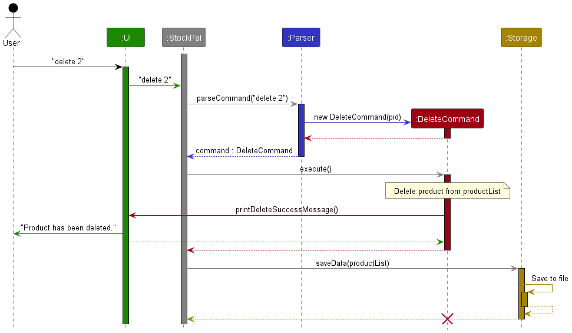

 --------------------------------------------------------------------------------------------------------------------

## **Appendix: Requirements**

### Product scope

**Target user profile**:
* Small business owners who are looking to keep track of their inventory using CLI
* Possibly established companies looking to expand our application
  **Target user profile**:

**Value proposition**:  
Traditional inventory management methods often involve manual data entry, spreadsheets, and paper-based
tracking systems. These processes are time-consuming, error-prone, and lack real-time visibility into
inventory status. StockPal allows users to quickly update, track, and monitor inventory data through
intuitive command-line commands, saving time and improving efficiency.

## User Stories

| Version | As a ... | I want to ...                                            | So that I can ...                                                                                          |
|---------|----------|----------------------------------------------------------|------------------------------------------------------------------------------------------------------------|
| v1.0    | new user | see usage instructions                                   | refer to them when I forget how to use the application                                                     |
| v1.0    | user     | I want to be able to edit details of the products easily | so that I can easily change the name / price / quantity /description of the products, if there is an error |
| v1.0    | user     | I want to have a small manual page                       | so that I am aware of the commands that I can enter                                                        |
| v2.0    | user     | find a to-do item by name                                | locate a to-do without having to go through the entire list                                                |

## Non-Functional Requirements

* Any mainstream OS with Java `11` installed

## Glossary

* *PID (Product ID)* - A unique number assigned to each product for identification purposes.
* Mainstream OS: Windows, Linux, Unix, MacOS

--------------------------------------------------------------------------------------------------------------------

## **Appendix: Instructions for manual testing**

### Editing Product Details
1. Prerequisites: List all products using `list` command. There should be at least multiple products in the list.

2. Test case: `edit 1 n/Updated name d/Updated description`  
   Expected: The name and description of the product with Product ID (PID) 1 
   will be changed to `Updated name` and `Updated description` respectively.

3. Test case: `edit 1 q/100 p/0.99` 
   Expected: The quantity and price of the product with Product ID (PID) 1
   will be changed to `100` and `0.99` respectively.

### Deleting a product
1. Prerequisites: List all products using `list` command. There should be a particular product with `pid` of 1 and no 
product with `pid` of 2.

2. Test case 1: `delete 1`. 
   Expected: `product` with `pid` of 1 is deleted from the list. `"Product has been deleted"` is printed to the user.

   Test case 2: `delete 2`.
   Expected: `"Product with pid: 2 not found"`