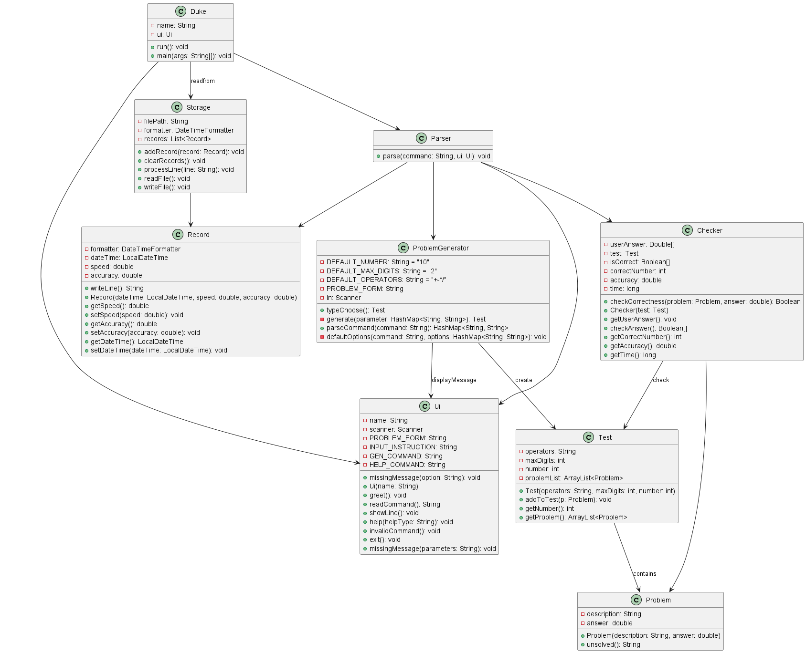

# Developer Guide

## Acknowledgements

{list here sources of all reused/adapted ideas, code, documentation, and third-party libraries -- include links to the original source as well}

## Design & implementation

the overall UML diagram looks like this


### problemGenerator Component
the main idea in the design of problemGenerator is that it take 3 parameters and generate a test which include some number of problems


when the gengerator is triggered, users enter a command like this:

    generate -t [operators] -n [number] -d [maximum digit]
for example , user can enter:

    generate -t +-*/ -n 10 -d 2

in which case the parseCommand() will take the command and pass the parameters to generete().

generate() function will choose two random number with max digits of 2, take a random operation from the operation set of  $+,-,*,/$ to form a single problem ,and loop the execution for 10 times to form a test

if user missed some parameters ,defaultOptions() function will use pre-set default options and invoke UI to print a message for every missing parameter


### Checker Component  
**API：`Checker.java`**   
**How the `Checker` work:**  
1. Every `Checker` was created with a `Test` class.   
2. The `Checker` will ask user's input and compare the answer up to 2 decimal tolerance.   
3. If the user input is not a number, the answer will automatically viewed as a incorrect answer.   
4. The accuracy and the user's answers will be stored for UI or other class to access with the specific function.   
5. The checker will also store the times that user use to caculate for the problemset.  
    
**`Psedue code` for reference:**  
```
# the brief psedue code for how to check the answer

correct = 0
isCorrect = []
for problem in problem set: 
    UI.PrintProblem
    answer <- user_input
    if answer - problem.answer < 0.01
        correct <- correct+1
        isCorrect.append("1")
    else
        isCorrect.append("0")
        continue

```
**next to be added for `Checker.java`:**  
1. Support check on more types of problems (i.e Quadratic equation of one variable)   
2. Give some explanation of the math problems.   
   
* To be added

### Record Component - Design

API: 

The Record component:

- a snapshot of a completed problem sets, including the individual problems, the date it was solved, the time taken to solve the problem set, and the accuracy of the attempt.
- \[Proposed\] records the specifics of each problem, including whether the answer is correct or not, for organized or filtered viewing of past records.

### Record Component - Implementation

- \[Proposed\] Store in each Record object a referential Test object for storing specifics of the attempted Problem Set.

### Storage Component - Design

API: 

The Storage Component:

- Read / Write to external file at appropriate runtime to enable data persistence throughout multiple usages of the software.
- a unique and strict format for external file formatting for proper loading data as well as input file corruption detection.
- \[Proposed\] incorporate the UI, Parser component for proper user feedback regarding the save/load process

### Storage Component - Implementation

- Uses a list of Record objects to store all past attempts
- \[Proposed\] Use a hashing method to write / read properly all information of test object

### Testcase Component
   # Proposed Implementation
     The proposed test mechanism is facilitated by ProblemGeneratorTest, CheckerTest. It check the correctness of the generated problemsets' types,
    number of questions and max digits, by comparing the generated output to the user input.

ProblemGeneratorTest#operatorTest() — Test if the input operator type is align with the generated one.
ProblemGeneratorTest#numberTest() — Test if the input number of questions is align with the generated number of questions.
ProblemGeneratorTest#digitTest() — Test if the input max digits is align with the generated one.
ProblemGeneratorTest#parseCommand() — parse the input command to fit in the program.
ProblemGeneratorTest#parseNumber() — parse out the operands from a given problem.

Given below is an example usage scenario and how the test behaves.

    Step 1. The user launch the ProblemGeneratorTest and run the operator testcase. The ProblemGeneratorTest#operatorTest() will loop through all the 
    commands in the data member "commands" and allocate each commands to its corresponding test case. During this process, a ProblemGenerator pb is 
    generated, and the problem sets it generates by calling ProblemGenerator#typeChoose will be store in variable #test#, then the problem set will be
    extracted using Test#getProblem(). After that, for every problem in the generated problem set, the assertTrue will check if the type of these problem 
    matches with the user input type. If all of them matches, it will successfully output the generated dataset, else, it will output the problem with 
    incorrect format.

    Step 2. The user launch the ProblemGeneratorTest and run the number testcase. The ProblemGeneratorTest#numberTest() will loop through all the commands
    in the data member #commands# and call ProblemGeneratorTest#parseCommand to parse the input command to get a hashmap with the input type, number and digits
    information. Then generate a new ProblemGenerator and use ProblemGenerator#typeChoose to collect the generated problem, then use assertEquals to compare 
    the user input number with the generated number of questions.
    
    Step 3. The user launch the ProblemGeneratorTest and run the digit testcase. The ProblemGeneratorTest#digitTest() will loop through all the commands
    in the data member #commands# and call ProblemGeneratorTest#parseCommand to parse the input command to get a hashmap with the input type, number and digits
    information. Then generate a new ProblemGenerator and use ProblemGenerator#typeChoose to collect the generated problem,then for every problem, call 
    ProblemGeneratorTest#parseNumbers to extract the digits in the problem, then use assertTrue to verify if the input max digit is greater or equal to the digits
    of every operands in the generated problems.


## Product scope
### Target user profile

* The student who wish to practise their mathematical problem solving ability.  
* The teachers who wish to provide students with some math problems and check their performance.  

### Value proposition

The product automates the generation of mathematical problems and their corresponding answers, thereby reducing the effort required by students to find practice problems.

## User Stories

|Version| As a ... | I want to ... | So that I can ...|
|--------|----------|---------------|------------------|
|v1.0|student who just started learning quadratic equations|use MathGenius to specifically generate problem sets|gain specialized practice on this topic|
|v1.0|a student who’s unfamiliar with mathematics terms|watch explanations and introductions to unfamiliar terms|strengthen understanding|
|v1.0|primary school teacher|wcreate course or topic-specific arithmetic questions for students|teaching student more effortlessly|
|v2.0|student who want to pracise solving foumula|generate various kinds of formula|practise the ability of solving math formula|

## Non-Functional Requirements
1. Should work on any mainstream OS as long as it has Java 11 or above installed.  
2. A user with above average typing speed for regular English text (i.e. not code, not system admin commands) should be able to accomplish most of the tasks faster using commands than using the mouse.   
    
**{More to be add}**

## Glossary

* Mainstream OS: Windows, Linux, Unix, MacOS  
* Private contact detail: A contact detail that is not meant to be shared with others  

## Instructions for manual testing

## Launch and Shutdown
   1. initial launch:
      1. Download the jar file and copy into an empty folder
      2. run the jar file use command '_java -jar tp.main.jar_'
   2. Saving window preferences

      1. Resize the window to an optimum size. Move the window to a different location. Close the window.

      2. Re-launch the app by double-clicking the jar file.
         Expected: The most recent window size and location is retained.
   3. Shutdown
      1. input command '_exit_' in the terminal after launch the program.
## Generate ProblemSet
   1. generate expected problem set by input its type('+ or - or * or /'), number of problems(integer) and
      the maximum digits.
      1. the example input: 'generate -t + -n 2 -d 3', which means generate a problem set, who has 2 problems,
         all of their operator is '+', and the maximum digit of their operands is 3 digits.
      2. input the answer: after all problems are generated, every problem will show on the terminal again,
         user can type his answer on the blank. Then the next problem will show as follows. After user type in
         all the answers, the accuracy of his performance and his speed will be shown as follows, e.g. 
        'Acc: 0.0
         Spend Time: 121s' .
   2. after shut down the program, user can view his performance report in a .txt file called 'recordList.txt' 
      with the complete date and accuracy inside.

