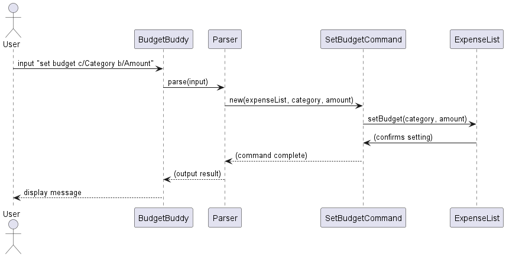
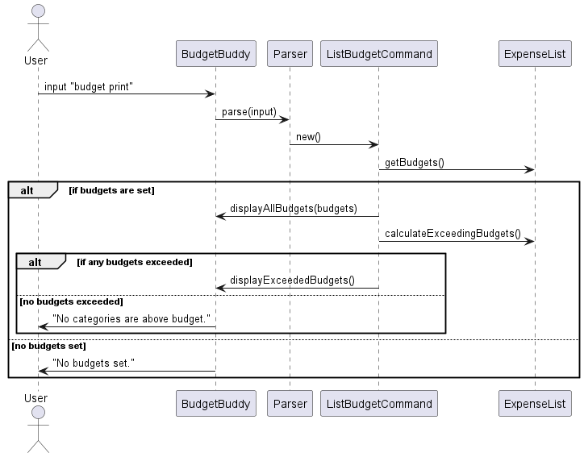
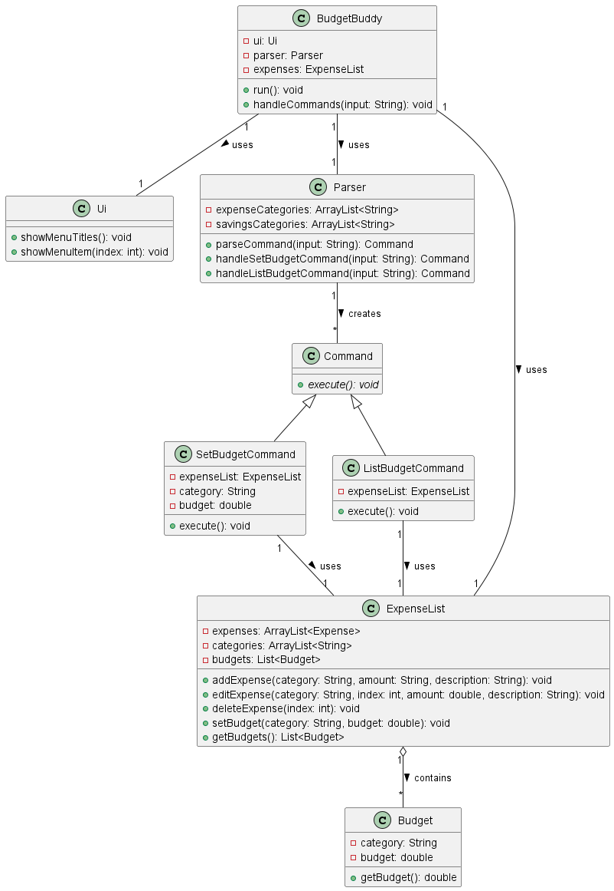
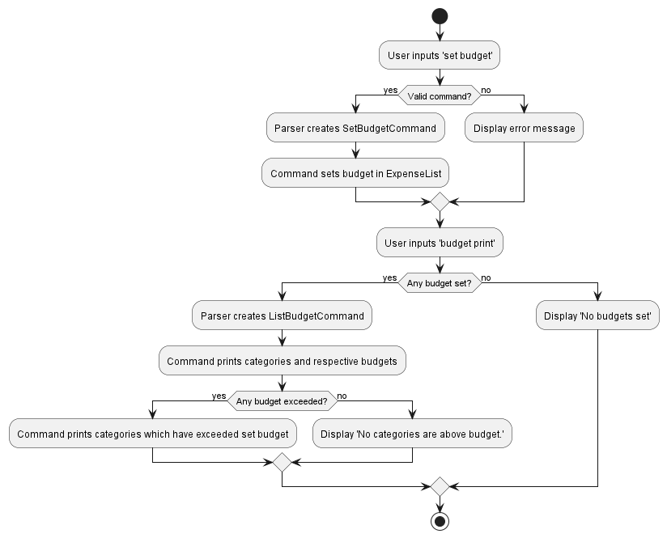

# Developer Guide

## Acknowledgements

{list here sources of all reused/adapted ideas, code, documentation, and third-party libraries -- include links to the original source as well}

## Design & implementation

### Budget Management

#### Implementation
The Budget Management feature allows users to set financial limits for the various categories and monitor their spending. 
This feature's objective is to give users the ability to stay within their financial goals and avoid overspending.

This feature is orchestrated by `ListBudgetCommand` and `SetBudgetCommand`, which are initialised by the `Parser` 
class. Below is a description of the key class attributes and methods involved in the budget setting and listing 
process:

##### Class Attributes for `SetBudgetCommand`:
| Class Attribute | Variable Type | Relevance                                                           |
|-----------------|---------------|---------------------------------------------------------------------|
| expenseList     | ExpenseList   | Object containing the list of expenses to check against set budgets |
| category        | String        | The category for which the budget is being set                      |
| budget          | double        | The budget amount to be set for the category                        |

##### Class Attributes for `ListBudgetCommand`:
| Class Attribute | Variable Type | Relevance                                                           |
|-----------------|---------------|---------------------------------------------------------------------|
| expenseList     | ExpenseList   | Object containing the list of expenses to check against set budgets |

Upon the call of the `execute()` method in `BudgetBuddy` using `command.execute()`, `SetBudgetCommand` will update the 
budget in `ExpenseList` using `setBudget`. Similarly, `ListBudgetCommand` will fetch and display all categories with 
their budgets using `getBudgets`, and highlight those that are above the set budget.

##### Key Methods used from `ExpenseList`
| Method                      | Return Type   | Relevance                                                          |
|-----------------------------|---------------|--------------------------------------------------------------------|
| setBudget(category, budget) | void          | Sets or updates the budget for a given category in the ExpenseList |
| getBudgets()                | List<Budget>  | Retrieves the list of all budgets set                              |

#### Sequence diagrams

##### Setting a Budget
The following UML Sequence diagram shows how `SetBudgetCommand` works when a user sets a budget for a category in the
following format: `set budget c/<Category> b/<Amount>`

##### Printing Budgets
The following UML Sequence diagram shows how `ListBudgetCommand` works when a user checks the budget status with the
command: `budget print`

#### Class diagram
The class diagram below outlines the relationships between the classes involved in the Budget Management feature:

#### Activity diagram

The activity diagram provides an overview of the Budget Management feature's workflow:

#### Examples of usage

1. The user types `set budget c/food b/500` to set a budget of $500 for the food category. The Parser class creates a 
`SetBudgetCommand` object which calls `setBudget()` on the `ExpenseList` object.
2. To view budgets, the user enters `budget print`. The Parser class creates a `ListBudgetCommand` object. This command 
retrieves the budgets using `getBudgets()` and displays them, also indicating any categories that are over budget.

## Product scope
### Target user profile

{Describe the target user profile}

### Value proposition

{Describe the value proposition: what problem does it solve?}

## User Stories

| Version  | As a ... | I want to ...             | So that I can ...                                           |
|----------|----------|---------------------------|-------------------------------------------------------------|
| v1.0     | new user | see usage instructions    | refer to them when I forget how to use the application      |
| v2.0     | user     | find a to-do item by name | locate a to-do without having to go through the entire list |

## Non-Functional Requirements

{Give non-functional requirements}

## Glossary

* *glossary item* - Definition

## Instructions for manual testing

{Give instructions on how to do a manual product testing e.g., how to load sample data to be used for testing}
=======
## Edit Expenses
### Implementation

The Edit Expense feature allows users to edit their previously added expenses, specifically the `category`, `amount`, 
and `description`. This feature is managed by the `EditExpenseCommand` class, which is initialized by the 
`Parser` class. Within the `EditExpenseCommand` object, 5 variables would have been initialized in the `Parser` class:
an `ExpenseList` object, `category`, `index`, `amount` and `description`. The relevance of these Class Attributes in 
`EditExpenseCommand` is as follows:

| Class Attribute | Variable Type | Relevance                                                             |
|-----------------|---------------|-----------------------------------------------------------------------|
| expenses        | ExpenseList   | ExpenseList Object containing the list of expenses that can be edited |
| category        | String        | The edited category for the expense in the spciefied index            |
| index           | Integer       | The index of the expense to be edited from `ExpenseList`              |
| amount          | Double        | The edited amount the expense in the specified index should be        |
| description     | String        | The edited description for the expense in the specified index         |

When the `execute()` method in `BudgetBuddy` is called via `command.execute()`, the `EditExpenseCommand` Object, 
utilizes the following method from the `ExpenseList` class to edit the expense.

| Method        | Return Type | Relevance                                                                                 |
|---------------|-------------|-------------------------------------------------------------------------------------------|
| editExpense() | void        | Edits the `category`, `amount` and `description` for the expense in the specified `index` |

The following UML Sequence diagram below shows how the Edit Expense Feature Command is executed when a user
inputs a valid edit expense command:

The following is a step by step explanation of the processes that occur for an example input:
`edit expense c/Transport i/2 a/40 d/GRAB`

1. The BudgetBuddy application receives the input string `edit expense c/Transport i/2 a/40 d/GRAB` and uses 
the `Parser` to interpret it.
2. The `Parser` splits the input into parts and constructs a `EditExpenseCommand` Object with the category 
(`c/Transport`), index (`i/2`), 
amount (`a/40`), and description (`d/GRAB`).
3. `Parser` returns this called `EditExpenseCommand` Object to `BudgetBuddy`.
4. The `BudgetBuddy` application calls `execute()` on the `EditExpenseCommand` object.
5. The `EditExpenseCommand` object calls `editExpense` on the `ExpenseList` with the provided parameters. 
6. The `ExpenseList` looks up the second expense in its list 
(as lists are zero-indexed, it uses index - 1 to access the correct item), and updates this expense’s 
category to "Transport," amount to 40.0, and description to "GRAB."
7. A message "Expense edited successfully." is printed to the console.

