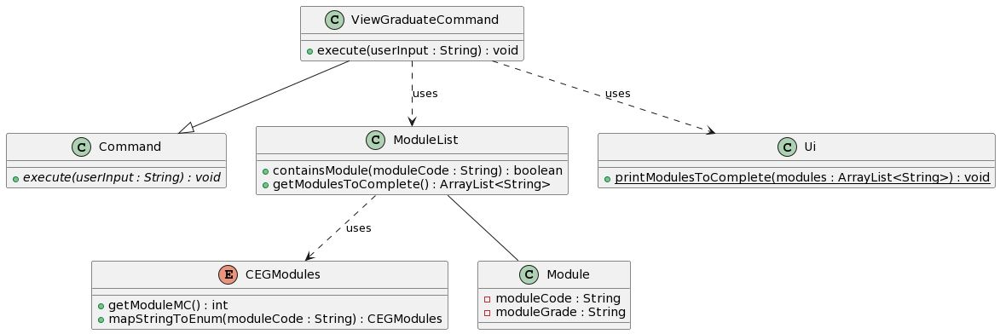
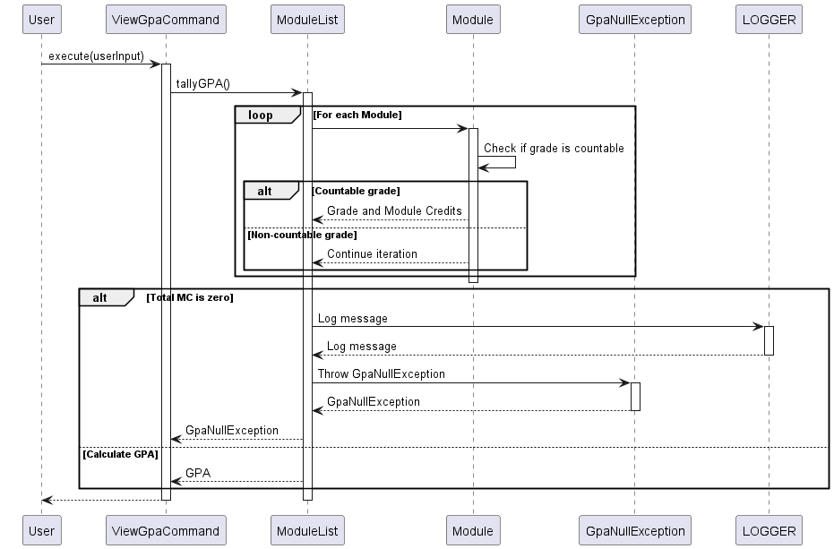
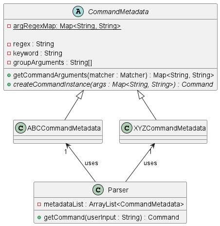

# Developer Guide

## Acknowledgements

{list here sources of all reused/adapted ideas, code, documentation, and third-party libraries -- include links to the
original source as well}

## Design & implementation

### Main Class: `FAP`

The `FAP` class serves as the central hub of the application, orchestrating the flow of execution and managing critical
resources. It embodies key software design principles and showcases thoughtful architectural decisions.

#### Design Overview

- **Singleton Components:** `FAP` manages singleton components such as `moduleList` and `LOGGER`, ensuring they are
  initialized once and accessible throughout the application's lifecycle.
    - `ModuleList`: A collection that holds modules, initialized with a capacity of 10.
    - `LOGGER`: Utilized for logging various levels of application events and errors.

- **Separation of Concerns:** The class delegates specific responsibilities to specialized classes, adhering to the
  principle of separation of concerns.
    - Interaction with users is managed by the `Ui` class.
    - Command parsing is delegated to the `Parser` class.
    - Command execution is handled by implementations of the `Command` interface.

- **Error Handling:** Demonstrates robust error handling strategies by catching and logging different exceptions, which
  ensures graceful handling of unexpected situations.

#### Implementation Details

1. **Application Initialization and Entry Point:**

   The `main` method, as the application's entry point, performs initial setups such as greeting the user and ensuring
   critical components are initialized properly. It encapsulates high-level flow control and implements error handling
   to manage assertion errors and unexpected exceptions.

   ```java
   public static void main(String[] args) {
       try {
           printGreeting();
           assert moduleList != null : "moduleList should not be null";
           runApplication();
       } catch (AssertionError e) {
           LOGGER.log(Level.SEVERE, "Assertion failed: " + e.getMessage(), e);
           System.err.println("Critical assertion failure: " + e.getMessage());
       } catch (Exception e) {
           LOGGER.log(Level.SEVERE, "An unexpected error occurred: " + e.getMessage(), e);
           System.err.println("An unexpected error occurred: " + e.getMessage());
       }
   }
   ```

2. **Running the Application Loop:**

   The `runApplication` method maintains a loop that processes user input until an error occurs or an exit condition is
   met. This method highlights interactions with other components of the application and demonstrates the use of
   polymorphism and encapsulation.

   ```java
   private static void runApplication() {
       Ui ui = new Ui();
       boolean continueRunning = true;

       while (continueRunning) {
           try {
               String userInput = ui.getUserCommand();
               LOGGER.log(Level.INFO, "User input: " + userInput);
               Command command = Parser.getCommand(userInput);
               command.execute(userInput);
           } catch (Exception e) {
               LOGGER.log(Level.SEVERE, "An error occurred: " + e.getMessage(), e);
               System.out.println("An error occurred: " + e.getMessage());
               continueRunning = false;
           }
       }
   }
   ```
3. **Module Class:**

   Represents individual modules with attributes for code, grade, credits, status, and semester. The main methods being
   run are the getter and setters as seen below

    ```java
    public void setModuleGrade(String moduleGrade) throws ModuleException {

        if (moduleGrade != null && !moduleGrade.matches("A\\+|A|A-|B\\+|B|B-|C\\+|C|D\\+|D|F|CS|CU")) {
            throw new IllegalArgumentException("Invalid module grade.");
        }
        if (!moduleTaken) {
            throw new ModuleException("Module needs to be taken before its grade can be updated.");
        }
        this.moduleGrade = moduleGrade;
    }

    public int getModuleMC() {
        return moduleMC;
    }

    public void setModuleMC(int moduleMC) {
        if (moduleMC <= 0) {
            throw new IllegalArgumentException("Module MC (Modular Credits) must be positive.");
        }
        this.moduleMC = moduleMC;
    }

    public boolean getModuleStatus() {
        return moduleTaken;
    }

    public void setModuleStatus(boolean moduleTaken) {
        this.moduleTaken = moduleTaken;
    }

    public int getModuleDate() {
        return moduleDate;
    }

    public void setModuleDate(int moduleDate) {
        if (moduleDate <= 0) {
            throw new IllegalArgumentException("Module date must be a positive number.");
        }
        this.moduleDate = moduleDate;
    }

    public double getGradeNumber () {
        switch (moduleGrade) {
        case "A+":
            //fall through
        case "A":
            return 5.0;
        case "A-":
            return 4.5;
        case "B+":
            return 4.0;
        case "B":
            return 3.5;
        case "B-":
            return 3.0;
        case "C+":
            return 2.5;
        case "C":
            return 2.0;
        case "D+":
            return 1.5;
        case "D":
            return 1.0;
        case "F":
            return 0;
        default:
            throw new IllegalStateException("Invalid or unassigned module grade.");
        }
    }
    ```

4. **ModuleList Class:**
   Represents a list of objects of module class. It is used for storing modules and facilitating accessing of modules.
   The methods it contains are mainly for either accessing or editing certain attributes of the modules the modulelist
   contains.
    ```java
     public Module getModule(String courseCode) throws ModuleNotFoundException {
        if (courseCode == null || courseCode.trim().isEmpty()) {
            throw new IllegalArgumentException("Course code cannot be null or empty.");
        }
        courseCode = courseCode.toUpperCase(); // Convert once and reuse, improving efficiency

        for (Module module : takenModuleList) {
            if (module.getModuleCode().equals(courseCode)) {
                return module;
            }
        }
        throw new ModuleNotFoundException("Module " + courseCode + " not found!");
     }

     public ArrayList<Module> getTakenModuleList() {
        return takenModuleList;
     }

     public void addModule(Module module) {
        if (module == null) {
            throw new IllegalArgumentException("Module cannot be null.");
        }
     takenModuleList.add(module);
     }

     public void printModules() {
        for (Module module:takenModuleList) {
            System.out.println(module.getModuleCode());
        }
     }
     public void removeModule(Module module) {
        assert module != null : "Module cannot be null";
        // The remove operation returns false if the item was not found
        boolean removed = takenModuleList.remove(module);
        if (!removed) {
            System.out.println("Module not found in either list.");
        }
     }

     public void changeModuleGrade(String moduleCode, String grade) {
        if (moduleCode == null || moduleCode.trim().isEmpty()) {
            throw new IllegalArgumentException("Module code cannot be null or empty.");
        }
        try{
            Module toChange = getModule(moduleCode);
            toChange.setModuleGrade(grade);
            System.out.println("Grade for " + moduleCode + " updated to " + grade);
            assert toChange.getModuleGrade().equals(grade) : "Grade is not updated successfully";

        } catch (ModuleNotFoundException e){
            System.out.println("Module not found in list");
        } catch (ModuleException e){
            System.out.println(e.getMessage());
        }
     }

     public double tallyGPA() throws GpaNullException {
        int totalMC = 0;
        double sumOfGPA = 0;
        for (Module module : takenModuleList) {
            if(module.getModuleGrade() == null || module.getModuleGrade().equals("CS") ||
                    module.getModuleGrade().equals("CU") ) {
                continue;
            }
            totalMC += module.getModuleMC();
            sumOfGPA += module.getGradeNumber() * module.getModuleMC();
        }
        if(sumOfGPA == 0) {
            LOGGER.log(Level.INFO, "No modules with grades available to tabulate GPA.");
            throw new GpaNullException("No countable grades present to tally.");
        }
        return sumOfGPA/(double)totalMC;
     }

     public Map<Integer, ArrayList<Module>> groupModulesBySemester() {
        Map<Integer, ArrayList<Module>> moduleBySemMap = new HashMap<>();
        for (int i = 1; i <= NUM_SEMESTERS; i++) {
            moduleBySemMap.put(i, new ArrayList<>());
        }

        for (Module module : takenModuleList) {
            moduleBySemMap.get(module.getModuleDate()).add(module);
        }

        return moduleBySemMap;
     }
    ```

5. **Getting module details from Json File (JsonManager Class):**
   The JsonManager class is responsible for initiating of processes required to load the json file. It also helps to
   retrieve the relevant data such as module credit and description based on the parsed module code.

   This is the constructor that should always get called first to allow the json file to be loaded
    ```java
    public JsonManager() {

        this.inputStream = this.getClass().getResourceAsStream("/moduleInfo.json");
        if (inputStream == null) {
            throw new RuntimeException("Cannot find resource file");
        }

        this.gson = new Gson();

        try (InputStreamReader reader = new InputStreamReader(inputStream)) {
            Type type = new TypeToken<List<JsonObject>>(){}.getType();
            jsonArray = gson.fromJson(reader, type);
            this.reader = reader;
        } catch (Exception e){
            e.printStackTrace();
        }
    }
    ```

   The main purpose of this method is to ensure that the module exist in the NUS curriculum before the user is allowed
   to add the mod
    ```java
    public boolean moduleExist(String moduleCode) {
        // Now, you can iterate through the array of objects just like before
        for (JsonObject obj : jsonArray) {
            // Process the object as needed; assuming there's a 'name' field
            String name = obj.get("moduleCode").getAsString();  // Replace 'name' with actual field names
            // If you want to match a specific module code, add an if check here
            if (name.equals(moduleCode)) {
                // Print out or process the module info
                return true;
            }
        }
        return false;
    }
    ```

   The getModuleInfo get called in other classes when the relevant details of a particular module are needed. This
   method then loads the relevant details such as module description and credits into the JsonManager's class attribute.
   The getters below can then be called from other classes to return a particular detail out of the two or more details
   retrieved.
    ```java
    public void getModuleInfo(String moduleCode) {
        // Now, you can iterate through the array of objects just like before
        for (JsonObject obj : jsonArray) {
            // Process the object as needed; assuming there's a 'name' field
            String name = obj.get("moduleCode").getAsString();  // Replace 'name' with actual field names
            // If you want to match a specific module code, add an if check here
            if (name.equals(moduleCode)) {
                // Print out or process the module info
                this.moduleMC = obj.get("moduleCredit").getAsInt();
                this.moduleDescription = obj.get("description").getAsString();
                this.moduleTitle = obj.get("title").getAsString();
            }
        }
    }

    public String getModuleDescription() {
        return moduleDescription;
    }

    public int getModuleMC() {
        return moduleMC;
    }

    public String getModuleTitle() {
        return moduleTitle;
    }

    ```
6. **Viewing modules left to graduate**

   The `ViewGraduateCommand` class is responsible for displaying the list of modules that a student needs to
   complete
   for graduation with respect to the modules the user has previously completed. The diagram below provides an overview
   of how this class interacts with other components in the
   system.

   

   It utilizes the `Ui` class to print out the list of modules in a
   formatted manner. Additionally, it interacts with the `CEGModules` enum to retrieve module information such as
   module codes and Module Credits (MCs).
7. **Viewing GPA**

    The `ViewGpaCommand` class is responsible for displaying the current GPA attained by the student. It 
    accesses `ModuleList`, which looks through all `Module` object contained in the list. If the `Module` is marked as
    taken and has been assigned a valid grade with `GradeCommand` by the user, its grades will be included into the 
    calculation.

    This is the formula used for tabulation of GPA.
    `GPA = SUM(Course Grade Point * Course Units) / SUM(Course Units Counted Towards GPA)`
    
    Below is the sequence diagram for `ViewGpaCommand`.
    

8. **Parsing UserInput**

    The `Parser` class, together with the `CommandMetadata` class parses user input to 
    **return appropriate command objects** for the corresponding `Command` classes. If input validation fails or no 
    matching command is found, it returns an `Invalid` command instance.
    <br />
    <br />
    **High Level Overview:**
    
    The`CommandMetadata` class is an abstract class that manages regular expressions (regex) and validation
    for command arguments, allowing subclasses to generate specific **`Command` instances** based on **command keywords and
    parsed arguments.**
    <br />
    <br />
    The `Parser` class maintains a list of these `CommandMetadata` subclasses instances and iterates through them to
    identify a given user command.
    <br />
    <br />
    Below is a diagram that shows this relationship

    
    <br />
    <br />
    **Use of regular expressions (Regex) in FAP:** 
    
    The add command class requires a user input that best 
    matches this string
    ```
    add c/COURSECODE w/SEMESTERTAKEN
    ```
    where `COURSECODE` and `SEMESTERTAKEN` have their defined restrictions: `COURSECODE` should best match an actual
    course code at NUS, `SEMESTERTAKEN` should be a number value in some range. The `COURSECODE` and `SEMESTERTAKEN` 
    will thus have their own argument regex pattern.
    <br />
    <br />
    A simple example would be that `SEMESTERTAKEN` would be a number ranging from 1-8 to represent a normal honours 
    pathway for a CEG student (FAP's target user). A regex pattern for that would look like `w/(?<semester>[1-8])`. 
    An **argument name capturing group** `semester` is enclosed within the brackets so that the argument group will be 
    **named** and thus the argument value (anywhere between `1-8`) can be referenced/called by using the 
    `matcher.group()` method.
    Meanwhile, the `Pattern` and `Matcher` methods used for regex would handle the checks that the argument value given 
    is indeed between `1-8`
    <br />
    <br />
    A userInput regex would thus follow this convention:
    ```
    keyword argument_1 argument_2 ...
    ```
    This full regex pattern for a command itself can be generated by having a `keyword`, as well as all the 
   `argument group names` (a name to use so as to _reference_ the argument) and the `argument regex pattern` 
    corresponding to that name reference. Typically, these arguments would be spaced out and thus a `\s+` (representing
    at least one whitespace character) is placed between the gaps of the regex pattern for 
    `keyword, argument_1, argument_2...`
    <br />
    <br />
    While regex allows the `userInput` checks to be prudent, as well as potentially offering the flexibility for string
    inputs to allow a different order of arguments, there are limitations where it becomes hard to determine the exact 
    error of the user's input solely based on the regular expressions, because it solely returns a true/false value 
    if the string value itself fits the criteria given). Regardless, we think the use of regex in FAP can help provide 
    us **safety in the arguments** that passes through to the commands via the userInput.
    <br />
    <br />
    **Developer usage FAP: Parser & CommandMetadata class as of v2.0**: **How to create a new command**
    1. First, we would need a `Command` type class to return as an object. In the future, this may be expanded to any 
    `T` type. 
    2. Second, we would need a string that would be used to create this `Command` instance. This string should follow
    the format `keyword argument_1 argument_2` where arguments are **optional**
    3. Third, for every argument available, make a **regex pattern with name capturing** that encloses the value 
    within the brackets. (eg.`n/(?<name>[A-Za-z0-9 ]+)`, `g/(?<grade>[ab][+-]?|[cd][+]?|f|cs|cu)`)
    <br />
    <br />
    **Begin:** Using example `add c/COURSECODE w/SEMESTERTAKEN`
    - Create a subclass that extends `CommandMetadata`.
    - Put in the `keyword` (eg. `add`) and `groupArgumentNames` (eg.`{"courseCode", "semester"}`) in super constructor
    - Put in the argument regex pattern in static variable `argsRegexMap` (eg. 
    `argRegexMap.put("semester", "w/(?<semester>[1-8])")`) (Note: Currently `argsRegexMap` is in superclass 
    `CommandMetadata`)
    - Override method `createCommandInstance(Map<String, String> args)` to implement the method on how to create the 
    `Command` object you want. Return the `Command` instance
      - `Map<String, String> args` contains the `groupArgumentName : argumentValue` pairing
   
    - On `Parser` class, add in the created `CommandMetadata subclass` to `metadataList`
    - `Parser` method `getCommand(String userInput)` will help to validate the userInput. If the userInput matches the 
    string you wanted, then `getCommand(String userInput)` will return the Command instance you require.
      <br />
      <br />
    Sample example code:
   ```
   public class AddCommandMetadata extends CommandMetadata {
    private static final String ADD_KEYWORD = "add";
    private static final String[] ADD_ARGUMENTS = {"courseCode", "semester"};

    public AddCommandMetadata() {
        super(ADD_KEYWORD, ADD_ARGUMENTS);
    }

    // Add Command Creator
    @Override
    protected Command createCommandInstance(Map<String, String> args) {
        try {
            String moduleCode = args.getOrDefault("courseCode", "COURSECODE_ERROR");
            String semester = args.getOrDefault("semester", "SEMESTER_ERROR");
            int semesterInt = Integer.parseInt(semester);

            return new AddCommand(moduleCode, semesterInt);
        } catch (ModuleNotFoundException e) {
            LOGGER.log(Level.SEVERE, "An error occurred: " + e.getMessage());
            System.out.println("An error occurred: " + e.getMessage());
        }
        return new InvalidCommand();
    }
   ```
#### UML Diagram


Below is a brief description of the UML diagram that outlines the structure and relationships of the `FAP` class:

- **Classes:** `FAP`, `ModuleList`, `Ui`, `Parser`, and `Command`.
- **Associations:** `FAP` has associations with `ModuleList` for managing modules and `LOGGER` for logging. It uses `Ui`
  for user interactions, `Parser` for parsing commands, and `Command` for executing actions.
- **Flow:** The diagram would show `FAP` at the center, indicating its role in orchestrating the application flow and
  its interactions with other components.

This section highlights the central role of the `FAP` class in coordinating the application's functionality, emphasizing
its design as a modular, maintainable, and extensible entry point.

---

## Product scope

### Target user profile

{Describe the target user profile}

### Value proposition

{Describe the value proposition: what problem does it solve?}

## User Stories

| Version | As a ... | I want to ...             | So that I can ...                                           |
|---------|----------|---------------------------|-------------------------------------------------------------|
| v1.0    | new user | see usage instructions    | refer to them when I forget how to use the application      |
| v2.0    | user     | find a to-do item by name | locate a to-do without having to go through the entire list |

## Non-Functional Requirements

{Give non-functional requirements}

## Glossary

* *glossary item* - Definition

## Instructions for manual testing

{Give instructions on how to do a manual product testing e.g., how to load sample data to be used for testing}


