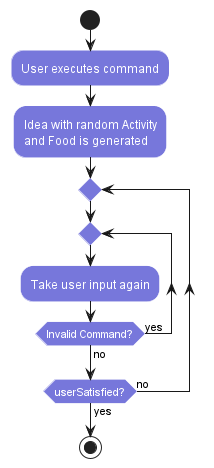

# Developer Guide

## Acknowledgements

{list here sources of all reused/adapted ideas, code, documentation, and third-party libraries -- include links to the original source as well}

## Design & implementation

{Describe the design and implementation of the product. Use UML diagrams and short code snippets where applicable.}

### [Implemented] Generate Idea feature

#### Implementation

The existing Generate Idea feature is facilitated by `GenerateIdea` by leveraging the methods `getRandomActivity()` and `getRandomFood()` in `ActivityList` and `FoodList`. It extends `Command` and implements the following operation:

- `execute()` - Generates a randomised date idea consisting of 1 food and 1 dining option. Users can prompt to regenerate an idea until they are satisfied.

Given below is an example usage scenario and how the Generate Idea mechanism behaves at each step.

Step 1. The user launches the application and executes the `idea` command. The `idea` command is parsed by the `parseCommand` method in the `Parser` class, which creates a `GenerateIdeaCommand` instance.

Step 2. The `execute` method of `GenerateIdea` is invoked. It retrieves a random activity and a random dining option from `ActivityList` and `FoodList` and presents it to the user.

Step 3. The user is not satisfied with the proposed idea and inputs the `no` command. The loop in `execute` does not meet the exit condition and thus, generates another idea using the same process as Step 2.

Step 4. The user is satisfied with the proposed idea and inputs the `yes` command. The loop in `execute` has met the exit condition and thus, the `run` method continues running allowing the user to input other commands.

The following activity diagram summarises what happens when a user inputs `idea`:



### [Proposed] Smart Itinerary Generation feature

#### Proposed Implementation
The proposed Smart Itinerary Generation mechanism leverages the existing UserDetails class to retrieve user preferences and create smart itineraries. It extends the Command class with a new ```GenerateSmartItineraryCommand```. Additionally, it implements the following operations:
- ```GenerateSmartItineraryCommand(UserDetails userDetails)``` — Initializes the command with the user's stored preferences from the UserDetails object.
- ```execute(FavouritesList favourites, FoodList foods, ActivityList activities, Ui ui, Storage storage)``` — Generates a personalized itinerary by filtering food and activity options based on the user's preferences, ensures variety in the selections, and outputs the generated itinerary.

These operations are detailed in the ```Parser``` class, where the ```parseCommand(String userInput, UserDetails userDetails)``` method is updated to accept the ```UserDetails``` object and return a ```GenerateSmartItineraryCommand``` when the `"smart"` command is entered by the user.

Given below is an example usage scenario and how the Smart Itinerary Generation mechanism behaves at each step.

Step 1. The user launches the application for the first time. Their user details, including preferred location and cuisine preferences, are collected via the ```UserDetailsCommand``` and stored in a ```UserDetails``` object.

Step 2. The user enters the `"smart"` command to generate a personalized itinerary. The `"smart"` command is parsed by the ```parseCommand``` method in the ```Parser``` class, which creates a ```GenerateSmartItineraryCommand``` instance, passing the ```UserDetails``` object.

Step 3. The execute method of ```GenerateSmartItineraryCommand``` is invoked. It retrieves the user's preferred location and cuisine from the ```UserDetails``` object. The method then filters the ```FoodList``` to find food options matching the user's preferences, ensures the selected food options are distinct, and randomly selects two activities from the ```ActivityList```. The generated itinerary, consisting of the selected food and activity options, is then output to the user.

## Product scope
### Target user profile

Couples in Singapore

### Value proposition

In today's fast-paced world, maintaining a healthy and exciting relationship can often be challenging for couples. Balancing work, personal responsibilities, and quality time with a partner requires effort and planning. Many couples struggle to come up with new and interesting date ideas that cater to both partners' preferences, leading to a routine that can become stale and uninspiring. This is where Flirt and Fork steps in to rejuvenate the love life of couples by offering a seamless, engaging, and personalised date planning experience.

## User Stories

|Version| As a ... | I want to ... | So that I can ...|
|--------|----------|---------------|------------------|
|v1.0|first-time user|see a help message|know how to use the features within the app & its parameters|
|v1.0|busy user|effortlessly generate date ideas|not waste time endlessly searching for ideas|
|v1.0|budget conscious user|generate a date itinerary based on price|choose when to splurge and when to save|
|v1.0|user looking for variety|view a variety of date activities|enjoy diverse date experiences|
|v1.0|experienced user of the platform|save some of my preferred activities|reference back to them in future|

## Non-Functional Requirements

{Give non-functional requirements}

## Glossary

* *glossary item* - Definition

## Instructions for manual testing

{Give instructions on how to do a manual product testing e.g., how to load sample data to be used for testing}
