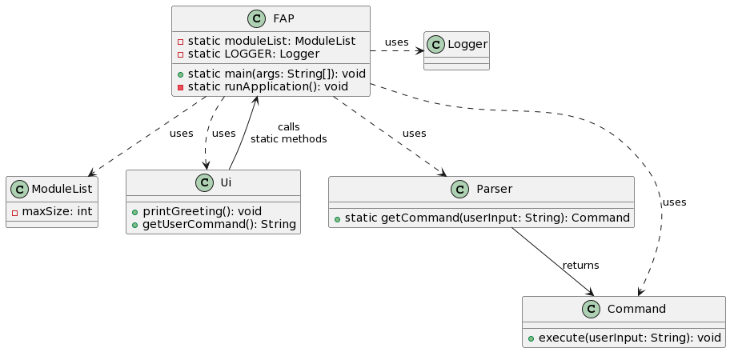

# Developer Guide

## Acknowledgements

{list here sources of all reused/adapted ideas, code, documentation, and third-party libraries -- include links to the original source as well}

## Design & implementation

### Main Class: `FAP`

The `FAP` class serves as the central hub of the application, orchestrating the flow of execution and managing critical resources. It embodies key software design principles and showcases thoughtful architectural decisions.

#### Design Overview

- **Singleton Components:** `FAP` manages singleton components such as `moduleList` and `LOGGER`, ensuring they are initialized once and accessible throughout the application's lifecycle.
    - `ModuleList`: A collection that holds modules, initialized with a capacity of 10.
    - `LOGGER`: Utilized for logging various levels of application events and errors.

- **Separation of Concerns:** The class delegates specific responsibilities to specialized classes, adhering to the principle of separation of concerns.
    - Interaction with users is managed by the `Ui` class.
    - Command parsing is delegated to the `Parser` class.
    - Command execution is handled by implementations of the `Command` interface.

- **Error Handling:** Demonstrates robust error handling strategies by catching and logging different exceptions, which ensures graceful handling of unexpected situations.

#### Implementation Details

1. **Application Initialization and Entry Point:**

   The `main` method, as the application's entry point, performs initial setups such as greeting the user and ensuring critical components are initialized properly. It encapsulates high-level flow control and implements error handling to manage assertion errors and unexpected exceptions.

   ```java
   public static void main(String[] args) {
       try {
           printGreeting();
           assert moduleList != null : "moduleList should not be null";
           runApplication();
       } catch (AssertionError e) {
           LOGGER.log(Level.SEVERE, "Assertion failed: " + e.getMessage(), e);
           System.err.println("Critical assertion failure: " + e.getMessage());
       } catch (Exception e) {
           LOGGER.log(Level.SEVERE, "An unexpected error occurred: " + e.getMessage(), e);
           System.err.println("An unexpected error occurred: " + e.getMessage());
       }
   }
   ```

2. **Running the Application Loop:**

   The `runApplication` method maintains a loop that processes user input until an error occurs or an exit condition is met. This method highlights interactions with other components of the application and demonstrates the use of polymorphism and encapsulation.

   ```java
   private static void runApplication() {
       Ui ui = new Ui();
       boolean continueRunning = true;

       while (continueRunning) {
           try {
               String userInput = ui.getUserCommand();
               LOGGER.log(Level.INFO, "User input: " + userInput);
               Command command = Parser.getCommand(userInput);
               command.execute(userInput);
           } catch (Exception e) {
               LOGGER.log(Level.SEVERE, "An error occurred: " + e.getMessage(), e);
               System.out.println("An error occurred: " + e.getMessage());
               continueRunning = false;
           }
       }
   }
   ```
3. **Module Class:**

   Represents individual modules with attributes for code, grade, credits, status, and semester. The main methods being run are the getter and setters as seen below

    ```java
    public void setModuleGrade(String moduleGrade) throws ModuleException {

        if (moduleGrade != null && !moduleGrade.matches("A\\+|A|A-|B\\+|B|B-|C\\+|C|D\\+|D|F|CS|CU")) {
            throw new IllegalArgumentException("Invalid module grade.");
        }
        if (!moduleTaken) {
            throw new ModuleException("Module needs to be taken before its grade can be updated.");
        }
        this.moduleGrade = moduleGrade;
    }

    public int getModuleMC() {
        return moduleMC;
    }

    public void setModuleMC(int moduleMC) {
        if (moduleMC <= 0) {
            throw new IllegalArgumentException("Module MC (Modular Credits) must be positive.");
        }
        this.moduleMC = moduleMC;
    }

    public boolean getModuleStatus() {
        return moduleTaken;
    }

    public void setModuleStatus(boolean moduleTaken) {
        this.moduleTaken = moduleTaken;
    }

    public int getModuleDate() {
        return moduleDate;
    }

    public void setModuleDate(int moduleDate) {
        if (moduleDate <= 0) {
            throw new IllegalArgumentException("Module date must be a positive number.");
        }
        this.moduleDate = moduleDate;
    }

    public double getGradeNumber () {
        switch (moduleGrade) {
        case "A+":
            //fall through
        case "A":
            return 5.0;
        case "A-":
            return 4.5;
        case "B+":
            return 4.0;
        case "B":
            return 3.5;
        case "B-":
            return 3.0;
        case "C+":
            return 2.5;
        case "C":
            return 2.0;
        case "D+":
            return 1.5;
        case "D":
            return 1.0;
        case "F":
            return 0;
        default:
            throw new IllegalStateException("Invalid or unassigned module grade.");
        }
    }
    ```

4. **ModuleList Class:**
   Represents a list of objects of module class. It is used for storing modules and facilitating accessing of modules. The methods it contains are mainly for either accessing or editing certain attributes of the modules the modulelist contains.
    ```java
     public Module getModule(String courseCode) throws ModuleNotFoundException {
        if (courseCode == null || courseCode.trim().isEmpty()) {
            throw new IllegalArgumentException("Course code cannot be null or empty.");
        }
        courseCode = courseCode.toUpperCase(); // Convert once and reuse, improving efficiency

        for (Module module : takenModuleList) {
            if (module.getModuleCode().equals(courseCode)) {
                return module;
            }
        }
        throw new ModuleNotFoundException("Module " + courseCode + " not found!");
     }

     public ArrayList<Module> getTakenModuleList() {
        return takenModuleList;
     }

     public void addModule(Module module) {
        if (module == null) {
            throw new IllegalArgumentException("Module cannot be null.");
        }
     takenModuleList.add(module);
     }

     public void printModules() {
        for (Module module:takenModuleList) {
            System.out.println(module.getModuleCode());
        }
     }
     public void removeModule(Module module) {
        assert module != null : "Module cannot be null";
        // The remove operation returns false if the item was not found
        boolean removed = takenModuleList.remove(module);
        if (!removed) {
            System.out.println("Module not found in either list.");
        }
     }

     public void changeModuleGrade(String moduleCode, String grade) {
        if (moduleCode == null || moduleCode.trim().isEmpty()) {
            throw new IllegalArgumentException("Module code cannot be null or empty.");
        }
        try{
            Module toChange = getModule(moduleCode);
            toChange.setModuleGrade(grade);
            System.out.println("Grade for " + moduleCode + " updated to " + grade);
            assert toChange.getModuleGrade().equals(grade) : "Grade is not updated successfully";

        } catch (ModuleNotFoundException e){
            System.out.println("Module not found in list");
        } catch (ModuleException e){
            System.out.println(e.getMessage());
        }
     }

     public double tallyGPA() throws GpaNullException {
        int totalMC = 0;
        double sumOfGPA = 0;
        for (Module module : takenModuleList) {
            if(module.getModuleGrade() == null || module.getModuleGrade().equals("CS") ||
                    module.getModuleGrade().equals("CU") ) {
                continue;
            }
            totalMC += module.getModuleMC();
            sumOfGPA += module.getGradeNumber() * module.getModuleMC();
        }
        if(sumOfGPA == 0) {
            LOGGER.log(Level.INFO, "No modules with grades available to tabulate GPA.");
            throw new GpaNullException("No countable grades present to tally.");
        }
        return sumOfGPA/(double)totalMC;
     }

     public Map<Integer, ArrayList<Module>> groupModulesBySemester() {
        Map<Integer, ArrayList<Module>> moduleBySemMap = new HashMap<>();
        for (int i = 1; i <= NUM_SEMESTERS; i++) {
            moduleBySemMap.put(i, new ArrayList<>());
        }

        for (Module module : takenModuleList) {
            moduleBySemMap.get(module.getModuleDate()).add(module);
        }

        return moduleBySemMap;
     }
    ```

5. **Getting module details from Json File (JsonManager Class):**
   The JsonManager class is responsible for initiating of processes required to load the json file. It also helps to retrieve the relevant data such as module credit and description based on the parsed module code.

   This is the constructor that should always get called first to allow the json file to be loaded
    ```java
    public JsonManager() {

        this.inputStream = this.getClass().getResourceAsStream("/moduleInfo.json");
        if (inputStream == null) {
            throw new RuntimeException("Cannot find resource file");
        }

        this.gson = new Gson();

        try (InputStreamReader reader = new InputStreamReader(inputStream)) {
            Type type = new TypeToken<List<JsonObject>>(){}.getType();
            jsonArray = gson.fromJson(reader, type);
            this.reader = reader;
        } catch (Exception e){
            e.printStackTrace();
        }
    }
    ```

   The main purpose of this method is to ensure that the module exist in the NUS curriculum before the user is allowed to add the mod
    ```java
    public boolean moduleExist(String moduleCode) {
        // Now, you can iterate through the array of objects just like before
        for (JsonObject obj : jsonArray) {
            // Process the object as needed; assuming there's a 'name' field
            String name = obj.get("moduleCode").getAsString();  // Replace 'name' with actual field names
            // If you want to match a specific module code, add an if check here
            if (name.equals(moduleCode)) {
                // Print out or process the module info
                return true;
            }
        }
        return false;
    }
    ```

   The getModuleInfo get called in other classes when the relevant details of a particular module are needed. This method then loads the relevant details such as module description and credits into the JsonManager's class attribute.
   The getters below can then be called from other classes to return a particular detail out of the two or more details retrieved.
    ```java
    public void getModuleInfo(String moduleCode) {
        // Now, you can iterate through the array of objects just like before
        for (JsonObject obj : jsonArray) {
            // Process the object as needed; assuming there's a 'name' field
            String name = obj.get("moduleCode").getAsString();  // Replace 'name' with actual field names
            // If you want to match a specific module code, add an if check here
            if (name.equals(moduleCode)) {
                // Print out or process the module info
                this.moduleMC = obj.get("moduleCredit").getAsInt();
                this.moduleDescription = obj.get("description").getAsString();
                this.moduleTitle = obj.get("title").getAsString();
            }
        }
    }

    public String getModuleDescription() {
        return moduleDescription;
    }

    public int getModuleMC() {
        return moduleMC;
    }

    public String getModuleTitle() {
        return moduleTitle;
    }

    ```

#### UML Diagram



Below is a brief description of the UML diagram that outlines the structure and relationships of the `FAP` class:

- **Classes:** `FAP`, `ModuleList`, `Ui`, `Parser`, and `Command`.
- **Associations:** `FAP` has associations with `ModuleList` for managing modules and `LOGGER` for logging. It uses `Ui` for user interactions, `Parser` for parsing commands, and `Command` for executing actions.
- **Flow:** The diagram would show `FAP` at the center, indicating its role in orchestrating the application flow and its interactions with other components.

This section highlights the central role of the `FAP` class in coordinating the application's functionality, emphasizing its design as a modular, maintainable, and extensible entry point.

---

## Product scope
### Target user profile

{Describe the target user profile}

### Value proposition

{Describe the value proposition: what problem does it solve?}

## User Stories

|Version| As a ... | I want to ... | So that I can ...|
|--------|----------|---------------|------------------|
|v1.0|new user|see usage instructions|refer to them when I forget how to use the application|
|v2.0|user|find a to-do item by name|locate a to-do without having to go through the entire list|

## Non-Functional Requirements

{Give non-functional requirements}

## Glossary

* *glossary item* - Definition

## Instructions for manual testing

{Give instructions on how to do a manual product testing e.g., how to load sample data to be used for testing}


