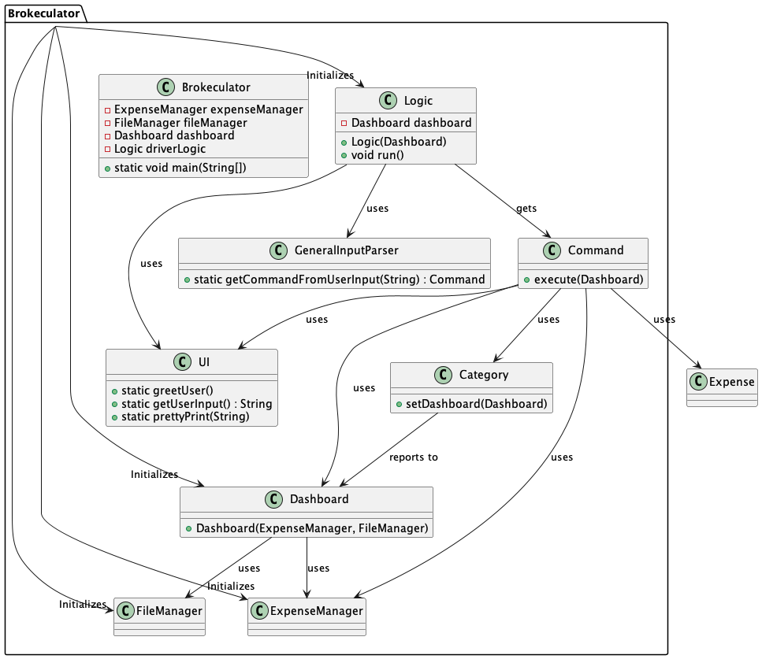

# Developer Guide

* [Acknowledgements](#acknowledgements)
* [Setting up, getting started] (#setting-up-getting-started)
* [Design & implementation](#design--implementation)
  * [Architecture](#architecture)
  * [Category feature](#category-feature)
* [Product scope](#product-scope)
  * [Target user profile](#target-user-profile)
  * [Value proposition](#value-proposition)
* [User Stories](#user-stories)
* [Non-Functional Requirements](#non-functional-requirements)
* [Glossary](#glossary)
* [Instructions for manual testing](#instructions-for-manual-testing)

## Acknowledgements

{list here sources of all reused/adapted ideas, code, documentation, and third-party libraries -- include links to the original source as well}

## Setting up, getting started

Refer to the guide [Setting up and getting started]().

## Design & implementation

{Describe the design and implementation of the product. Use UML diagrams and short code snippets where applicable.}

### Architecture

The UML diagram below shows the main relationships between the classes in the Brokeculator application.

### Category feature
**Implementation**  
The category feature is mainly facilitated by the `Category` class. The `Category` class is responsible for storing the names of the categories present in expenses. 
In order for the user to be able to add expenses with a category, the category must be added using the `addCategory` method. 
The `addCategory` method takes in a string as a parameter and adds it to the set of categories.
The `Category` class implements the following operations:
- `addCategory(String category)` - Adds a category to the set of categories
- `getCategoryListString()` - Returns a string representation of the set of categories
- `removeCategory(String category)` - Deletes a category from the set of categories

The `Category` class is supplemented by the following classes to interact with the user:
- `CategoryCommand` - This class is responsible for handling and executing the commands related to categories 
- `CategoryParser` It is responsible for parsing the user input

The UML diagram below shows the main relationships between the classes in the category feature.

The Following sequence diagram shows how a user input is processed to add, delete or list the categories:

**User input category parsing sequence**
1. The user enters a command to add a category
2. The `CategoryParser` class parses the user input and returns a `CategoryCommand` object or an `InvalidCommand` object
depending on whether the user input is valid or not
3. The returned Command object is executed by the Logic Class (omitted in the diagram for brevity)
4. The appropriate method in the `Category` class is called to add the category, based on how the constructor
of the `CategoryCommand` object was called

**Initialization**  
On startup, the `Category` class has its' set of categories loaded from the file `categories.txt` in the data folder.
This is facilitated by the `FileManager` and `GeneralFileParser` classes, with the `Logic` class serving as the main logic loop. 
The `GeneralFileParser` class reads the file and returns a list of strings.
The process is shown in the sequence diagram below:

## Product scope
### Target user profile

This project is designed to cater to the needs of university students who encounter the challenge of managing a myriad of expenses across various categories.

### Value proposition

Brokeculator is a CLI application designed for university students to log and view their expenses. 
For experienced CLI users, they can enter their expenses faster compared to GUI applications

## User Stories

|Version| As a ... | I want to ... | So that I can ...|
| v1.0 | student | see a basic summary of my expenses to see how much i have spent in total | ------------------ |
| v1.0 | student | view the expenses I have logged | know how much I have spent |
| v1.0 | paranoid user | save my expenses into a file | backup locally via a file to prevent data loss |
| v1.0 | student | have the ability to add expenses | ------- |
| v1.0 | student | have the ability to delete expenses | remedy my erroneous expenses |
|v2.0|user|find a to-do item by name|locate a to-do without having to go through the entire list|

## Non-Functional Requirements

{Give non-functional requirements}

## Glossary

* *glossary item* - Definition

## Instructions for manual testing

{Give instructions on how to do a manual product testing e.g., how to load sample data to be used for testing}
