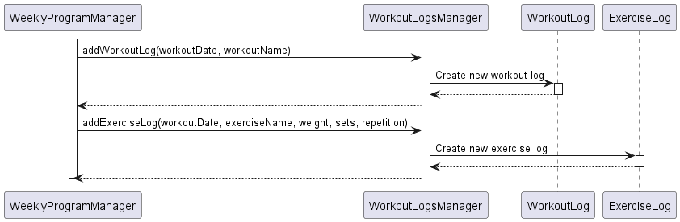

# Developer Guide

## Acknowledgements

{list here sources of all reused/adapted ideas, code, documentation, and third-party libraries -- include links to the original source as well}

## Design & implementation

{Describe the design and implementation of the product. Use UML diagrams and short code snippets where applicable.}
### Implementation
#### Logging of workouts 
In order to log workouts, we have several layers to implement:
1. Logging of exercises
2. Storing logged exercises in a logged workout
3. Storing all logged workouts

The implementation for the above is as such:
1. `ExerciseLog` extends from the `Activity` class, and introduces `weight`, `set` and `repetitions` as variables to be stored.
2. `WorkoutLog` extends from the `Activity` class, and introduces `HashSet<ExerciseLog>` to store all logged exercises for that given workout, and `workoutName` to store the name of the `Workout` that was intended to be for that day. The id for this class is the date of the workout.
3. All `WorkoutLog` classes created are stored in `WorkoutLogsManager`, which is extended from `ActivityManager`. 

The user interfaces with this feature through the `WeeklyProgramManager`, as it is intended that the user logs their exercises according to the workout program that they have assigned to a specified day. 

The sequence diagram below shows how a log is created.

## Product scope
### Target user profile

{Describe the target user profile}

### Value proposition

{Describe the value proposition: what problem does it solve?}

## User Stories

|Version| As a ... | I want to ... | So that I can ...|
|--------|----------|---------------|------------------|
|v1.0|new user|see usage instructions|refer to them when I forget how to use the application|
|v2.0|user|find a to-do item by name|locate a to-do without having to go through the entire list|

## Non-Functional Requirements

{Give non-functional requirements}

## Glossary

* *glossary item* - Definition

## Instructions for manual testing

{Give instructions on how to do a manual product testing e.g., how to load sample data to be used for testing}
