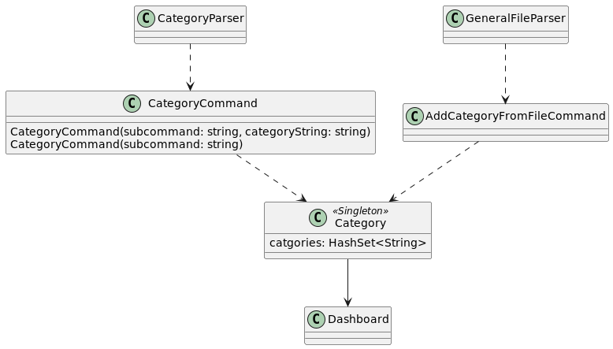
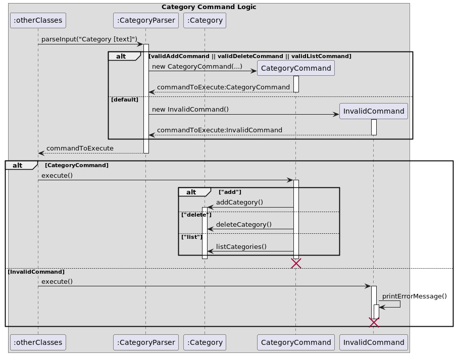
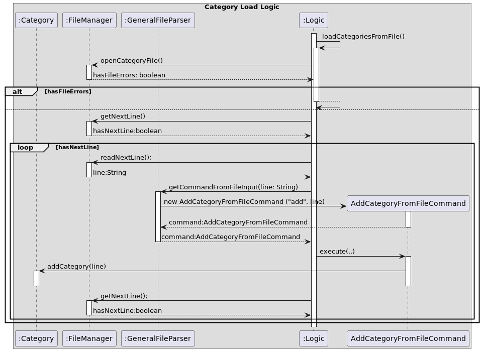
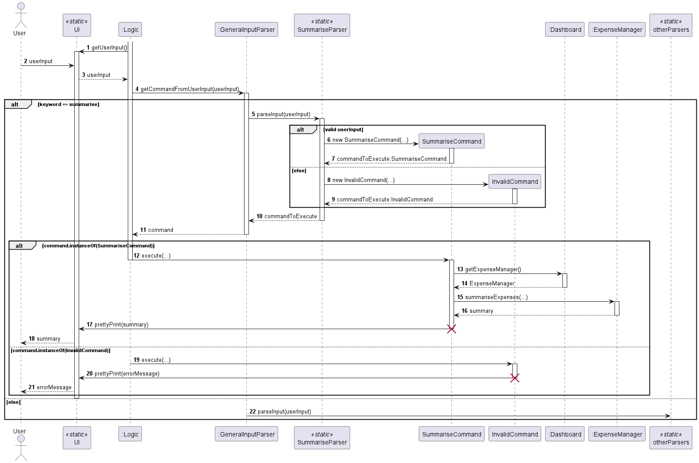
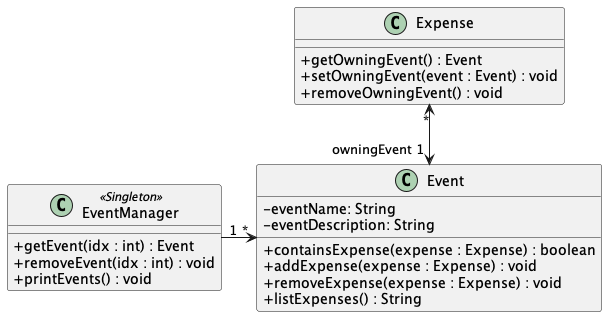
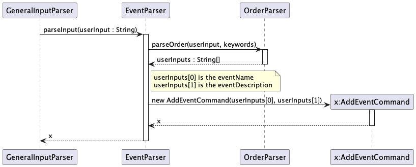
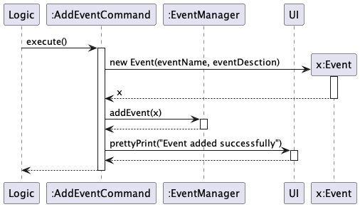
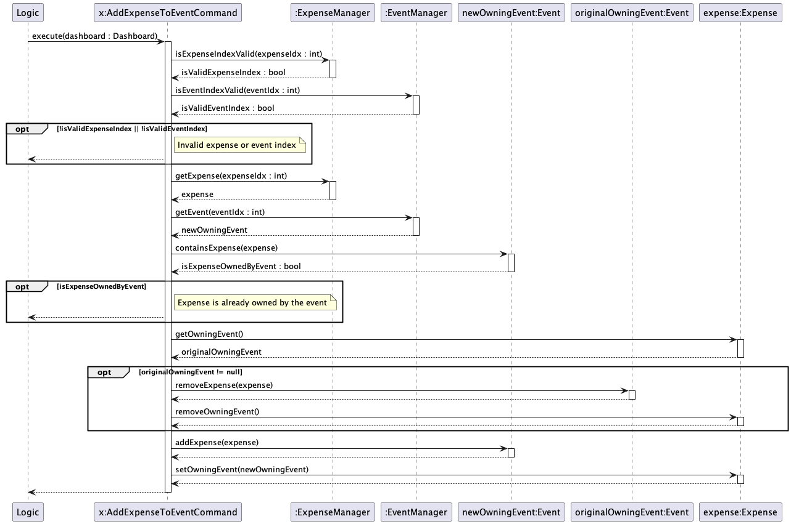

# Developer Guide

## Acknowledgements

{list here sources of all reused/adapted ideas, code, documentation, and third-party libraries -- include links to the original source as well}

## Design & implementation

{Describe the design and implementation of the product. Use UML diagrams and short code snippets where applicable.}

# Category feature
**Implementation**  
The category feature is mainly facilitated by the `Category` class. The `Category` class is responsible for storing the names of the categories present in expenses. 
In order for the user to be able to add expenses with a category, the category must be added using the `addCategory` method. 
The `addCategory` method takes in a string as a parameter and adds it to the set of categories.
The `Category` class implements the following operations:
- `addCategory(String category)` - Adds a category to the set of categories
- `getCategoryListString()` - Returns a string representation of the set of categories
- `removeCategory(String category)` - Deletes a category from the set of categories

The `Category` class is supplemented by the following classes to interact with the user:
- `CategoryCommand` - This class is responsible for handling and executing the commands related to categories 
- `CategoryParser` It is responsible for parsing the user input

The UML diagram below shows the main relationships between the classes in the category feature.

The Following sequence diagram shows how a user input is processed to add, delete or list the categories:

**User input category parsing sequence**
1. The user enters a command to add a category
2. The `CategoryParser` class parses the user input and returns a `CategoryCommand` object or an `InvalidCommand` object
depending on whether the user input is valid or not
3. The returned Command object is executed by the Logic Class (omitted in the diagram for brevity)
4. The appropriate method in the `Category` class is called to add the category, based on how the constructor
of the `CategoryCommand` object was called

**Initialization**  
On startup, the `Category` class has its' set of categories loaded from the file `categories.txt` in the data folder.
This is facilitated by the `FileManager` and `GeneralFileParser` classes, with the `Logic` class serving as the main logic loop. 
The `GeneralFileParser` class reads the file and returns a list of strings.
The process is shown in the sequence diagram below:

# Summarising expenses
**Implementation**  
The expense summarising functionality is mainly facilitated by the `SummariseCommand`and `SummariseParser` classes. 
The `SummariseParser` class is responsible for constructing a `SummariseCommand` object from valid user input, which upon
execution would call the `summariseExpenses` method of the application's `ExpenseManager` object to obtain a summary of the expenses
currently tracked.

The following sequence diagram shows how user input is parsed to produce a summary of expenses in accordance with user
specifications:

**User input parsing sequence**
1. The user enters a command to summarise expenses, which is caught by the `UI` class and returned to the `Logic` class
2. The `Logic` class directs the user input to the `GeneralInputParser` class, which sees the `summarise` keyword
in the user input and directs it to the `SummariseParser` class
3. The `SummariseParser` class parses the user input and returns a `SummariseCommand` object or an `InvalidCommand` object 
depending on whether the user input is valid or not. A `SummariseCommand` object would store relevant information from
the user input in its private fields, whereas an `InvalidCommand` object would store an error message specifying the issues
of the user input
4. The `Logic` class calls the `execute(Dashboard dashboard)` method of the returned `Command` object
5. Upon execution, a `SummariseCommand` object would retrieve a reference to the `ExpenseManager` object stored within the 
`dashboard` and execute its `summariseExpenses` method, passing in its fields as parameters to the method call. This summarises
the expenses stored in the `ExpenseManager` object according to the user's specifications. The summary is then printed 
by the `UI` class to be viewed by the user
6. Executing an `InvalidCommand` object would instead have its error message printed by the `UI` class to be viewed by the user

# Event feature
**Implementation**  
The event feature aims to group expenses happening on specific occasions together. 
The `Event` class stores the details of the event and the list of expenses that are associated with the event.
The `EventManager` class is responsible for aggregate operations on the events.

The UMl diagram below shows the main relationships between the classes in the event feature (some methods are omitted)  

The following sequence diagrams show how a user input is processed to add the events:  

  

**User input event main parsing sequence**
1. The user enters a command to add an event
2. The `EventParser` class parses the user input to identify the event name and the event description
3. The `AddEventCommand` object is created with the event name and description
4. When executed, the `AddEventCommand` object creates an `Event` object with the event name and description
5. The `AddEventCommand` object calls the `addEvent` method in the `EventManager` class to add the event created in step 4
6. Feedback is given to the user via the UI

Details such as accessing the EventManager via the central dashboard and handling of exceptions using invalid commands are omitted for brevity.

The following sequence diagram shows the execution of an `AddExpenseToEventCommand` command object  

**Execution sequence of AddExpenseToEventCommand**
1. The command checks the validity of the event and expense indexes 
2. If the indexes are invalid, a feedback message is returned to the user
3. The event and expense objects are retrieved based on the indexes
4. If the expense already exists in the event, a feedback message is returned to the user
5. The original owning event of the expense is retrieved 
6. If the expense has an owning event, the expense is removed from the owning event
7. The expense is added to the new event, and its owning event is updated

## Product scope
### Target user profile

This project is designed to cater to the needs of university students who encounter the challenge of managing a myriad of expenses across various categories.

### Value proposition

Brokeculator is a CLI application designed for university students to log and view their expenses. 
For experienced CLI users, they can enter their expenses faster compared to GUI applications

## User Stories

|Version| As a ... | I want to ... | So that I can ...|
| v1.0 | student | see a basic summary of my expenses to see how much i have spent in total | ------------------ |
| v1.0 | student | view the expenses I have logged | know how much I have spent |
| v1.0 | paranoid user | save my expenses into a file | backup locally via a file to prevent data loss |
| v1.0 | student | have the ability to add expenses | ------- |
| v1.0 | student | have the ability to delete expenses | remedy my erroneous expenses |
|v2.0|user|find a to-do item by name|locate a to-do without having to go through the entire list|

## Non-Functional Requirements

{Give non-functional requirements}

## Glossary

* *glossary item* - Definition

## Instructions for manual testing

{Give instructions on how to do a manual product testing e.g., how to load sample data to be used for testing}
