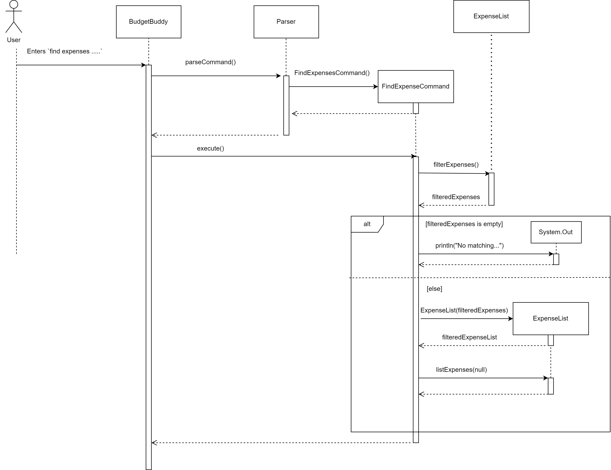

# Developer Guide

## Acknowledgements

{list here sources of all reused/adapted ideas, code, documentation, and third-party libraries -- include links to the original source as well}

## Design & implementation

### Find Feature

#### Implementation

The Find Feature allows users to search for expenses based on a specific criteria such as description, minimum amount
and maximum amount. This feature is orchestrated by the `FindExpensesCommand` class, which is created by the `FindExpensesCommandCreator`
, which is in turn created by the `Parser`. Within the `FindExpensesCommand` object, the `FindExpensesCommandCreator` 
would have initialized it with 4 variables, an `ExpenseList` object,  along with a `description`, `minAmount` , 
`maxAmount`. The relevance of these Class Attributes in `FindExpensesCommand` is as follows : 

| Class Attribute | Variable Type | Relevance                                                                 |
|-----------------|---------------|---------------------------------------------------------------------------|
| expenses        | ExpenseList   | ExpenseList Object containing the list of expenses which will be filtered |
| description     | String        | The description to match against expenses in `expenses`                   |
| minAmount       | Double        | The minimum amount matched expenses should be                             |
| maxAmount       | Double        | The **maximum** amount matched expenses should be                         |

Upon the call of the `execute()` method in `BudgetBuddy` using `command.execute()`,
the `FindExpensesCommand` Object, utilizes the following methods from the `ExpenseList` class in order to both 
obtain a new `ExpenseList` object containing the filtered expenses, along with printing them.

| Method           | Return Type        | Relevance                                                       |
|------------------|--------------------|-----------------------------------------------------------------|
| filterExpenses() | ArrayList<Expense> | Returns an ArrayList<Expense> containing all filtered expenses  |
| listExpenses()   | void               | Prints the filtered expenses obtained from `filterExpenses()`   |

The following UML Sequence diagram below shows how FindExpensesCommandCreator works to 
obtain the relevant inputs for the Find Feature, NOTING that the Parser has already determined the input to be a find :
expenses command, and has also created the FindExpensesCommandCreator.

The following is a step-by-step explanation for the processes that occur before the FindExpensesCommand is created :
1. `BudgetBuddy` calls `Parser#parseCommand(input)` with `input` being the entire user input.
E.g `find expenses d/bruno`
2. Within the `Parser`, it will have determined that the `input` is a Find Command from the `isFindCommand(input)`.
3. The `Parser` then creates a `FindExpensesCommandCreator` object, initializing it with the overall Expense List and
the provided user input
4. The `Parser` then calls `FindExpensesCommandCreator#createCommand()`.
5. `FindExpensesCommandCreator#createCommand()` then calls `FindExpensesCommandCreator#handleFindExpensesCommand()`
4. Within `handleFindExpensesCommand(input)`, the first check would be the check for the existence of any combination of 
`d/ , morethan/ and lessthan/`. If none of these combinations were found, it immediately returns `null`
5. This is then followed by a second check `checkForDuplicateParameters()`, which checks for duplicates of parameters
in the user input. It duplicates are found, similarly, it immediately returns `null`.
5. If the checks in `4.` and `5` is passed, Three variables would be initialized.

    * | Variable Name | Variable Type |                                                              
      |---------------|---------------|
      | description   | String        | 
      | minAmount     | Double        |
      | maxAmount     | Double        |
6. Depending on which parameters were present, the corresponding input would be extracted and placed into each variable
using the `FindExpensesCommandCreator#parse*()`, where `*` represents the variable name we wish to obtain.
7. Should the values of `minAmount` and `maxAmount` not be empty,  a check is done to ensure `minAmount` is less than
or equals to `maxAmount`. If this check does not pass, the function immediately returns `null`
8. Finally, `FindExpensesCommandCreator#handleFindExpensesCommand()` creates and returns a 
`FindExpensesCommand` containg the extracted description, minAmount and maxAmount,to 
9. `FindExpensesCommandCreator#createCommand()`, which is returned to, `Parser#parseCommand()`
, which is then returned to `BudgetBuddy`

The following UML Sequence diagram below shows how the Find Feature command works when a user provides a **valid**
find expenses command:

The following is an example of the processes that occur when the user uses the find expenses feature:

**Important Note** : Although d/ , morethan/ and lessthan/ are optional parameters, the optional component would mean
user has left that option empty if not in use, e.t.c `find expenses d/ morethan/ lessthan/200`. Hence, 
unused parameters are treated a null variables instead.

1. The user types `find expenses d/bruno morethan/30 lessthan/200`. This input is passed through the `Parser`
class from `BudgetBuddy`, which constructs a `FindExpenseCommand` Object with `expenses : current overall ExpenseList`, 
`description : bruno`, `minAmount : 30`, `maxAmount : 200`.
2. `Parser` returns this created `FindExpenseCommand` Object to `BudgetBuddy` and `BudgetBuddy` calls 
`FindExpenseCommand#execute()`
3. `execute()` is called, which initializes a variable `filteredExpenses` of type `ArrayList<Expense>`.
4. `execute()`then calls `ExpenseList#filterexpenses`, which returns the filtered expenses based on the `description`,
`minAmount` and `maxAmount` into the `filteredExpenses` variable.
5.  If `filteredExpenses` is empty, "No Matching Expenses Found" is printed and `execute` ends here.
5. If `filteredExpenses` is not empty, `execute()` then initializes a new variable `filteredExpenseList` 
of type `ExpenseList` with `filteredExpenses` initialized as the `expenses` Class attribute.
6. Finally `execute()` calls `filteredExpenseList#listexpenses()` to print filtered expenses into the CLI.

## Product scope
### Target user profile

{Describe the target user profile}

### Value proposition

{Describe the value proposition: what problem does it solve?}

## User Stories

|Version| As a ... | I want to ... | So that I can ...|
|--------|----------|---------------|------------------|
|v1.0|new user|see usage instructions|refer to them when I forget how to use the application|
|v2.0|user|find a to-do item by name|locate a to-do without having to go through the entire list|

## Non-Functional Requirements

{Give non-functional requirements}

## Glossary

* *glossary item* - Definition

## Instructions for manual testing

{Give instructions on how to do a manual product testing e.g., how to load sample data to be used for testing}
