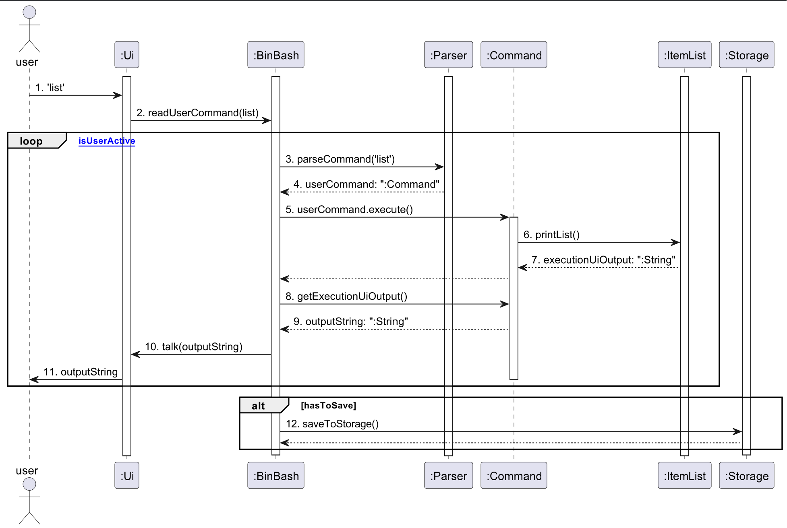
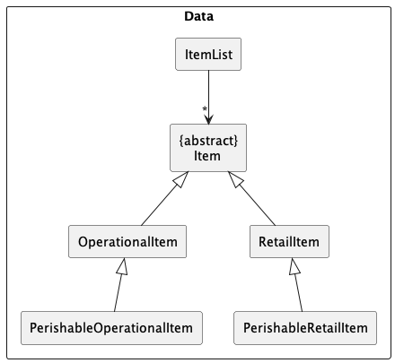
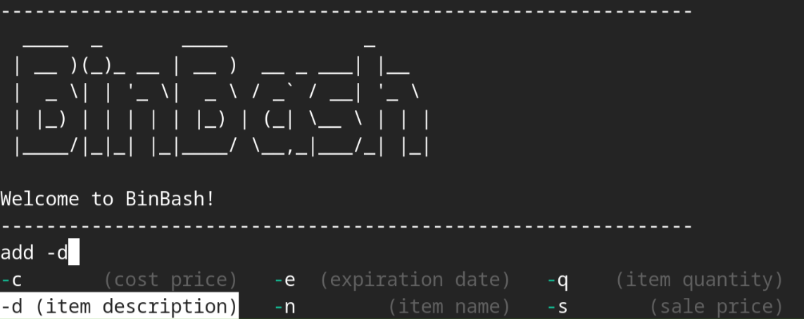

# Developer Guide

## Table of Contents

* [Acknowledgements](#acknowledgements)
* [Setting up, getting started](#setting-up-getting-started)
* [Design](#design)
  * [Data Component](#data-component)
  * [Ui](#ui)
* [Implementation](#implementation)
* [Logging](#logging)
* [Product scope](#product-scope)
  * [Target user profile](#target-user-profile)
  * [Value proposition](#value-proposition)
* [User Stories](#user-stories)
* [Non-Functional Requirements](#non-functional-requirements)
* [Glossary](#glossary)
* [Instructions for manual testing](#instructions-for-manual-testing)

## Acknowledgements

{list here sources of all reused/adapted ideas, code, documentation, and third-party libraries -- include links to the original source as well}

## Setting up, getting started

## Design

# Design

### Architecture

Given below is a quick overview of main components and how they interact with each other.

### Main components of the architecture

The bulk of the app's work is done by the following six components:

- `Ui`: The UI of the App.
- `Storage`: Reads data from and writes data to a .txt file
- `Parser`: Makes sense of the user input to return the appropriate command
- `Command`: Executes the command requested by the user
- `ItemList`: Consists of all the classes that are involved during command execution
- `BinBash`: Responsible for initializing the above classes in the correct sequence during startup, and connecting them up with each other.

### Sequence Diagram

The **Sequence Diagram** below shows how the components interact with each other for the scenario where the user issues the command `list`.



#### Figure 2: Architecture Encode Sequence Diagram

1. User enters the command `list` to the `Ui`.
2. `Ui` passes the command as a string through the method `readUserInput('list')`, called via `BinBash`.
3. `BinBash` passes the string to `Parser` through the method `parseCommand('list')`.
4. `Parser` returns a new `Command` object. (In this specific case, it would be a ListCommand object)
5. `BinBash` calls the `execute()` method of `Command`.
6. `Command` then interacts with `ItemList`, and calls the relevant method.
7. `ItemList` returns the executionUiOutput, in the form of a String object. 
8. `BinBash` calls the `getExecutionUiOutput` command in `Command`
9. `Command` returns the outputString, in the form of a String object.
10. `BinBash` calls the `talk()` method in `Ui`, and passes the outputString.
11. `Ui` prints this outputString to the user.
12. If the `Command` executed modifies the database, `BinBash` will call the `saveToStorage()` method of `Storage`

### Data Component



API: [`ItemList.java`](https://github.com/AY2324S2-CS2113T-T09-2/tp/blob/master/src/main/java/seedu/binbash/ItemList.java)

The `Data` component is primarily composed of an `ItemList` object that stores different types of `Item`.

`Item` has different types, such as `RetailItem`, `OperationalItem`, `PerishableRetailItem`, and `PerishableOperationalItem`.

## Features

### Iman

### Add Item

The `add` command adds an item to the `Item` object and prints out a formatted message to state the name, description,
quantity, expiration date, sale price, and cost price entered for the item.

When the `execute()` method from `AddCommand` class is called, the `addItem()` method is first called to create a new
`RetailItem` object or `PerishableRetailItem` object depending on the user inputs. It will then add the object to the
`ItemList`. It will then call the `Ui` class to print out a message indicating that the item has
been successfully added.

Separation of Concerns is applied to ensure the `Ui` is only responsible for printing the messages to output, while the 
`ItemList` class deals with the logic of adding an item to the list. This implementation also encapsulates the details 
of adding an item and displaying messages. This way, only classes relevant to the logic of adding an item will have 
access to `ItemList`.

### Haziq

### List all items in inventory

The `ListCommand` class is designed to handle the operation of listing all items in the inventory. When the `execute()` method is called, it retrieves the complete list of items from the `ItemList`
and assigns it to `executionUiOutput`.

#### Implementation Notes ####
The ListCommand is concerned only with the execution of the listing operation. It follows a straightforward process that relies on the `ItemList` to format the list of items, ensuring separation of concerns between command execution and UI presentation.

### Jun Han

### Delete Item

TODO: Sequence diagram of DeleteCommand

The `delete` command deletes an object of the `Item` class or any of its subclasses from the inventory list and 
prints a formatted message stating the details of the items that was deleted. 

The constructor of the `DeleteCommand` class is overloaded and its behavior differs based on what search parameter is 
entered. The possible constructors are:

* `DeleteCommand(int index)`: This constructor is used if the search parameter is an `Integer`. The `isIndex` variable will be set to true, which indicates that an item should be removed by matching its `index`.
* `DeleteCommand(String keyword)`: This constructor is used if the search parameter is a `String`. Conversely, the `isIndex` variable will be set to false, which indicates that an item should be removed by matching its `name`.

When the `execute()` method from `DeleteCommand` class is called, it first checks whether the search parameter entered
is an `Integer` or a `String` using the `isIndex` variable. Once the search parameter is checked, it calls the
`deleteItem` method of the `ItemList` object passed as a parameter to the `execute()` method.

Similar to the `DeleteCommand` constructor, the `deleteItem` method of the `ItemList` class has different behaviors 
based on the data type of the parameter passed. The implementation is done by overloading the `deleteItem` method and
having one `deleteItem` method take in an `Integer` and another taking in a `String`.
* If the parameter is an `Integer`, the `deleteItem(int index)` method will call the `remove` method of the `ArrayList` class to
remove the item from the inventory list.
* If the parameter is a `String`, the `deleteItem(String keyword)` method will run a `for` loop to iterate through the `ArrayList`
until it finds a `Item` object whose name `equals` to that of the search parameter. If an `Item` object has matching
names with the search parameter, it will store the index in the `targetIndex` variable. This `deleteItem(String keyword)` method will
then call another `deleteItem(int index)` method, but this time, the parameter passed is an integer. The execution after this
will be exactly the same as passing an `Integer` to the `deleteItem(int index)` method mentions above.

Upon completion of either operation, the `execute()` method sets the `hasToSave` flag to true, signaling the need to persist changes to storage. This entire process is logged at various levels, providing a trail for audit and debugging purposes.

#### Implementation Notes ####
The design of `DeleteCommand` is such that it encapsulates the delete operation, separating concerns by handling the logic of deletion internally and interacting with `ItemList` without exposing the details of the list's data structure. This modular approach simplifies the responsibilities of the `Parser` and `BinBash` (main) components, which do not need to understand the internals of the delete operation, thereby adhering to the principles of high cohesion and low coupling.

Additionally, the decision to use two constructors promotes the Single Responsibility Principle, as each constructor's logic is tailored to the type of deletion it handles.

### UI

API: [`Ui.java`](../src/main/java/seedu/binbash/ui/Ui.java)


The above class diagram shows the components delegating separate functionalities of the Ui.

The `TextIn` class is responsible for reading user input and returning it to `Ui`, upon which it is passed to the *main()* program.

The `PrintStream` class writes text at the behest of `Ui` to standard output, upon which it is received by the user.

Note the use of an externally provided `LineReader` object in the `TextIn` class that handles input. This allows us to greatly extend our text-based user interface with features such as:

1. Command completion on tab

2. Displaying option descriptions on hover

3. Contextual help menus



This allows us to overload options on a small number of commands to provide full functionality of the application. Developers can then extend its features without also the worry of finding a way for users to access those features easily.

### Yi Hao

### Xavier

## Implementation

### Iman

### Haziq

### Jun Han

### [Proposed] Search by universal fields

#### Proposed Implementation

This feature redefines our current Search command to allow searching by attributes of class `Item` and not just its name. An example usage scenario is as such:

The user executes the following

```console
$ search -d battery -e 2w --match 3
```

The arguments are then parsed in turn, stored in the filter for the method *SearchItem()* in `ItemList` and filtered to return an ArrayList of at most *match* items.

This return value can be printed to the user as per pre-existing *print()* methods.

### Yi Hao

### Xavier

## Logging

* We are using `java.util.logging` package for logging.
* The `BinBashLogger` class is used to manage all logging related funtions.
* The `Logger` for a class can be obtained by contructing a `BinBashLogger` object and assigning it as a class-level variable
* Log messages are output to a `logs.txt` file in the `*/logs/` directory by default.
* If there are issues with the `logs.txt` file that results in no `logs` being written, warnings logs will be output through the console instead.

## Product scope

### Target user profile

* Retail shop owners who has a need to efficiently manage their inventory list
* prefer desktop apps over other types of apps
* can type fast
* prefers typing to mouse interactions
* is reasonably comfortable using CLI apps

### Value proposition

* Manage inventory list more efficiently compared to manual stock taking and typical mouse/GUI driven apps
* Portability allows usage on multiple operating systems (E.g. Windows, Linux, Mac).
* Lightweight, only requires entry-level hardware to run.

## User Stories

| Version | As a ... | I want to ...             | So that I can ...                                           |
| ------- | -------- | ------------------------- | ----------------------------------------------------------- |
| v1.0    | new user | see usage instructions    | refer to them when I forget how to use the application      |
| v2.0    | user     | find a to-do item by name | locate a to-do without having to go through the entire list |

## Non-Functional Requirements

{Give non-functional requirements}

## Glossary

* *glossary item* - Definition

## Instructions for manual testing

{Give instructions on how to do a manual product testing e.g., how to load sample data to be used for testing}
