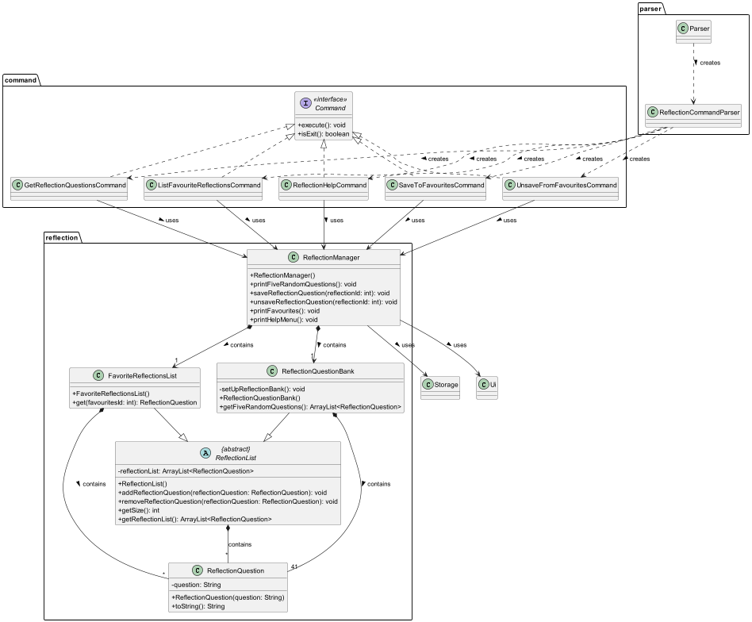
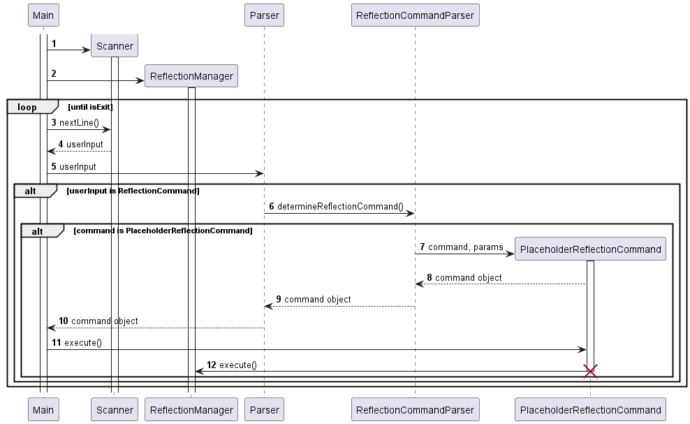
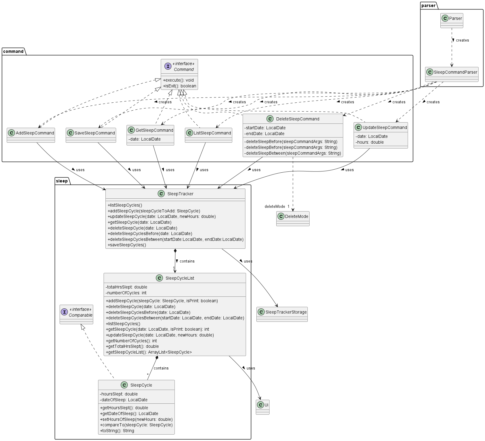
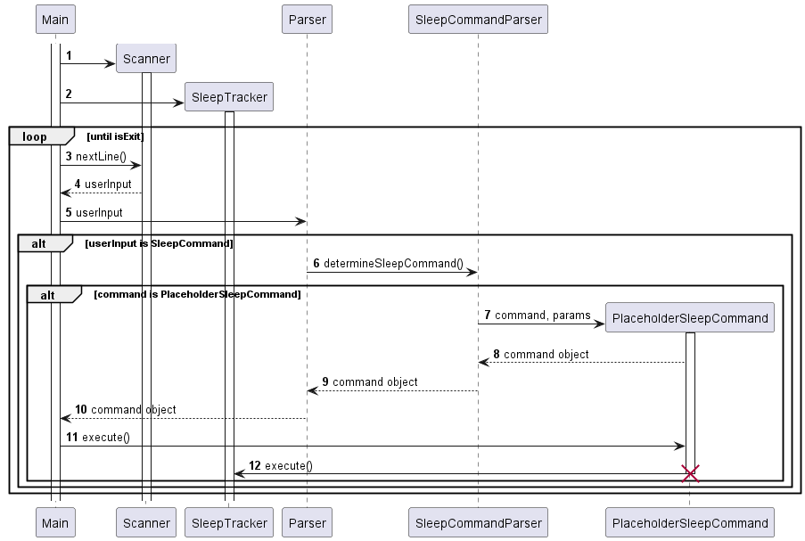

# Wellness360 Developer Guide

## Table of Contents
- [Wellness360 Developer Guide](#wellness360-developer-guide)
- [Table of contents](#table-of-contents)
- [Acknowledgements](#acknowledgements)
- [Setting up, getting started](#setting-up-getting-started)
  - [Setting up the project in your computer](#setting-up-the-project-in-your-computer)
  - [Before writing code](#before-writing-code)
- [Design & implementation]()
  - [Architecture]()
  - [Ui component]()
  - [Command parser component]()
  - [Storage component]()
  - [Reflection component](#reflection-component)
    - [Description](#description)
    - [Design Considerations](#design-considerations)
      - [User Design Considerations](#user-design-considerations)
      - [Developer Design Considerations](#developer-design-considerations)
    - [Implementation](#implementation)
      - [Class Diagram](#class-diagram)
      - [Sequence Diagram](#sequence-diagram)
  - [Habit tracker component]()
  - [Sleep tracker component](#sleep-tracker-component)
    - [Description](#description-1)
    - [Design Considerations](#design-considerations-1)
      - [User Design Considerations](#user-design-considerations-1)
      - [Developer Design Considerations](#developer-design-considerations-1)
    - [Implementation](#implementation-1)
      - [Class Diagram](#class-diagram-1)
      - [Sequence Diagram](#sequence-diagram-1)
  
  - [Focus timer component]()
  - [Fitness tracker component]()

## Acknowledgements

Reference to AB-3 Developer Guide
* [Source URL](https://se-education.org/addressbook-level3/DeveloperGuide.html#documentation-logging-testing-configuration-dev-ops)
* Used as template to structure this DeveloperGuide

Reference to AB-3 diagrams code
* [Source URL](https://github.com/se-edu/addressbook-level3/tree/master/docs/diagrams)
* Used as reference to understand PlantUML syntax

## Setting up, getting started

### Setting up the project in your computer
Fork this repo, and clone it on your local machine.

You are recommended to use Intellij IDEA:

1. Configure the JDK: Follow the guide [[se-edu/guides] IDEA: Configuring the JDK](https://se-education.org/guides/tutorials/intellijJdk.html) to ensure Intellij is configured to use JDK 11.
2. Import the project as a Gradle project: Follow the guide [[se-edu/guides] IDEA: Importing a Gradle project](https://se-education.org/guides/tutorials/intellijImportGradleProject.html) to import the project into IDEA.
3. Verify the setup:
    * Run the main class in IntelliJ and try a few commands.
    * Run the tests to ensure they all pass.

### Before writing code
1. Configure the coding style: [[se-edu/guides] IDEA: Configuring the code style](https://se-education.org/guides/tutorials/intellijCodeStyle.html)
2. Set up CI: This project comes with a GitHub Actions config files (in .github/workflows folder). When GitHub detects those files, it will run the CI for your project automatically at each push to the master branch or to any PR. No set up required.
3. Read the developer guide to understand the design.

## Design & implementation

### Architecture

### Ui component

### Command parser component

### Storage component

### Reflection component
#### Description
The Reflection component provides users with random reflections questions to reflect on about their personal lives and goals. 
This component aims to contribute to the goal of improving user's wellness.

#### Design Considerations
* ##### User Design Considerations
  * The sets of 5 questions are randomly generated each time. They are randomised to allow users to reflect on different areas. 
  * Users can save questions they liked into their favourites list for future review.
  * Users can also delete questions from their favourites list if the question is no longer relevant to them.
  * Help menu is available for new users to guide them on how to use the reflection feature.
  * Error messages with guidance messages will be printed to console if command input by user is invalid.

* #### Developer Design Considerations
  * Modularity: Organized into packages for separation of concerns. Each package contains related classes, such as ReflectionManager and ReflectionList in the reflection package, and ReflectionCommandParser in the parser package.
  * Abstraction: Use of abstract classes and interfaces for flexibility and extensibility. Abstract classes (ReflectionList) provide a common structure and behavior for subclasses (FavoriteReflectionsList, ReflectionQuestionBank), promoting code reuse and ensuring consistent functionality across different implementations.
  * Encapsulation: Private access modifiers and encapsulated methods ensure data integrity. Methods like addReflectionQuestion() and removeReflectionQuestion() in ReflectionList encapsulate the manipulation of the reflection list, ensuring data integrity and promoting a clear interface for interacting with the list.
  * Exception Handling: Graceful error handling with meaningful messages.
  * Command Design Pattern: Encapsulation of actions as objects for decoupling.
  * Dependency Injection: Dependencies injected via constructors for loose coupling.
  * SRP: Classes adhere to the Single Responsibility Principle. For example, the ReflectionManager class is responsible for managing reflection-related operations, while the ReflectionCommandParser class handles parsing and determining reflection commands.
  * Readability and Maintainability: Descriptive naming, comments, and documentation for clarity.

#### Implementation

##### Class Diagram

  * `ReflectionManager` class
    * Overview
      * The `ReflectionManager` class oversees reflection-related operations, managing reflection questions and favorites. 
    * Attributes:
      * `HELP_MENU_INSTRUCTIONS`: Array containing instructions for the help menu. (Omitted from Class Diagram)
      * `FAVOURITE_QUESTIONS_FILE_PATH`: Path to the file storing favorite reflection questions. (Omitted from Class Diagram)
      * `fiveRandomQuestions`: ArrayList holding five random reflection questions. (Omitted from Class Diagram)
      * `questionBank`: Instance of `ReflectionQuestionBank` managing reflection questions.
      * `favoriteReflectionsList`: Instance of `FavoriteReflectionsList` managing favorite reflection questions.
    * Methods:
      * `printFiveRandomQuestions()`: Prints five random reflection questions.
      * `saveReflectionQuestion(int reflectionId)`: Saves a reflection question to favorites based on ID.
      * `unsaveReflectionQuestion(int reflectionId)`: Removes a reflection question from favorites based on ID.
      * `printFavourites()`: Prints the list of favorite reflection questions.
      * `printHelpMenu()`: Prints the help menu with available reflection commands.
    * Dependencies:
      * Storage: Utilized for data storage operations.
      * Ui: Utilized for user interface interactions.
    * UML notes:
      * `ReflectionManager` contains exactly one `ReflectionQuestionBank` class and one `FavoriteReflectionsList` class.
      * It relies on `Storage` class for file operations and `Ui` class for user interactions.
  
  * `ReflectionQuestion` class
    * Overview:
      * This class represents a reflection question
    * Attributes:
      * `question`: Private attribute holding the text of the reflection question.
    * Methods:
      * `toString()`: Overriden method that retrieves the text of the reflection question.
    * UML notes:
      * `ReflectionList` and `FavoriteReflectionsList` may contain 0 or more `ReflectionQuestion` instances.
      * `ReflectionQuestionBank` contains exactly 41 of `ReflectionQuestion` instances.
      * When a `ReflectionList`/ `FavoriteReflectionsList`/ `ReflectionQuestionBank` object is destroyed, its associated `ReflectionQuestion` instances are also destroyed, reflecting a "whole-part" relationship.
  
  * `ReflectionList` class
    * Overview:
      * The `ReflectionList` class serves as an abstract representation of a list of reflection questions within the Reflection Management System. It provides basic operations for managing reflection questions, such as adding, removing, and retrieving questions from the list.
    * Attributes:
      * `reflectionList`: Protected attribute representing the list of reflection questions. It is an ArrayList of ReflectionQuestion objects.
    * Methods:
      * `addReflectionQuestion(ReflectionQuestion reflectionQuestion)`: Adds a reflection question to the list. 
      * `removeReflectionQuestion(ReflectionQuestion reflectionQuestion)`: Removes a reflection question from the list.
      * `getSize()`: Retrieves the size of the reflection list. 
      * `getReflectionList()`: Retrieves the list of reflection questions.
    * UML notes:
      * `FavoriteReflectionsList` inherits from `ReflectionList`
      * `ReflectionQuestionBank` inherits from `ReflectionList`
      * `ReflectionList` may contain 0 or more instances of `ReflectionQuestion`. The association is of type composition.
  
  * `FavoriteReflectionsList` class
    * Overview:
      * The `FavoriteReflectionsList` class extends the `ReflectionList` class and represents a specialized list of favorite reflection questions within the Reflection Management System. It inherits functionality from `ReflectionList`.
    * Attributes:
      * Inherits from the superclass `ReflectionList`.
    * Methods:
      * `get(int favouritesId)`: Retrieves a favorite reflection question by its index in the list.
    * Dependencies:
      * Inherits functionality from the `ReflectionList` class.
    * UML notes:
      * `FavoriteReflectionsList` inherits from `ReflectionList`.
      * `ReflectionManager` contains a single instance of `FavoriteReflectionsList`.
      * `FavoriteReflectionsList` may contain 0 or more instances of `ReflectionQuestion`.

  * `ReflectionQuestionBank` class
    * Overview:
      * The `ReflectionQuestionBank` class represents a bank of reflection questions within the Reflection Management System. It extends the ReflectionList class to inherit basic list management functionalities and provides additional methods for initializing the bank with predefined questions and retrieving random sets of questions.
    * Attributes:
      * Inherits from the superclass `ReflectionList`. 
      * `REFLECTION_QUESTIONS`: Static array containing predefined reflection questions that used for setup of question bank.
    * Methods:
      * `setUpReflectionBank()`: Initializes the reflection question bank with predefined questions. 
      * `getFiveRandomQuestions()`: Retrieves five random reflection questions from the bank.
    * Dependencies:
      * Inherits functionality from the `ReflectionList` class.
    * UML notes:
      * `ReflectionManager` contains a single instance of `ReflectionQuestionBank`
      * `ReflectionQuestionBank` inherits from `ReflectionList`
      * `ReflectionQuestionBank` contains 41 instances of `ReflectionQuestion`
  
  * `ReflectionCommandParser`
    * Overview: Parses reflection-related commands and create different reflection command objects based on user input.
    * Method: `determineReflectionCommand(ReflectionManager reflectionManager, String commandArgs)`
  
  * Reflection command classes
    * `GetReflectionQuestionsCommand`: Retrieve random reflection questions.
      * Command format: `reflect get`
    * `ListFavouriteReflectionsCommand`: List favorite reflection items.
      * Command format: `reflect list`
    * `ReflectionHelpCommand`: Display help menu for reflection commands.
      * Command format: `reflect help`
    * `SaveToFavouritesCommand`: Save a reflection item to favorites.
      * Command format: `reflect save <reflection_id>`
    * `UnsaveFromFavouritesCommand`: Unsave a reflection item from favorites.
      * Command format:`reflect unsave <reflection_id>`

#### Sequence Diagram

* Note that `PlaceholderReflectionCommand` can refer to any of the reflection commands as mentioned above, as all of them follow the same call pattern.

When main starts, `scanner` and `ReflectionManager` objects are created. Upon receiving user input, the input will first be
determined if it is a command related to the reflection feature. If it is, it will be further parsed by `ReflectionCommandParser` to determine
the command. The corresponding reflection command object is then created and is returned to `Main`, where `execute` will then be called
and the corresponding method in `ReflectionManager` is invoked.

### Habit tracker component

### Sleep tracker component

#### Description

The Sleep tracker component allow users to keep track of the number of hours they have slept, so that users will know
when their lacking sleep or getting more sleep hours as the day progresses. With information on the user's sleep cycle,
one will be able to understand what is their optimal sleep cycle. With this users can have better sleep, improving
user's wellness.

#### Design Considerations

* ##### User Design Considerations
    * Users can add hours slept on a specific date
    * Users can update hours slept on a specific date in case of mistakes in adding of sleep hours
    * Users can list out all sleep hours tracked or get number of hours slept on a specific date
    * Users can delete sleep cycles with deletion methods of:
        * Deleting a sleep cycle that is of a certain date
        * Deleting sleep cycles before a certain date
        * Deleting sleep cycles between certain dates
    * Error messages with guidance messages will be printed to console if command input by user is invalid.

* ##### Developer Design Considerations
    * SRP: Ease of scalability is achieved as classes adhere to the Single Responsibility Principle. For example, 
    the SleepTracker class is responsible for managing sleep tracker related commands, SleepCommandParser class handles
    parsing and determining which sleep command is being called and SleepCycleList is responsible for storing sleep 
    cycles and methods that can be called to edit it's content.
    * Readability and Maintainability: Descriptive naming, use of Enumerations and JavaDoc for clarity. 
    For example, use of enumerations for deleteMode.
    * Encapsulation: Private access modifiers and encapsulated methods ensure data integrity. Methods like addSleepCycle
    and deleteSleepCycle in SleepCycleList encapsulate the manipulation of the reflection list, ensuring data integrity
    and promoting a clear interface for interacting with the list.
    * Exception Handling: Extensive coverage of exceptions in sleepCommand classes to ensure all errors are handled 
    properly

#### Implementation

##### Class Diagram

* `SleepTracker` class
  * Overview
    * The `SleepTracker` class oversees sleep-related operations, managing sleep cycles.
  * Attributes:
    * `sleepCycleList`: Instance of `SleepCycleList` managing sleep cycles.
  * Methods:
    * `listSleepCycles()`: List out all sleep cycles.
    * `addSleepCycle(SleepCycle sleepCycleToAdd)`: Add sleep cycle.
    * `updateSleepCycle(LocalDate date, double newHours)`: Change hours slept for specific date.
    * `getSleepCycle(LocalDate date)`: Get number of hours slept for specific date.
    * `deleteSleepCycle(LocalDate date)`: Delete sleep cycle for specific date.
    * `deleteSleepCyclesBefore(LocalDate date)`: Delete sleep cycle before specific date.
    * `deleteSleepCyclesBetween(LocalDate startDate, LocalDate endDate)`: Delete sleep cycles between 2 dates.
    * `saveSleepCycles()`: Save sleep cycle list into a text file.
  * Dependencies:
    * `SleepTrackerStorage`: Utilized for sleep cycle data storage operations
  * UML Notes:
    * `SleepTracker` contains only 1 `SleepCycleList`
    * It relies on `SleepTrackerStorage` class for file operations

* `SleepCycle` class
  * Overview:
    * This class represents a sleep cycle
  * Attributes:
    * `hoursSlept`: Number of hours slept
    * `dateOfSleep`: Date that user slept on
  * Methods:
    * getHoursSlept(): Get Hours slept for this sleep cycle.
    * getDateOfSleep(): Get date slept for this sleep cycle.
    * setHoursOfSleep(double newHours): Set Hours slept for this sleep cycle to a new duration.
    * compareTo(SleepCycle: SleepCycle): Comparison between sleep cycles.
    * toString(): String format for what needs to be printed out for a sleep cycle.
  * `SleepCycleList` may contain 0 or more instances of `SleepCycle`.
  * UML Notes:
    * When a `SleepCycleList` object is destroyed, its associated `SleepCycle` instances are also destroyed,
    reflecting a "whole part" relationship.

* `SleepCycleList` class
  * Overview
    * The `SleepCycleList` class contains all sleep cycles added by the user.
  * Attributes:
    * `totalHrsSlept`: Accumulated number of hours slept from all sleep cycles. 
    * `numberOfCycles`: Number of sleep cycles in sleepCycleList.
  * Methods:
    * `listSleepCycles()`: List out all sleep cycles.
    * `addSleepCycle(SleepCycle sleepCycleToAdd)`: Add sleep cycle.
    * `updateSleepCycle(LocalDate date, double newHours)`: Change hours slept for specific date.
    * `getSleepCycle(LocalDate date)`: Get number of hours slept for specific date.
    * `deleteSleepCycle(LocalDate date)`: Delete sleep cycle for specific date.
    * `deleteSleepCyclesBefore(LocalDate date)`: Delete sleep cycle before specific date.
    * `deleteSleepCyclesBetween(LocalDate startDate, LocalDate endDate)`: Delete sleep cycles between 2 dates.
    * `getNumberOfCycles()`: Get number of sleep cycles in sleepCycleList.
    * `getTotalHrsSlept()`: Get total number of hours slept.
    * `getSleepCycleList`: Get list of sleep cycles.
  * Dependencies:
    * Ui: Utilized for user interface interactions
  * UML Notes:
    * `SleepTracker` contains a single instance of `SleepCycleList`.
    * `SleepCycleList` may contain 0 or more instances of `SleepCycle`. 
    * It relies on `Ui` class for user interaction.

* `SleepCommandParser` class
  * Overview: 
    * Parses sleep-related commands and create different sleep command objects based on user input.
  * Method:
    * determineSleepCommand(SleepTracker sleepTracker, String commandArgs)

* Sleep command classes
    * `AddSleep Command`: Add a sleep cycle.
        * Command format: `sleep add`
    * `DeleteSleepCommand`: Delete sleep cycles.
        * Delete sleep cycle matching date command format: `sleep delete /date <date>`
        * Delete sleep cycle before date command format: `sleep delete /before <date>`
        * Delete sleep cycles between 2 dates command format: `sleep delete /from <start_date /to <end_date>`
    * `GetSleepCommand`: Get number of hours slept on a specific date.
        * Command format: `sleep get <date>`
    * `ListSleepcommand`: Get information on all the sleep.
        * Command format: `sleep list`
    * `SaveSleepCommand`: Save current sleep cycles added/deleted/updated into a text file.
        * Command format:`sleep save`
    * `UpdateSleepCommand`: Change number of hours slept on a specific date.
        * Command format: `sleep update <date> /new <new_hours>`
    
##### Sequence Diagram

* Note that PlaceholderReflectionCommand can refer to any of the reflection commands as mentioned above, 
as all of them follow the same call pattern.

When main starts, scanner and SleepTracker objects are created. Upon receiving user input, the input will first 
be determined if it is a command related to the sleep tracker feature. If it is, it will be further parsed by 
SleepTrackerParser to determine the command. The corresponding sleep command object is then created and is 
returned to Main, where execute will then be called and the corresponding method in SleepTracker is invoked.

### Focus timer component

### Fitness tracker component

## Product scope
### Target user profile

{Describe the target user profile}

### Value proposition

{Describe the value proposition: what problem does it solve?}

## User Stories

|Version| As a ... | I want to ... | So that I can ...|
|--------|----------|---------------|------------------|
|v1.0|new user|see usage instructions|refer to them when I forget how to use the application|
|v2.0|user|find a to-do item by name|locate a to-do without having to go through the entire list|

## Non-Functional Requirements

{Give non-functional requirements}

## Glossary

* *glossary item* - Definition

## Instructions for manual testing

{Give instructions on how to do a manual product testing e.g., how to load sample data to be used for testing}
