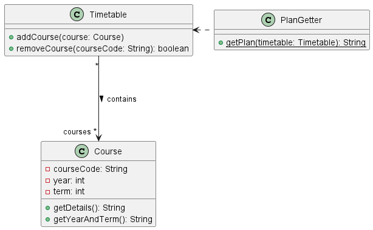
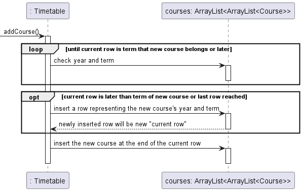
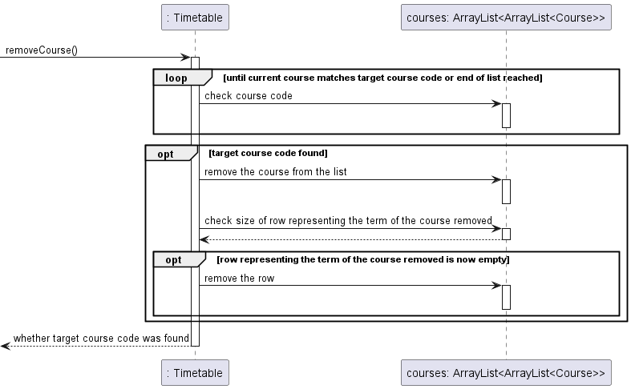
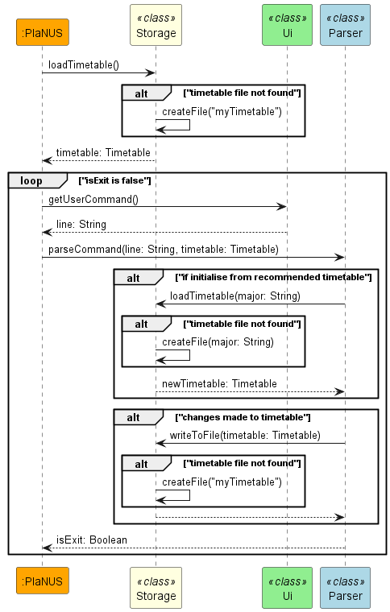
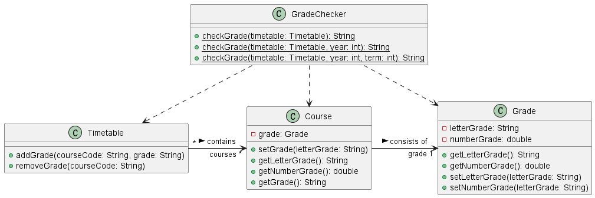

# Developer Guide

## Acknowledgements

{list here sources of all reused/adapted ideas, code, documentation, and third-party libraries -- include links to the original source as well}

## Design & implementation
### Timetable plan component
In order to keep track of the timetable plan of the user, 3 classes are used mainly.
- `Course`: Represents a course taken or planned by the user
- `Timetable`: Stores the list of courses
- `PlanGetter`: Provides access to the timetable plan

Below is the class diagram to illustrate this:

 

When `addCourse()` is called, it finds the suitable position to insert the newly added course according to the 
year and term. Then, the new course will be added into the list of courses.

Below is the sequence diagram to illustrate the implementation:

 

When `removeCourse()` is called, it attempts to find the course with the given course code and removes the course 
from the list of courses if it exists.

Below is the sequence diagram to illustrate the implementation:

 

There are 3 overloaded variations of the `getPlan()` method in the `PlanGetter` class.
The first is as shown in the class diagram above. 
The second takes in an additional integer `year`, while the third takes in two additional integers `year` and `term`.

Each of them loops through the timetable, getting the details of the courses in the course list.
The first variation outputs the details of all the courses in the plan, 
while the second and the third only pick out the specified year or term.

 

### Storage component
In order to store user data and load different data files for course planning, 
PlaNUS uses Storage class for this purpose.

Storage has two main file access APIs:
- `writeToFile(Timetable)`:
  - Take in a timetable containing courses, then write courses to the user data file at __./data/myTimetable.csv__.
    - Params: timetable – A table containing all courses of the user.
- `Timetable loadTimetable(String)`:
  - Take in a file name, then load the file containing all courses of the major/user to a Timetable object.
    - Params: timetableName – The name of the file containing all courses of the major/user. e.g. timetableName of "CEG" indicating the recommended timetable of Computer Engineering, while timetableName of "myTimetable" indicating the timetable of the user.
    - Returns: A timetable object that is loaded from the given file.

If target file is not found, the above two methods will be able to create the missing file.

Storage also contains a useful parser method `parseCourse(String)` that can parse a line of csv file into a Course object.

Below is a sequence diagram that shows how Storage takes part in the programme.

### Grade component
In order to store and check the grades of courses of the user, 4 classes are used mainly.
- `Grade`: Represents a grade of a course
- `Course`: Represents a course taken or planned by the user with grades being specified
- `Timetable`: Stores the list of courses
- `GradeChecker`: Provides access to the grades of the given period

Below is the class diagram to illustrate this:

The grades keyed in by the user are **String** type, e.g.`"A"`.
In the `Grade` class, the `setNumberGrade()` method converts the grade into **double** type, which is more appropriate for the calculation of GPA and total grades.

There are 3 overloaded variations of the `checkGrade()` method in the `GradeChecker` class.
The first only takes in Timetable `timetable`, which records the current plan of the user.
The second takes in an additional integer `year`, while the third takes in two additional integers `year` and `term`.

## Product scope
### Target user profile

Our target user profile is engineering students studying in NUS.

### Value proposition

The app aims to serve as a centralized platform for our target user to manage their past, current, and future courses 
based on their grades and interests. The app is able to keep a record of the user’s existing academic record and 
give the user relevant course information and future course recommendations.

## User Stories

|Version| As a ...                           | I want to ...                                                      | So that I can ...                                      |
|--------|------------------------------------|--------------------------------------------------------------------|--------------------------------------------------------|
|v1.0| new user                           | see usage instructions                                             | refer to them when I forget how to use the application |
|v1.0| new user                           | initialise my course plan based on my major's recommended schedule | populate the plan easily                               |
|v1.0| user                               | have my data auto-saved                                            | not worry about saving them                            |
|v1.0| user planning for future semesters | add new courses to the plan                                        | update the records                                     |
|v1.0| user planning for future semesters | remove courses from the plan                                       | change my mind                                         |
|v1.0| user planning for future semesters | view my course plan                                                | recall my plans                                        |
|v1.0| user recording past grades         | add my grades                                                      | keep track of my latest results                        |
|v1.0| user recording past grades         | modify my grades                                                   | keep track of my correct results                       |
|v1.0| user recording past grades         | check my grades along with the GPA calculated                      | see my results easily                                  |
|v2.0|                                    |                                                                    |                                                        |

## Non-Functional Requirements

{Give non-functional requirements}

## Glossary

* *glossary item* - Definition

## Instructions for manual testing

{Give instructions on how to do a manual product testing e.g., how to load sample data to be used for testing}
