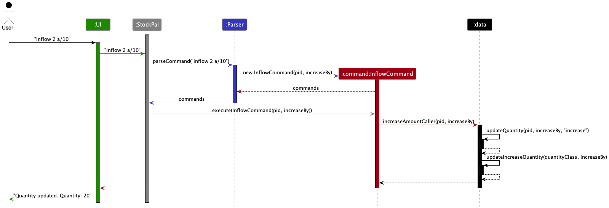
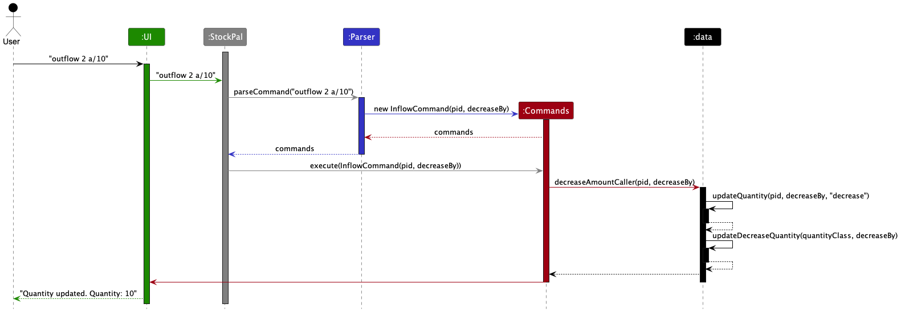

---
layout: page
title: Developer Guide
---
* Table of Contents
  {:toc}

--------------------------------------------------------------------------------------------------------------------

## **Acknowledgements**

* The formatting for the developer guide is inspired by [AB-3](https://se-education.org/addressbook-level3/DeveloperGuide.html).

Third-party libraries:
* [OpenCSV](https://opencsv.sourceforge.net/) - This package is licensed under [Apache2](https://opencsv.sourceforge.net/licenses.html), which is a business-friendly open-source software license.

--------------------------------------------------------------------------------------------------------------------

## **Design**

:bulb: **Tip:** The `.puml` files used to create diagrams in this document `docs/diagrams` folder. Refer to the [_PlantUML Tutorial_ at se-edu/guides](https://se-education.org/guides/tutorials/plantUml.html) to learn how to create and edit diagrams.

### Architecture

The ***Architecture Diagram*** given above explains the high-level design of the App.

Given below is a quick overview of main components and how they interact with each other.

**Main components of the architecture**

[**`StockPal`**](https://github.com/AY2324S2-CS2113T-T09-3/tp/blob/master/src/main/java/seedu/stockpal/StockPal.java) is in charge of the app launch and shut down.

The bulk of the app's work is done by the following five components:

* [**`UI`**](#ui-component): The UI of the App.
* [**`Parser`**](#parser-component): Parses user input into respective commands.
* [**`Commands`**](#commands-component): The command executor.
* [**`Data`**](#data-component): Holds the data of the App in memory.
* [**`Storage`**](#storage-component): Reads data from, and writes data to, the hard disk.

[**`Commons`**](#common-classes) represents a collection of classes used by multiple components above.
[**`Exceptions`**](#exceptions-classes) represents a collection of exceptions used by multiple components above.

**How the architecture components interact with each other**

The *Sequence Diagram* below shows how the components interact with each other for the scenario where the user issues the command `delete 1`.

The sections below give more details of each component.

### UI component
The **API** of this component is specified in [`Ui.java`](https://github.com/AY2324S2-CS2113T-T09-3/tp/tree/master/src/main/java/seedu/stockpal/ui/Ui.java)

### Parser component

**API** : [`Parser.java`](https://github.com/AY2324S2-CS2113T-T09-3/tp/blob/master/src/main/java/seedu/stockpal/parser/Parser.java)

### Commands component

**API** : [`Command.java`](https://github.com/AY2324S2-CS2113T-T09-3/tp/blob/master/src/main/java/seedu/stockpal/commands/Command.java)

### Data component

**API** : [`Data`](https://github.com/AY2324S2-CS2113T-T09-3/tp/blob/master/src/main/java/seedu/stockpal/data)

### Storage component

**API** : [`Storage.java`](https://github.com/AY2324S2-CS2113T-T09-3/tp/blob/master/src/main/java/seedu/stockpal/storage/Storage.java)

The `Storage` component,
* can save product list data in CSV format, and load them back into corresponding Products.
* depends on the `StockPal` component (because the `Storage` component's job is to save/load objects that belong to `StockPal`)
* consists of the classes `Storage`, `CsvWriter` and `CsvReader`.
  * `Storage` defines methods that loads and saves data.
  * `CsvWriter` is responsible for handling the writing of data to the CSV data file.
  * `CsvReader` is responsible for handling the reading of data from the CSV data file.

### Common classes

Classes used by multiple components are in the `seedu.stockpal.common` package.

### Exception classes

Exceptions classes used by multiple components are in the `seedu.stockpal.exceptions` package.

--------------------------------------------------------------------------------------------------------------------

## **Implementation**

This section describes some noteworthy details on how certain features are implemented.

### Add new product feature

The NewCommand class is responsible for adding a new product to the inventory in the StockPal application.

**Attributes**
* name: The name of the product.
* quantity: The initial quantity of the product.
* price: The price of the product.
* description: The description of the product.

**Methods**
* `NewCommand`: Constructor for creating a new instance of the NewCommand class.
* `execute`: Method to add the new product to the product list.
* `createProduct`: Method to create a new product with a unique product ID.

The following sequence diagram shows how an add operation works:

### Edit product feature

#### Implementation

#### Design consideration

### InflowCommand Feature

**API** : [`InflowCommand.java`](https://github.com/AY2324S2-CS2113T-T09-3/tp/blob/master/src/main/java/seedu/stockpal/commands/InflowCommand.java)

The `InflowCommand` class is used to increase the quantity of a specific product in the inventory.
This could represent scenarios like receiving new stock and updating inventory with new quantities.

**Implementation of InflowCommand**

The InflowCommand class is called in this format: `InflowCommand(pid, amountToIncrease)`
When the InflowCommand is called, a new instance of the InflowCommand initialised with pid and
amountToIncrease would be created.

The execute method will call `increaseAmount` which is a method of the ProductList class.
In the ProductList class, the `increaseAmount` method will call a `updatedIncreaseQuantity`
method in the quantity class.

It is implemented this way to adhere to Single Responsibility Principle (SRP), such that the
ProductList class will only handle the product involved in quantity increase, whereas the
Quantity class will be responsible for updating the quantities.

**Attributes**
* pid: The unique Product ID for each product
* quantity: The amount of quantity to increase product by

**Methods**
* `InflowCommand`: Constructor for creating a new instance of the InflowCommand class.
* `execute`: Method to increase quantity of the specified product.
  * `execute` calls `increaseAmount` in the ProductList class.
  * `increaseAmount` will call `updateIncreaseQuantity` in the Quantity class.

The following sequence diagram shows how the InflowCommand works.

### OutflowCommand Feature

**API** : [`OutflowCommand.java`](https://github.com/AY2324S2-CS2113T-T09-3/tp/blob/master/src/main/java/seedu/stockpal/commands/OutflowCommand.java)

The `OutflowCommand` class is used to decrease the quantity of a specific product in the inventory.
This could represent scenarios like selling products and updating inventory with new updated quantities.

**Implementation of OutflowCommand**

The OutflowCommand class is called in this format: `OutflowCommand(pid, amountToDecrease)`
When the OutflowCommand is called, similar to the InflowCommand class, a new instance of the
OutflowCommand initialised with pid and amountToDecrease would be created.

The execute method will call `decreaseAmount` which is a method of the ProductList class.
In the ProductList class, the `decreaseAmount` method will call a `updatedDecreaseQuantity`
method in the quantity class.

It is implemented this way to adhere to Single Responsibility Principle (SRP), such that the
ProductList class will only handle the product involved in quantity increase, whereas the
Quantity class will be responsible for updating the quantities.

**Attributes**
* pid: The unique Product ID for each product
* quantity: The amount of quantity to decrease product by

**Methods**
* `OutflowCommand`: Constructor for creating a new instance of the InflowCommand class.
* `execute`: Method to increase quantity of the specified product.
  * `execute` calls `decreaseAmount` in the ProductList class.
  * `decreaseAmount` in ProductList class will call `updateDecreaseQuantity` in the Quantity class.

The following sequence diagram shows how the OutflowCommand works.

 --------------------------------------------------------------------------------------------------------------------

## **Appendix: Requirements**

### Product scope

**Target user profile**:
* Small business owners who are looking to keep track of their inventory using CLI
* Possibly established companies looking to expand our application
  **Target user profile**:

**Value proposition**:  
Traditional inventory management methods often involve manual data entry, spreadsheets, and paper-based
tracking systems. These processes are time-consuming, error-prone, and lack real-time visibility into
inventory status. StockPal allows users to quickly update, track, and monitor inventory data through
intuitive command-line commands, saving time and improving efficiency.

## User Stories

|Version| As a ... | I want to ... | So that I can ...|
|--------|----------|---------------|------------------|
|v1.0|new user|see usage instructions|refer to them when I forget how to use the application|
|v2.0|user|find a to-do item by name|locate a to-do without having to go through the entire list|

## Non-Functional Requirements

* Any mainstream OS with Java `11` installed

## Glossary

* Mainstream OS: Windows, Linux, Unix, MacOS

--------------------------------------------------------------------------------------------------------------------

## **Appendix: Instructions for manual testing**

{Give instructions on how to do a manual product testing e.g., how to load sample data to be used for testing}

