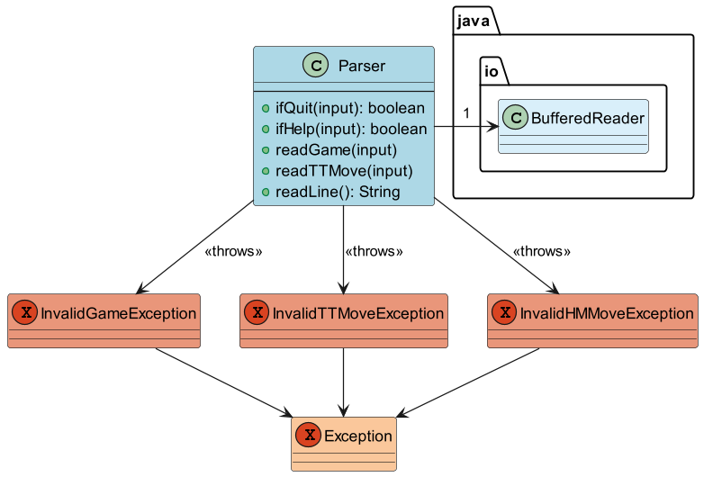

# AeroCade Developer Guide

## Table of Contents

- [Design & Implementation](https://ay2324s2-cs2113-w13-1.github.io/tp/DeveloperGuide.html#design--implementation)
- [Product Scope](https://ay2324s2-cs2113-w13-1.github.io/tp/DeveloperGuide.html#product-scope)
- [User Stories](https://ay2324s2-cs2113-w13-1.github.io/tp/DeveloperGuide.html#user-stories)
- [Non-Functional Requirements](https://ay2324s2-cs2113-w13-1.github.io/tp/DeveloperGuide.html#non-functional-requirements)
- [Glossary](https://ay2324s2-cs2113-w13-1.github.io/tp/DeveloperGuide.html#glossary)
- [Instructions for Manual Testing](https://ay2324s2-cs2113-w13-1.github.io/tp/DeveloperGuide.html#instructions-for-manual-testing)

## Acknowledgements

{list here sources of all reused/adapted ideas, code, documentation, and third-party libraries -- include links to the original source as well}

## Design & Implementation

Here is a quick overview of the main components and how they interact with each other:

- [Parser](https://ay2324s2-cs2113-w13-1.github.io/tp/DeveloperGuide.html#parser-implementation): Reads input
- [Ui](https://ay2324s2-cs2113-w13-1.github.io/tp/DeveloperGuide.html#ui-implementation): The UI of the App
- [Game](https://ay2324s2-cs2113-w13-1.github.io/tp/DeveloperGuide.html#game-implementation): The Interface concerning the games
- [TicTacToe](https://ay2324s2-cs2113-w13-1.github.io/tp/DeveloperGuide.html#tictactoe-implementation): Game 1
- [Hangman](https://ay2324s2-cs2113-w13-1.github.io/tp/DeveloperGuide.html#hangman-implementation): Game 2

### Parser Implementation:
Parser Class (v1.0) reads user input from the standard input stream, checks the input, 
tests the validity, and conveys the validity back to the class it is called from.

Briefly, the Parser class interacts with the main program by reading the inputs and throwing exceptions
if the inputs are unexpected. These exceptions are then handled by the Duke class or the 
TicTacToe class. 

Currently, the Parser class only covers the reading of the chosen game by the user and 
the moves performed in TicTacToe. A future implementation for v2.0 would integrate methods
to read and verify user input for the HangMan class as well, such as readLetters(String: input) 
or readHMMove(String: input).

### UI Implementation:
The `UI` consists of the AeroCade `logo`, the `help` menu, the `tutorial`, and sends farewell to the user upon `quit`

The `UI` component,

* reads user commands using `Parser` component.
* displays a `help` menu with instructions.
* creates a `tutorial` to assist user.

(image)

### Game Implementation:

### TicTacToe Implementation:

### Hangman Implementation:

## Product scope

### Target user profile

- Loves to play games and challenge themselves
- Prefers using desktop for entertainment
- Has particular interest in CLI commands
- Enjoys retro-style

### Value proposition

CLI-based games work on different operating systems and environments that support 
command-line interfaces. This means players can enjoy the game no matter what kind 
of computer or setup they use.

## User Stories

|Version| As a ... | I want to ... | So that I can ...|
|--------|----------|---------------|------------------|
|v1.0|new user|see usage instructions|refer to them when I forget how to use the application|
|v2.0|user|find a to-do item by name|locate a to-do without having to go through the entire list|

## Non-Functional Requirements

1. Should work on any mainstream OS as long as it has `Java 11` installed.

## Glossary

* *glossary item* - Definition

## Instructions for Manual Testing

{Give instructions on how to do a manual product testing e.g., how to load sample data to be used for testing}
