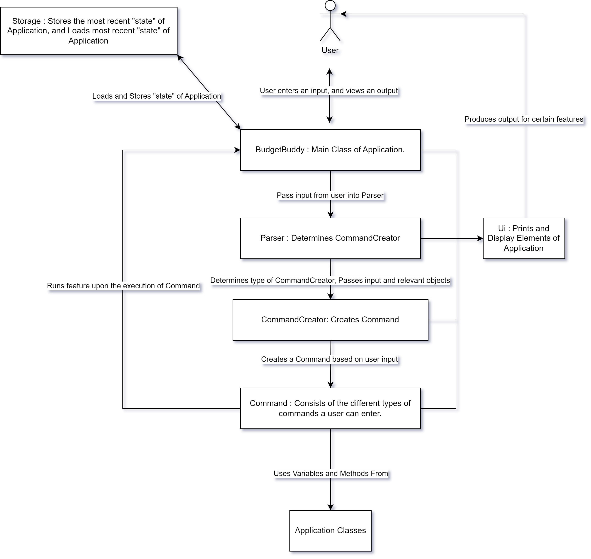

# Developer Guide

## Acknowledgements

{list here sources of all reused/adapted ideas, code, documentation, and third-party libraries -- include links to the original source as well}

## 1. Introduction
Welcome to the Developer Guide for BudgetBuddy! This guide has been created to help you current and future 
developers of Budget understand how BudgetBuddy works and aid developors in easily adding new features, 
fix bugs. In this guide, it will go over the main parts of the app, how they work together, 
and why we made them that way.

## 2. Setup Guide
This section describes how to set up the coding environment, along with the tools needed to work on BudgetBuddy

### 2.1. Prerequisites
1. JDK 11
2. IntelliJ IDEA

## 3.Design

### 3.1 Architecture
The following diagram provides a rough overview of how BudgetBuddy is built

`BudgetBuddy` is the main class of the application and directly interacts with the user, passing along the input
into the Parser. The `Parser` creates a `Command` object depending on the user's input, which will be executed in
`BudgetBuddy`. The `Command` object utilizes methods and the class present in the `Application Classes`, which will 
be explained in more detail in the following sections.

#### 3.2 Parser Class
Make Class Diagram + Explanation

#### 3.3 Ui Class
Make Class Diagram + Explanation

#### 3.4 Command Class
Make Class Diagram + Explanation

#### 3.5 Storage Class
Make Class Diagram + Explanation

### 3.6 Application Classes
The classes present in this group of `Application Classes` refers to certain elements which serves a purpose more
towards the `user` instead of application itself. They represent data of the user's financial transactions,
including expenses and savings, along with mechanisms for organizing and managing this data in meaningful ways.

##### 3.6.1 Transaction
Explain what it does

##### 3.6.2 Expense
Explain what it does

##### 3.6.3 ExpenseList
Explain what it does

##### 3.6.4 Saving
Explain what it does

##### 3.6.5 SavingList

### 4. Implementation

## 5. Product scope

### Target user profile
This product is for users who can type fast, and wishes to handle and track their current and future
expenses on a singular platform.

### Value proposition
BudgetBuddy is faster and more efficient way to track and calculate current and future expenses if a user is able to
type fast. It also provides the ability to deal with finances on a singular platform.

## 6. User Stories

| Rank | As a                          | I can                                     | So that I can                                 |
|------|-------------------------------|-------------------------------------------|-----------------------------------------------|
| 1    | user                          | add expenses                              | track my spending                             |
| 2    | user                          | Categorise my expenses                    | manage my finances more efficiently           |
| 3    | user                          | Plan my budget                            | Avoid overspending                            |
| 4    | user                          | Edit or delete expenses                   | remove any incorrectly added items            |
| 5    | User                          | Identify my largest spending category     | cut down on my spending                       |
| 6    | user                          | allocate saved funds                      | know how much I will have left after expenses |
| 7    | user                          | Have a section for children's allowances  | easily monitor their spending and teach them  |
| 8    | user interested in financial literacy | access educational content                | Learn more about financial literacy           |
| 9    | frequent traveler             | log expenses in multiple currencies       | accurately track my expenses across countries |
| 10   | User                          | See what commands i can use               | I know how to use the application             |

## Non-Functional Requirements

{Give non-functional requirements}

## Glossary

* *glossary item* - Definition

## Instructions for manual testing

{Give instructions on how to do a manual product testing e.g., how to load sample data to be used for testing}
