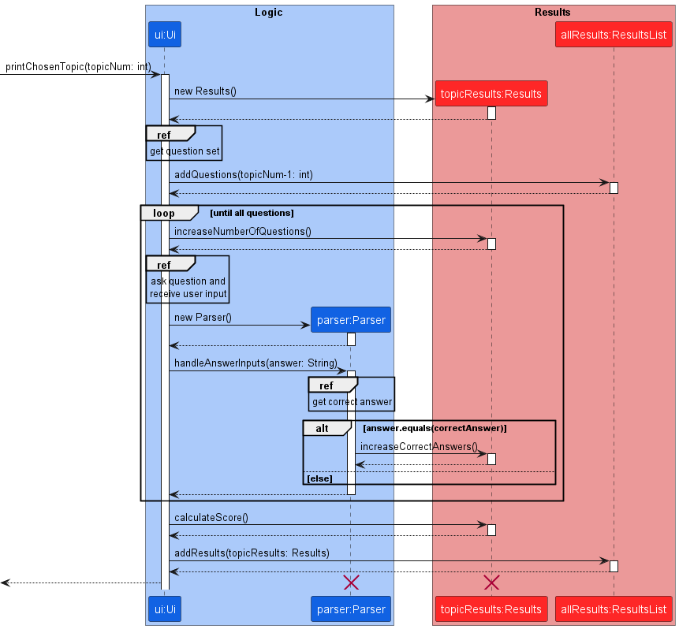

# Developer Guide

## Design & implementation

{Describe the design and implementation of the product. Use UML diagrams and short code snippets where applicable.}

### Results feature

The results feature is facilitated by `ResultsList` and 
`AnswerTracker`. Both are used to display the results for
all question sets attempted by the user, including details
such as specific questions and their respective answer inputs
from the user.

Given below is an example usage scenario and how the results
mechanism behaves at each step.

Step 1. The user launches the application for the first time,
and proceeds to start a game with their chosen topic.

The following sequence diagram shows how the `Results` for
one question set is added to the `ResultsList`:  

> **Note:** The lifeline for Parser and Results should end
> at the destroy marker (X) but due to a limitation of PlantUML,
> the lifeline reaches the end of the diagram.

Similarly, the following sequence diagram shows how the
`AnswerTracker` stores all the user answer inputs:  

Step 2. The user may repeat Step 1 with other question sets.  

The sequence diagram for this step involving `ResultsList` 
and `AnswerTracker` are the same as the ones shown in Step 1.

Step 3. The user now wants to view their results by executing
the `results` command.  

> **Note:** If the user uses the results feature before
> attempting any questions, the application will instead 
> return an error to the user indicating that there are no 
> results.

## Product scope

### Target user profile

CS2113/2103 students who wish to have an efficient tool to help them revise relevant concepts.

### Value proposition

Integration of key notions and learning learning objectives for CS2113 course, self-adaptive testing for understanding and feedback.

## User Stories

| Version | As a ...     | I want to ...                                        | So that I can ...                                            |
| ------- | ------------ | ---------------------------------------------------- | ------------------------------------------------------------ |
| v1.0    | new user     | see user guide in the app                            | refer to them if I am unfamiliar with the usage of a command |
| v2.0    | regular user | see a progress bar when answering MCQs               | track my progress when attempting a question set             |
| v2.0    | regular user | see a progress bar about all topics in the main menu | track my revision progress for the entire course             |

## Non-Functional Requirements

Usability: the user is able to use the app without reading lenthy documentations.

## Glossary

- _glossary item_ - Definition

## Acknowledgements

### Libraries

1. Display formatted tables in the CLI - [ASCII TABLES](https://bethecoder.com/applications/products/asciiTable.action)

2. Topic selection menu and testing mode progress bar - [ProgressBar](https://github.com/ctongfei/progressbar)

### References

## Instructions for manual testing

{Give instructions on how to do a manual product testing e.g., how to load sample data to be used for testing}
