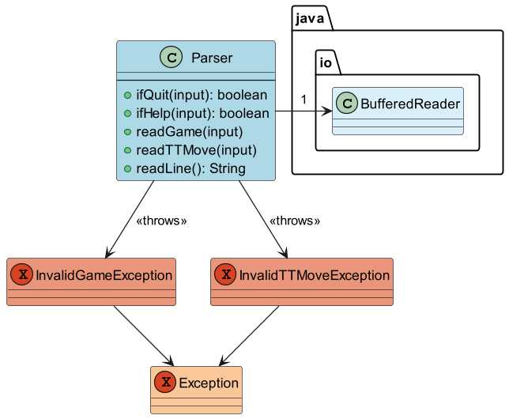

# Developer Guide

## Acknowledgements

{list here sources of all reused/adapted ideas, code, documentation, and third-party libraries -- include links to the original source as well}

## Design & implementation

{Describe the design and implementation of the product. Use UML diagrams and short code snippets where applicable.}

[Proposed] Update feature

Proposed Implementation

The proposed update feature is mainly carried out by `TravelActivityList`. It stores objects with class `TravelActivity`in an array called `travelActivities`
and each `TravelActivity` class object contains a date and duration. The `TravelAcivityList` also contains the following method:
* `TravelActivityList#updateTravelActivity(travelActivityNumber, date, duration)`-- Updates the date and duration of the specified object of `TravelActivity` class type.

Step 1. When the user launches the app for the first time, there will be no objects of type `TravelActivity` in `travelActivities`.
Thus any attempts to call the command `update INDEX`
will result in an output telling the user that no travel activity can be found.

Step 2. After the user has added new travel activities into the `travelActivityList`, the user can execute
`update 1 /date 2020-12-20 /duration 2hours` command to update the date and duration of the first travel activity
in the travel activity list. The `update` command calls the `Parser#updateCommand(line, list)` which then calls the `TravelActivityList#updateTravelActivity(travelActivityNumber, date, duration)`
. 

Step 3. The method will then find the travel activity with the corresponding travel activity number in the `travelActivities` and then set the new date and duration
of that travel activity.

The sequence diagram below shows how an update operation goes through the parser component:

## Product scope
### Target user profile

{Describe the target user profile}

### Value proposition

{Describe the value proposition: what problem does it solve?}

## User Stories

|Version| As a ... | I want to ... | So that I can ...|
|--------|----------|---------------|------------------|
|v1.0|new user|see usage instructions|refer to them when I forget how to use the application|
|v2.0|user|find a to-do item by name|locate a to-do without having to go through the entire list|

## Non-Functional Requirements

{Give non-functional requirements}

## Glossary

* *glossary item* - Definition

## Instructions for manual testing

{Give instructions on how to do a manual product testing e.g., how to load sample data to be used for testing}
