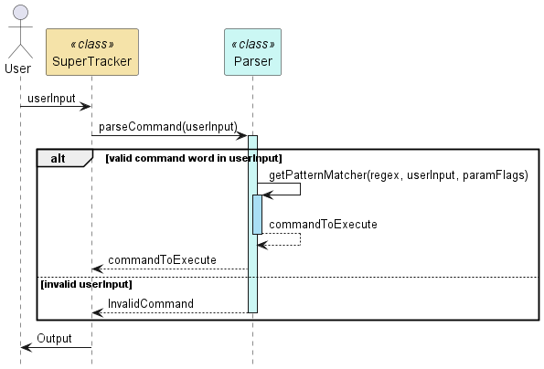
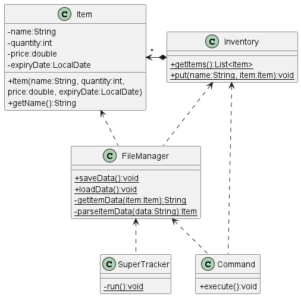
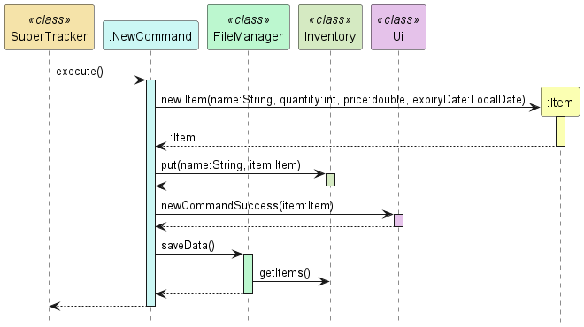
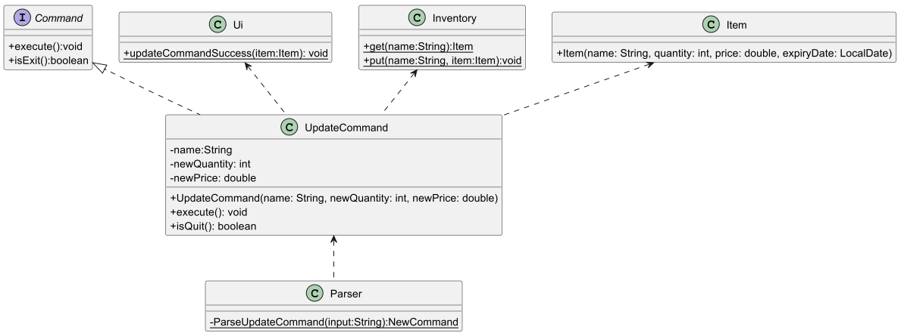
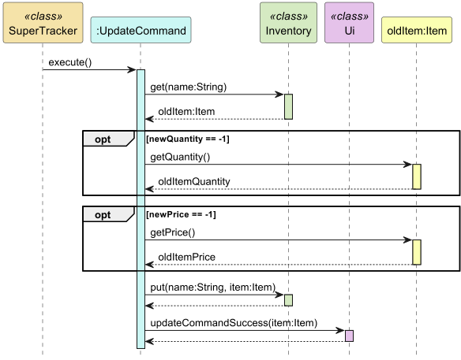
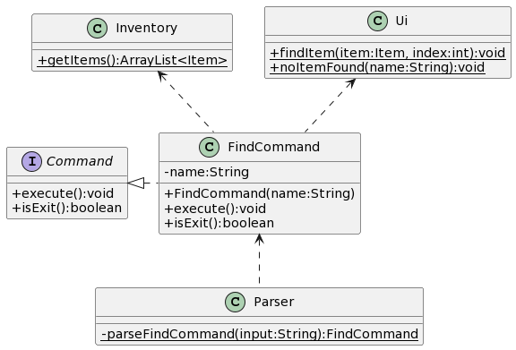
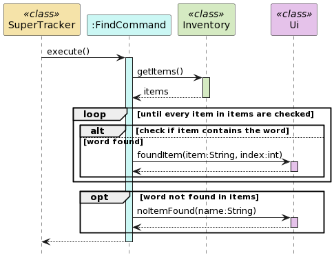

# Developer Guide

## Acknowledgements

{list here sources of all reused/adapted ideas, code, documentation, and third-party libraries -- include links to the original source as well}

## Design & implementation
This section describes how certain features are implemented

### Input Parsing
The program handles user inputs in the Parser class where inputs are parsed into command classes that implement the Command interface. 
The Parser class only contains static methods as we have determined that it would be more practical instead of instantiating an instance of a Parser class.

> Note on the command inputs:
> - All valid command inputs by the user will have a command word _(first word separated by whitespace)_ with its respective parameters following the word.
> - Each parameter must be entered following a flag, i.e. a name parameter will have the input `n/NAME`

The following is a class diagram of the `Parser` and its relevant dependencies\

The following is a sequence diagram of the execution sequence of a single user input\

`Parser+parseCommand(input)` will return a `Command` object according to the command word in the user input.
It returns an `InvalidCommand` class if the command word detected is invalid.

For the parsing of valid command word inputs, `Parser+parseCommand(input)` passes the parameters of the user input into the respective command's parsing method, 
then calls the method `Parser-getPatternMatcher(regex, input, paramFlags)`that returns a `Matcher` object, which is Java's regex pattern matcher.
We use regular expressions to simplify the process of pattern matching for input parameters. Each command will have their respective regex strings for pattern matching

> Note that `Parser-getPatternMatcher(regex, input, paramFlags)` will be called as long as the command word in the user input is valid,
> even if the parameters are invalid. The `Matcher` object returned will try to match the input parameters to the given regex.
> A `TrackerException` will be thrown if the input parameters are invalid.

The input parameters will be passed into another method, `Parser-makeStringPattern(inputParam, paramFlags)` that returns a string in a pattern
according to a preset format that contains all the necessary input parameters.
Converting the parameter string to a pattern is done because **order does not matter** in the user's input parameters _(if there are multiple parameters)._
Thus, it would be necessary to convert the user's input into a consistent format for pattern matching using regex.

> Note: 
> - All command regex are in the format:\
>   `a/(?<grp1>.*) b/(?<grp2>.*) c/(?<grp3>.*) ` with `a/`, `b/`, `c/` being the respective parameter flags
>   and `/` as the flag character.
>   - As of now, parameter flags must only contain 1 character right before the `/`
>   - Suppose we have `a/aaa b/bbb c/ccc ` as an input, according to the regex above, 
>   aaa will be in the named capture group "grp1", bbb in "grp2", ccc in "grp3"
> - If a parameter is optional, we would have it in a non-capture group with a `?` at the end
>   - i.e. in `a/(?<grp1>.*) (?<grp2>(?:b/.*)?)`, the `b/` flag is an optional parameter
> 
> For example, suppose the program wants to match the user input parameter
> `c/coconut a/apple b/bear a/anaconda d/donkey` to the regex `a/(?<grp1>.*) b/(?<grp2>.*) c/(?<grp3>.*) (?<grp4>(?:e/.*)?)`
> 1. The input parameter string and a string array of flags `{a, b, c, e}` is passed into `Parser-makeStringPattern(...)`
> 2. `Parser-makeStringPattern` will return a pattern string `a/apple b/bear c/coconut `
> 3. The program will then try to match the pattern string `a/apple b/bear c/coconut ` to the regex `
> a/(?<grp1>.*) b/(?<grp2>.*) c/(?<grp3>.*) (?<grp4>(?:e/.*)?)`
> 4. The above pattern string matches the regex, with the following strings in the named capture groups:
>    - "grp1": apple
>    - "grp2": bear
>    - "grp3": coconut
>    - "grp4" is empty

The `Matcher` will detect whether this input string pattern match the given regex pattern given to it
and extract out the necessary information if there is a match. 
This will be used by each command's respective parsing method and returns the relevant parsed `Command`
object to `SuperTracker+handleCommands()`

### File Saving and Loading
Saving and loading data of `Item` objects is performed by the `FileManager` class. As the program is running, 
`Item` objects will be stored in the `Inventory` class. The following is a class diagram of `FileManager`
and its relevant dependencies\

Take note that the `Command` class in the diagram refers to the classes that implement the `Command` interface and make changes to the item list in `Inventory`

#### Saving
Saving is performed automatically each time the item list is updated. Currently, there are only 5 commands that can make changes to
the item list and will call `FileManager+saveData()` at the end of `Command+execute()`.
> Commands that call `FileManager+saveData()` in `execute()`:
> - `NewCommand`
> - `UpdateCommand`
> - `DeleteCommand`
> - `AddCommand`
> - `RemoveCommand`

Item data is saved into a text file in `./data/items.txt` by generating a string for each `Item` in the list, containing the attributes of the `item`.
The string generated will have the attributes in the format and order of `NAME,QUANTITY,PRICE,EXPIRY_DATE`. Since an `Item`'s expiry date is
optional, `EXPIRY_DATE` can be the string `"no date"` if the expiry date is determined to not exist. This string will be written to the text file as mentioned.
> For example, suppose the program wants to save the `Item` with attributes `name = "Apple"`, `quantity = 5`, `price = 2.50`, `expiryDate = 19-04-2024`
> and the program uses `"|"` to indicate separation between groups.\
> The program generates the string `"Apple|5|2.50|19-04-2024|"`

This string is generated by the method `FileManager-getItemData()`

#### Loading
Loading is performed at the start of the program in `SuperTracker-run()` where it calls the method `FileManager+loadData()`.
`loadData()` looks for the save text file at `./data/items.txt` and reads the lines from the file `items.txt` exists. As indicated earlier,
each line containing a single `Item`'s data will be in the format and order of `NAME,QUANTITY,PRICE,EXPIRY_DATE`. Each attribute will be parsed into its
relevant data type, creating a new `Item` with the extracted attributes, which is then added to the item list in `Inventory`. In the event where the line
of data read is not in the correct format, or the attributes are unable to be parsed into its relevant data type _(i.e. the string in the QUANTITY part reads "f1ve" instead of "5")_,
the line will be ignored and a new `Item` will not be added to the list.

The parsing of string data to an `Item` object is handled by the method `FileManager-parseItemData()`.

### New Command
The following is a class diagram of the NewCommand and its relevant dependencies

The `NewCommand` class implements the `Command` interface and is responsible for handling the creation of new items in the `Inventory`.
A NewCommand instance is created by the `parseNewCommand` method called by Parser, which ensures that the provided parameters (name, quantity, price, expiry date) are valid.

#### Dependencies
- `Item`: For creating the new item
- `Inventory`: For adding the new item into the inventory
- `Ui`: To notify the user about the successful execution of `NewCommand`
- `FileManager`: To save the new item added onto the hard disk

The following sequence diagram shows the execution of a NewCommand

1. The `SuperTracker` class calls the `execute` method of `NewCommand`
2. A new `Item` object with the given parameters (name, quantity, price, expiry date) is created and returned to `NewCommand`
3. The `put` method of the `Inventory` class is called to add the newly created item into the `inventory`
4. The `newCommandSuccess` method of the `Ui` class is called to notify that `NewCommand` has been successfully executed
5. The `saveData` method of the `FileManager` class is called to save the new item added onto the hard disk

### Update Command
The following is a class diagram of the UpdateCommand and its relevant dependencies

The `UpdateCommand` class implements the `Command` interface and is responsible for updating existing items in the 
`Inventory`. A UpdateCommand instance is created by the `parseUpdateCommand` method called by Parser, which ensures 
that the provided parameters (name, quantity, price) are valid. While it is optional to include quantity and price, one
of the aforementioned parameters must be provided.

#### Dependencies
- `Item`: For getting the quantity and price of the to be updated item
- `Inventory`: For updating the item in the inventory
- `Ui`: To notify the user about the successful execution of `UpdateCommand`

The following sequence diagram shows the execution of a UpdateCommand

1. The `SuperTracker` class calls the `execute` method of `UpdateCommand`
2. The item object of the item to be updated is obtained from `inventory`
3. There is an optional check for newQuantity being -1 (an invalid value that indicates that quantity should not be 
updated). If the condition holds true it retrieves the item's previous quantity.
4. There is another optional check for newPrice being -1 (an invalid value that indicates that price should not be
   updated). If the condition holds true it retrieves the item's previous price.
5. A new `Item` object with the given parameters (name, new quantity, new price, old expiry date) is created and returned to `UpdateCommand`
6. The `put` method of the `Inventory` class is called to update the item in the `inventory`
7. The `UpdateCommandSuccess` method of the `Ui` class is called to notify that `UpdateCommand` has been successfully executed

### DeleteCommand
The following is a class diagram of the DeleteCommand and its relevant dependencies
*:(*

The `DeleteCommand` class implements the `Command` interface and is responsible for deleting existing items in the
`Inventory`. A DeleteCommand instance is created when calling the `parseDeleteCommand` method called in Parser class.
This method parses the input and ensures that the command parameter (item name) exists in the inventory. The `execute()`
method in the class will call the `delete` method from `inventory` class to remove the item. It will then execute
the `saveData` method from `FileManager` class to save changes to the inventory.

### Find Command
The following is a class diagram of the FindCommand and its relevant dependencies

The `FindCommand` class implements the `Command` interface and is responsible for searching for name in items provided by `Inventory`.
A FindCommand instance is created by the `parseFindCommand` method called by Parser, which ensures that the provided parameter (name) is valid.

#### Dependencies
- `Inventory`: For getting the inventory list of items
- `Ui`: To notify the user about the successful execution of `FindCommand`

The following sequence diagram shows the execution of a NewCommand

1. The `SuperTracker` class calls the `execute` method of `FindCommand`
2. A boolean variable `isFound` is assigned a false value 
3. The `getItems` method of the `Inventory` class is called to get the list of items in the inventory
4. The `FindCommand` class will loop through each item of the list of items
5. On every iteration, the item will be checked if it contains the word that is to be found
6. If the item contains the word, the `foundItem` method of the Ui class is called and the `isFound` variable is assigned a true value
7. After the loop ends, if the `isFound` variable is still false, the `noItemFound` method of the Ui class is called to notify that no item has been found containing the word

## Product scope
### Target user profile

{Describe the target user profile}

### Value proposition

{Describe the value proposition: what problem does it solve?}

## User Stories

|Version| As a ... | I want to ... | So that I can ...|
|--------|----------|---------------|------------------|
|v1.0|new user|see usage instructions|refer to them when I forget how to use the application|
|v2.0|user|find a to-do item by name|locate a to-do without having to go through the entire list|

## Non-Functional Requirements

{Give non-functional requirements}

## Glossary

* *glossary item* - Definition

## Instructions for manual testing

{Give instructions on how to do a manual product testing e.g., how to load sample data to be used for testing}
