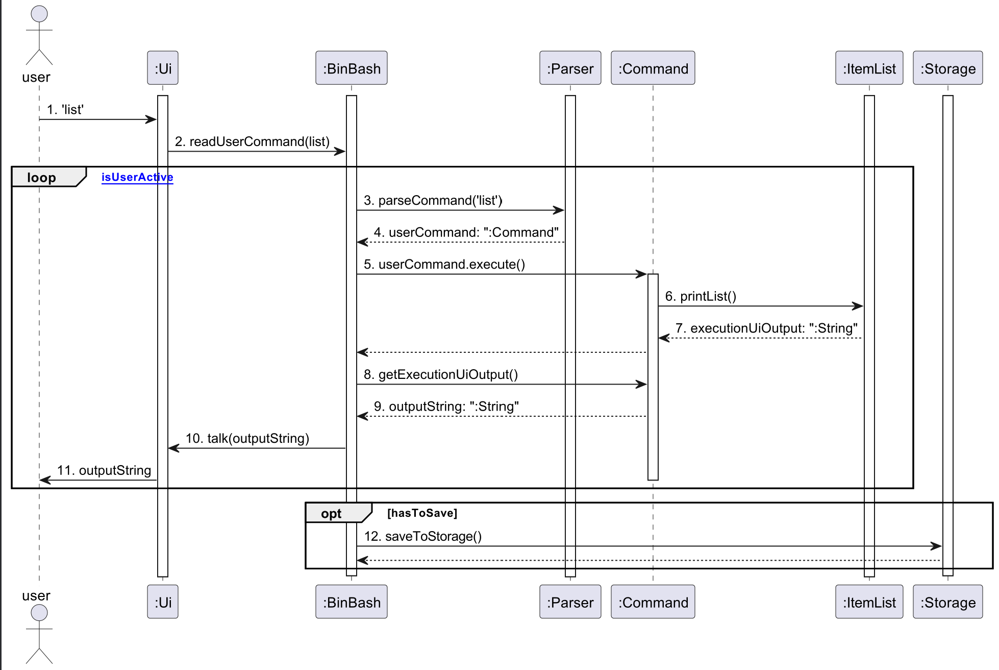

# Developer Guide

## Table of Contents
* [Acknowledgements](#acknowledgements)
* [Setting up, getting started](#setting-up-getting-started)
* [Design](#design)
  * [Data Component](#data-component)
* [Implementation](#implementation)
* [Logging](#logging)
* [Product scope](#product-scope)
  * [Target user profile](#target-user-profile)
  * [Value proposition](#value-proposition)
* [User Stories](#user-stories)
* [Non-Functional Requirements](#non-functional-requirements)
* [Glossary](#glossary)
* [Instructions for manual testing](#instructions-for-manual-testing)

## Acknowledgements

{list here sources of all reused/adapted ideas, code, documentation, and third-party libraries -- include links to the original source as well}

## Setting up, getting started

## Design
# Design

### Architecture

Given below is a quick overview of main components and how they interact with each other.

### Main components of the architecture

The bulk of the app's work is done by the following five components:

- `Ui`: The UI of the App.
- `Storage`: Reads data from and writes data to a .txt file
- `Parser`: Makes sense of the user input to return the appropriate command
- `Command`: Executes the command requested by the user
- `ItemList`: Consists of all the classes that are involved during command execution
- `BinBash`: Responsible for initializing the above classes in the correct sequence during startup, and connecting them up with each other.

### Sequence Diagram

The **Sequence Diagram** below shows how the components interact with each other for the scenario where the user issues the command `list`.

#### Figure 2: Architecture Encode Sequence Diagram

1. User enters the command `list` to the `Ui`.
2. `Ui` passes the command as a string through the method `readUserInput('list')`, called via `BinBash`.
3. `BinBash` passes the string to `Parser` through the method `parseCommand('list')`.
4. `Parser` returns a new `Command` object. (In this specific case, it would be a ListCommand object)
5. `BinBash` calls the `execute()` method of `Command`.
6. `Command` then interacts with `ItemList`, and calls the relevant method.
7. `ItemList` returns the executionUiOutput, in the form of a String object. 
8. `BinBash` calls the `getExecutionUiOutput` command in `Command`
9. `Command` returns the outputString, in the form of a String object.
10. `BinBash` calls the `talk()` method in `Ui`, and passes the outputString.
11. `Ui` prints this outputString to the user.
12. If the `Command` executed modifies the database, `BinBash` will call the `saveToStorage()` method of `Storage`

### Data Component

API: [`ItemList.java`](https://github.com/AY2324S2-CS2113T-T09-2/tp/blob/master/src/main/java/seedu/binbash/ItemList.java)

The `Data` component is primarily composed of an `ItemList` object that stores different types of `Item`.

`Item` has different types, such as `RetailItem`, `OperationalItem`, `PerishableRetailItem`, and `PerishableOperationalItem`.

### Iman

### Haziq

### Jun Han

### Kota

### Yi Hao

### Xavier

## Implementation

### Iman

### Haziq

### Jun Han

### Kota

### Yi Hao

### Xavier

## Logging

* We are using `java.util.logging` package for logging.
* The `BinBashLogger` class is used to manage all logging related funtions.
* The `Logger` for a class can be obtained by contructing a `BinBashLogger` object and assigning it as a class-level variable
* Log messages are output to a `logs.txt` file in the `*/logs/` directory by default.
* If there are issues with the `logs.txt` file that results in no `logs` being written, warnings logs will be output through the console instead.

## Product scope

### Target user profile

* Retail shop owners who has a need to efficiently manage their inventory list
* prefer desktop apps over other types of apps
* can type fast
* prefers typing to mouse interactions
* is reasonably comfortable using CLI apps

### Value proposition

* Manage inventory list more efficiently compared to manual stock taking and typical mouse/GUI driven apps
* Portability allows usage on multiple operating systems (E.g. Windows, Linux, Mac).
* Lightweight, only requires entry-level hardware to run.

## User Stories

|Version| As a ... | I want to ... | So that I can ...|
|--------|----------|---------------|------------------|
|v1.0|new user|see usage instructions|refer to them when I forget how to use the application|
|v2.0|user|find a to-do item by name|locate a to-do without having to go through the entire list|

## Non-Functional Requirements

{Give non-functional requirements}

## Glossary

* *glossary item* - Definition

## Instructions for manual testing

{Give instructions on how to do a manual product testing e.g., how to load sample data to be used for testing}
